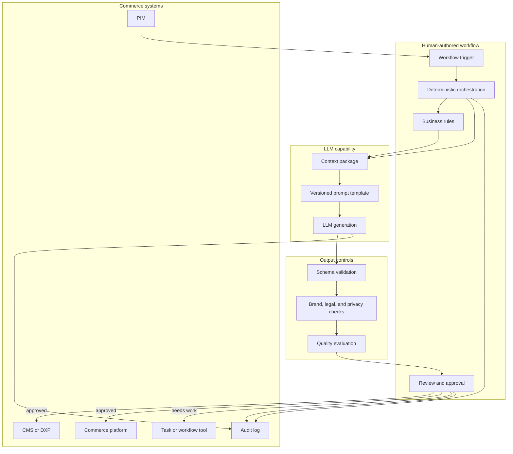

# Part Two · The Five Archetypes

### The running company: Meridian Outfitters

Every chapter in Part Two uses one fictional retailer, so the examples connect into a single operation rather than five unrelated demos. Meridian Outfitters is a mid-market omnichannel outdoor-and-apparel retailer: roughly $800M in revenue, 120 stores and a growing e-commerce channel, tens of thousands of SKUs, and several hundred suppliers.

Across the chapters, Meridian is preparing and running its **spring outdoor line launch**, a few thousand new and returning products across tents, packs, footwear, and apparel. Each archetype is a different system in Meridian's stack touching that launch. The chapters appear in order of autonomy. Part Three puts the systems back in the order the work actually happens and shows them working together.

## Archetype 1: LLM-assisted workflows (not yet agents)

*The model helps with language and structure. The workflow still decides everything.*

### What changes here

This is the simplest and most common place to start. A deterministic workflow calls a model to synthesize, extract, summarize, translate, classify, or draft content. The model does useful work, but it does not decide what happens next. A person or a human-authored system still defines the sequence, the routing, the checks, and the final action. The model is used like any other capability in the stack: given this context, produce this output.

That is why this archetype sits below the agency line. The model does not shape the behavior of the system. It generates or transforms information inside a path that was already designed. Calling this "agentic" is exactly what creates the vendor confusion the model in Part One is trying to resolve.

Adopting it still introduces real engineering concerns:

- **Prompting becomes implementation.** A prompt is no longer a casual instruction. It is part of the workflow contract.
- **Context becomes product surface.** Output quality depends heavily on what data the workflow gathers, filters, and passes to the model.
- **Validation becomes the handoff.** A probabilistic model produces output that deterministic systems have to trust, reject, or send for review.
- **Review stays human or rule-based.** The model can draft. It does not approve, publish, refund, reprice, or route.
- **Cost and latency matter early.** High-volume workflows get expensive fast if every trivial transformation runs through a model.

The value of this archetype is precise: you get the language capabilities of a model without introducing model-driven control flow.

### Running example: enriching content for the spring line

Meridian's merchandising team has thousands of spring-line products to get live before the season opens, and the supplier-provided copy is thin and inconsistent. Meridian runs a product content enrichment workflow to close the gap. The workflow receives a product record from the PIM, supplier feed, or ERP, then uses a model to generate better content for the web store, stores, and marketplace channels. It:

- **Receives** product attributes such as title, category, material, dimensions, and specifications.
- **Assembles** a controlled context package from approved data sources.
- **Generates** descriptions, SEO titles, short bullets, comparison copy, accessibility text, or localized variants.
- **Validates** the output against schema, brand, policy, and compliance checks.
- **Queues** the result for human review or sends it into an existing publishing workflow.

The model does not decide whether the product should be sold, which channel receives it, whether legal review is needed, or whether the content goes live. Those decisions stay outside the model. The model helps create the artifact; the workflow path is fixed.

### Architecture

The model is boxed in as a capability. It is not the orchestrator, the router, or the approver. Existing workflow infrastructure keeps control flow. The model is called for the one thing it is good at: producing a useful draft from messy or incomplete input.

The architecture is deliberately boring, and that is the point. There is no step where the model chooses a route. The workflow may retry, reject, publish, or escalate, but rules and human review decide those branches. The model never does.

A few practices carry most of the quality:

**Deterministic orchestration.** Treat the model call as one step inside a workflow engine rather than the engine itself. The application decides when to call the model, what to send, how many retries are allowed, which validators run, and who approves. You keep the familiar operational model: queues, states, approvals, logs, rollback.

**Context packaging.** The model sees only what the workflow gives it. Strong systems invest in context assembly: approved attributes, brand and terminology rules, channel constraints, localization requirements, prior approved examples, and prohibited claims. A weak context package produces weak output even with a strong model.

**Prompts as versioned artifacts.** Prompts get owners, version history, test cases, and release notes. A changed prompt can alter tone, risk, formatting, and compliance behavior without touching application code. Record which prompt version produced each output.

**Output contracts and validators.** Raw model output should never go straight to downstream systems. Validators enforce valid fields, character limits, required attributes, no unsupported claims, no invented specifications, and no personal data. The validator is the bridge between probabilistic generation and deterministic systems.

**Cost, latency, repeatability.** Not every transformation deserves a model call. Formatting, unit conversion, ID mapping, and deduplication belong in scripts. Reserve the model for language-heavy work, cache outputs when inputs have not changed, and batch when latency allows.

### Policy

**Data minimization.** The call should receive the minimum data required. A description workflow does not need customer history. Policy defines which data classes may be sent, which vendors and models are approved for which classes, how prompts and outputs are retained, whether training on submitted data is disabled, and how sensitive fields are redacted before the call.

**Approval ownership.** The workflow should make it clear who owns the final artifact. The model drafted it; a product owner, merchandiser, or compliance reviewer approves it. This prevents the classic failure where everyone treats the output as useful but nobody owns the consequence of publishing it.

**Claims and compliance.** A model can phrase a claim more confidently than the source data supports.

| Claim type | Example | Default control |
|---|---|---|
| Descriptive | "Made from cotton" | Validate against product attributes |
| Comparative | "Best in class" | Require approved source or block |
| Regulated | Health, financial, legal, sustainability | Route to human or compliance review |
| Unsupported | Invented specs or guarantees | Reject automatically |

**Evaluation and observability.** The failure mode here is quiet: output that degrades at scale while every individual call still looks fine. Use golden test sets, checks for hallucinated facts, tone and localization scoring, and regression tests when prompts or models change. Observability should answer content-provenance questions: which model and prompt version produced this, what source data was included, which validators passed, who approved it, and what was published where.

### Other examples that fit archetype 1

Customer support reply drafting, localization and market adaptation, meeting and transcript summaries, release-note drafting, and purchase-order extraction from supplier emails. In each, the model produces an artifact and a person or rule decides what happens with it.

### Readiness checklist

Architecture:
- [ ] Model calls run as steps inside a deterministic workflow engine, never as the orchestrator
- [ ] Context packages assembled from approved sources only
- [ ] Prompts versioned, tested, and rollback-able
- [ ] Output validators enforce schema, limits, and prohibited content before anything leaves the workflow
- [ ] Deterministic work kept out of the model; outputs cached where inputs are stable

Policy:
- [ ] Data classes permitted to reach the model are defined, with approved vendors per class
- [ ] Named owner for approval of every generated artifact
- [ ] Claim-handling rules in place, with regulated claims routed to review
- [ ] Golden test sets and regression checks run on prompt or model change
- [ ] Content provenance captured: model, prompt version, sources, validators, approver, publication

### Bridging to archetype 2

This archetype stops at generation and transformation. It becomes archetype 2 when the model's output changes the path. A generated product description is archetype 1. A model deciding that a product goes to legal review instead of copy enrichment is archetype 2. The safest way across is to promote one decision point at a time, keeping the paths explicit and the allowed outputs structured.
