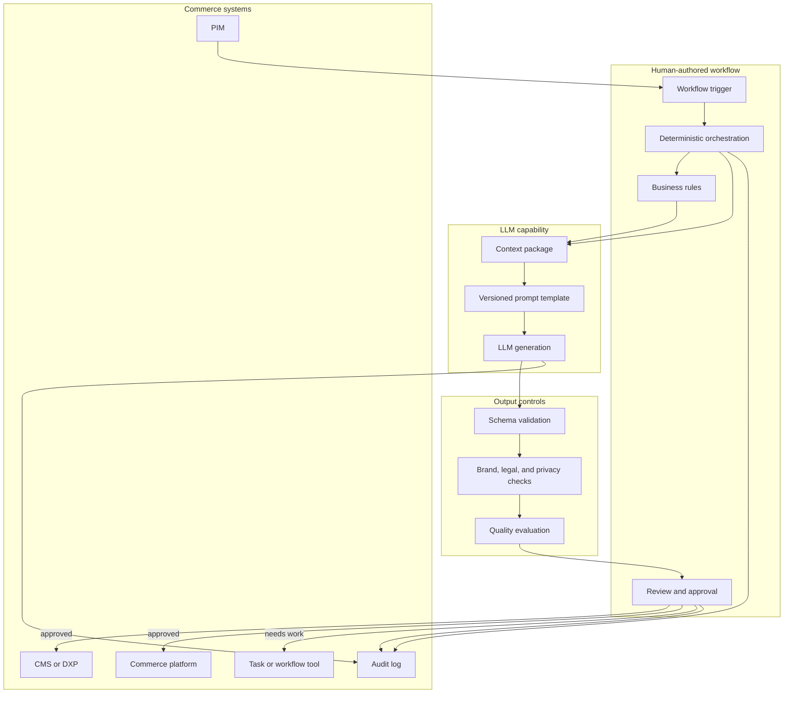

# Part Two · The Five Archetypes

### The running company: Meridian Outfitters

Every chapter in Part Two uses one fictional retailer, so the examples connect into a single operation rather than five unrelated demos. Meridian Outfitters is a mid-market omnichannel outdoor-and-apparel retailer: roughly $800M in revenue, 120 stores and a growing e-commerce channel, tens of thousands of SKUs, and several hundred suppliers.

Across the chapters, Meridian is preparing and running its **spring outdoor line launch**, a few thousand new and returning products across tents, packs, footwear, and apparel. Each archetype is a different system in Meridian's stack touching that launch, and the chapters appear in order of autonomy.

### A note on the readiness checklists

Every chapter ends with a readiness checklist split two ways. **Minimum to launch** is what has to be true before a first production deployment, because without it the system can cause harm you cannot see or undo. **Required at scale** is what gets added by running it at volume, across more categories, or for longer: the reliability, cost, and drift machinery that a pilot can defer and a production platform cannot.

Read as a single gate, the full list stops good first projects. What you cannot defer is knowing which items you have deferred, and to when.

## Archetype 1: LLM-assisted workflows (not yet agents) — *assisted*

*The model helps with language and structure. The workflow still decides everything.*

### What changes here

This is the simplest and most common place to start. A deterministic workflow calls a model to draft, extract, summarize, translate, or classify content. The model does useful work, but it does not decide what happens next. A person, or a system a person wrote, still sets the sequence, the routing, the checks, and the final action. The model is used like any other capability in the stack: given this context, produce this output.

That is why this archetype sits below the agency line. The model does not shape what the system does. It writes or reshapes information inside a path that was already designed. Calling this "agentic" is what creates the vendor confusion Part One sets out to fix.

Using it still brings real engineering concerns:

- **Prompting becomes implementation.** A prompt is no longer a casual instruction. It is part of the workflow contract.
- **Context becomes product surface.** Output quality depends heavily on what data the workflow gathers, filters, and passes to the model.
- **Validation becomes the handoff.** A model's output varies from run to run, and the fixed systems downstream have to trust it, reject it, or send it for review.
- **Review stays human or rule-based.** The model can draft. It does not approve, publish, refund, reprice, or route.
- **Cost and latency matter early.** High-volume workflows get expensive fast if every trivial change runs through a model.

The value of this archetype is precise: you get a model's way with language without letting the model steer the workflow.

### Running example: enriching content for the spring line

Meridian's merchandising team has thousands of spring-line products to get live before the season opens, and the supplier-provided copy is thin and inconsistent. Meridian runs a product content enrichment workflow to close the gap. The workflow receives a product record from the PIM, supplier feed, or ERP, then uses a model to write better content for the web store, stores, and marketplace channels. It:

- **Receives** product attributes such as title, category, material, dimensions, and specifications.
- **Assembles** a controlled context package from approved data sources.
- **Generates** descriptions, SEO titles, short bullets, comparison copy, accessibility text, or localized variants.
- **Queues** the result for human review or sends it into an existing publishing workflow.

The model does not decide whether the product should be sold, which channel receives it, whether legal review is needed, or whether the content goes live. Those decisions stay outside the model. The model helps create the artifact; the workflow path is fixed.

### Architecture

The model is boxed in as a capability. It is not the orchestrator, the router, or the approver. Existing workflow infrastructure keeps control of the flow. The model is called for the one thing it is good at: producing a useful draft from messy or incomplete input.

```mermaid
graph TB
    subgraph "Human-authored workflow"
        EVENT[Workflow trigger]
        ORCH[Deterministic orchestration]
        RULES[Business rules]
        REVIEW[Review and approval]
    end

    subgraph "LLM capability"
        CONTEXT[Context package]
        PROMPT[Versioned prompt template]
        MODEL[LLM generation]
    end

    subgraph "Output controls"
        SCHEMA[Schema validation]
        SAFETY[Brand, legal, and privacy checks]
        SCORE[Quality evaluation]
    end

    subgraph "Commerce systems"
        PIM[PIM]
        CMS[CMS or DXP]
        COMMERCE[Commerce platform]
        TASK[Task or workflow tool]
        AUDIT[Audit log]
    end

    PIM --> EVENT
    EVENT --> ORCH
    ORCH --> RULES
    ORCH --> CONTEXT
    RULES --> CONTEXT
    CONTEXT --> PROMPT
    PROMPT --> MODEL
    MODEL --> SCHEMA
    SCHEMA --> SAFETY
    SAFETY --> SCORE
    SCORE --> REVIEW
    REVIEW -->|approved| CMS
    REVIEW -->|approved| COMMERCE
    REVIEW -->|needs work| TASK
    ORCH --> AUDIT
    MODEL --> AUDIT
    REVIEW --> AUDIT
```

The architecture is deliberately boring. There is no step where the model chooses a route. The workflow may retry, reject, publish, or escalate, but rules and human review decide those branches. The model never does.

A few practices carry most of the quality:

**Deterministic orchestration.** Treat the model call as one step inside a workflow engine rather than the engine itself. The application decides when to call the model, what to send, how many retries are allowed, which validators run, and who approves. You keep the familiar operating model: queues, states, approvals, logs, rollback.

**Context packaging.** The model sees only what the workflow gives it. Strong systems put real work into assembling that context: approved attributes, brand and wording rules, channel limits, localization needs, earlier approved examples, and banned claims. A weak context package produces weak output even with a strong model.

**Prompts as versioned artifacts.** Prompts get owners, version history, test cases, and release notes. A changed prompt can shift tone, risk, formatting, and compliance behavior without touching application code. Record which prompt version produced each output.

**Output contracts and validators.** Raw model output should never go straight to downstream systems. Validators check for valid fields, character limits, required attributes, no unsupported claims, no invented specifications, and no personal data. The validator is the bridge between output that varies and systems that expect it not to.

**Cost, latency, repeatability.** Not every step deserves a model call. Formatting, unit conversion, ID mapping, and deduplication belong in scripts. Save the model for language-heavy work, cache outputs when inputs have not changed, and batch when latency allows.

### Policy

**Data minimization.** The call should get the least data it needs. A description workflow does not need customer history. Policy sets which data classes may be sent, which vendors and models are approved for which classes, how long prompts and outputs are kept, whether training on submitted data is turned off, and how sensitive fields are masked before the call.

**Approval ownership.** The workflow should make it clear who owns the final artifact. The model drafted it; a product owner, merchandiser, or compliance reviewer approves it. This heads off the classic failure where everyone treats the output as useful but nobody owns what happens once it is published.

**Claims and compliance.** A model can phrase a claim more confidently than the source data supports.

| Claim type | Example | Default control |
|---|---|---|
| Descriptive | "Made from cotton" | Check against product attributes |
| Comparative | "Best in class" | Require an approved source, or block |
| Regulated | Health, financial, legal, sustainability | Route to human or compliance review |
| Unsupported | Invented specs or guarantees | Reject automatically |

**Evaluation and observability.** The failure here is quiet: output that gets worse at scale while every single call still looks fine. Use golden test sets, checks for invented facts, tone and localization scoring, and regression tests when prompts or models change. Observability should answer where a piece of content came from: which model and prompt version produced it, what source data went in, which validators passed, who approved it, and what was published where.

### Other examples that fit archetype 1

Customer support reply drafting, localization and market adaptation, meeting and transcript summaries, release-note drafting, and purchase-order extraction from supplier emails. In each, the model produces an artifact and a person or a rule decides what happens with it.

### Readiness checklist

Architecture — minimum to launch:
- [ ] Model calls run as steps inside a deterministic workflow engine, never as the orchestrator
- [ ] Context packages assembled from approved sources only
- [ ] Prompts versioned and rollback-able
- [ ] Output validators check schema, limits, and banned content before anything leaves the workflow

Architecture — required at scale:
- [ ] Deterministic work kept out of the model; outputs cached where inputs are stable
- [ ] Prompt test cases maintained alongside the prompts themselves

Policy — minimum to launch:
- [ ] Data classes allowed to reach the model are defined, with approved vendors per class
- [ ] Named owner for approval of every generated artifact
- [ ] Claim-handling rules in place, with regulated claims routed to review

Policy — required at scale:
- [ ] Golden test sets and regression checks run on prompt or model change
- [ ] Content provenance captured: model, prompt version, sources, validators, approver, publication

### Bridging to archetype 2

This archetype stops at writing and reshaping content. It becomes archetype 2 the moment the model's output changes the path, and the safe way across is to promote one decision point at a time.
