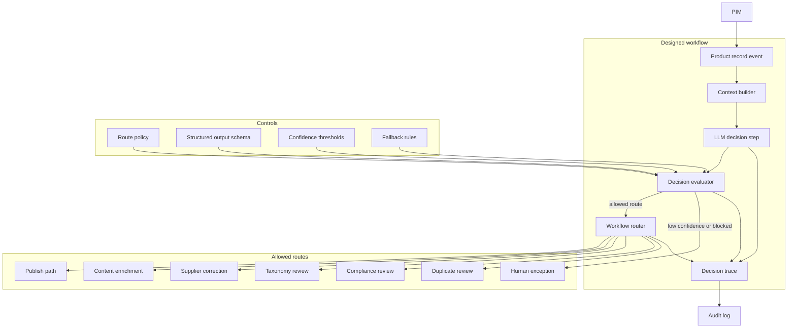

## Archetype 2: LLM-directed workflows

*The paths are designed by people. The model chooses which one to take.*

### What changes here

This is where a system first crosses the agency line. The model is no longer only generating content inside a fixed path. It evaluates context and makes a decision that changes how the workflow behaves.

That decision takes one of two shapes. The model chooses which path to take, routing a record or request to one of several designed branches. Or the model decides whether to continue, judging an output and looping to refine it or stopping. Routing is the most visible form, but a bounded refine-and-recheck loop belongs here just as much. In both, the model directs control flow without escaping the structure people designed.

The decision stays constrained. People design the paths and define the allowed routes, tools, thresholds, loops, and fallbacks; the model chooses among them at runtime, without inventing a plan of its own.

New concerns appear the moment the model picks a path:

- **The decision space must be explicit.** The model chooses from known routes. It does not invent new ones.
- **Outputs become control signals.** A classification, score, or route is no longer just text. It drives system behavior.
- **Fallbacks become part of safety.** Low confidence, ambiguity, unsupported routes, and policy conflicts need deterministic outcomes.
- **Decision traces become necessary.** Operators need to know why the workflow chose one path over another.
- **Deterministic work stays deterministic.** Scripts, rules, APIs, and validators do the repeatable work. The model handles ambiguity, judgment, and language-heavy interpretation.

The value: adaptive behavior without open-ended model control.

### Running example: triaging inbound spring-line data

Before Meridian's enrichment workflow from Chapter 1 can do its job, the raw product data has to be sorted. Spring-line data is landing from hundreds of suppliers through ERPs, spreadsheets, syndication tools, marketplaces, and the PIM, and it is messy: missing attributes, inconsistent categories, unsupported claims, weak descriptions, duplicate SKUs. Meridian runs a product data quality triage workflow ahead of enrichment. An archetype 1 workflow might rewrite a description. This archetype 2 workflow asks the model to decide which predefined remediation path each incoming record should follow:

- **Publish** when the record is complete and low risk.
- **Content enrichment** when the attributes are good but the copy is weak.
- **Supplier correction** when required fields are missing or contradictory.
- **Taxonomy review** when the category is ambiguous.
- **Compliance review** when the record carries regulated, comparative, or sustainability claims.
- **Duplicate review** when the record appears to overlap an existing product.
- **Human exception** when the model cannot make a confident decision.

The model chooses the route. The workflow executes it with deterministic systems: validators, scripts, APIs, task creation, review queues, publishing controls. The model can influence the path. It cannot escape the path set.

### Architecture

The model produces a structured route recommendation. A decision evaluator checks that recommendation before the router acts on it. There is no path from the model directly to execution.



Three terminal outcomes make up the full decision space: execute a permitted route, escalate an uncertain one, or block an invalid one. The workflow is adaptive without being open-ended.

**The designed decision space is the architecture.** If the route set is vague, the workflow is vague. Define the available decisions before introducing the model: allowed routes, required inputs per route, conditions that make a route unavailable, confidence thresholds, escalation rules, retry limits, and what evidence must be recorded. The model chooses inside this space. It does not create it.

**Structured outputs as contracts.** The control signal should be machine-readable and narrow. Free text is fine for rationale, but it is not the route.

```json
{
  "route": "compliance_review",
  "confidence": 0.86,
  "reason": "Description includes an environmental claim not supported by structured attributes.",
  "evidence": ["claim: 100% sustainable", "missing certification attribute"],
  "fallback_route": "human_exception"
}
```

The evaluator validates this shape before anything happens. An out-of-set route is rejected.

**Model as router, deterministic components as executors.** Keep schema checks, field validation, ID mapping, unit conversion, duplicate lookup, permission checks, and API calls outside the model. Use the model where the system needs judgment over messy context.

**Confidence, thresholds, fallbacks.** Every kind of uncertainty needs a defined response.

| Condition | Default outcome |
|---|---|
| High confidence, low risk | Execute route |
| Medium confidence | Human review or second evaluator |
| Low confidence | Human exception path |
| Unsupported route | Block and log |
| Conflicting evidence | Escalate with evidence |
| Missing required context | Request data or supplier correction |

The fallback path is part of the design. Treat it as expected behavior.

**Bounded evaluation loops.** The other common shape here is a decision about whether to continue. A generate-evaluate-revise loop sits directly on top of archetype 1's content workflow: a generator drafts a description, a separate evaluator call scores it against a rubric, and a passing draft ships while a failing one returns for revision. The loop is bounded by a fixed revision cap; if the draft still fails on the last attempt, it escalates to a human. The agency is not which path, it is whether to go again. Everything that bounds the loop, the rubric, the cap, the escalation, is human-designed. That is what keeps it here and out of archetype 3: the model decides only whether the output is good enough, while the goal and the attempt budget stay fixed by people. Loops without budgets drift toward archetype 3 behavior.

**Decision traces and replay.** Once the model chooses a route, the choice must be reconstructable: what context the model saw, which route it chose, what confidence and evidence it gave, which policy checks passed, whether a human overrode it, and what happened next. This is more than ordinary application logging. The workflow decision is now part of system behavior.

### Policy

**Route permissions.** Not every route should be available to every model, brand, region, or category.

| Route | Default control | Policy concern |
|---|---|---|
| Publish | Allow only for complete, low-risk records | Prevent accidental publication |
| Content enrichment | Allow for approved categories | Avoid invented product facts |
| Supplier correction | Allow when required data is missing | Keep feedback explainable |
| Taxonomy review | Allow when category confidence is low | Protect merchandising structure |
| Compliance review | Require for regulated or unsupported claims | Avoid legal exposure |
| Human exception | Always available | Provide a safe fallback |

**Human escalation.** Trigger review on risk, novelty, ambiguity, or low confidence, and give the reviewer the model's rationale and evidence alongside the selected route. Good escalation design helps humans move faster. Bad escalation design creates a queue of mysterious decisions nobody trusts.

**Prompt and model change control.** Changing the prompt or model can change routing behavior. Treat routing prompts like production decision logic: version them, track model versions, keep test sets with expected routes, roll out by percentage or category, and compare old and new behavior before committing.

**Data minimization.** The model should see enough to make the route decision and no more. Triage needs product attributes, category rules, prior matches, and policy snippets. It does not need customer or payment data.

**Monitoring route drift.** A workflow can drift even when each decision looks plausible. A workflow that sent 5 percent of records to compliance review suddenly sending 40 percent may reflect a real change in supplier data, or prompt drift, or a broken context builder. Track route and confidence distributions over time, human override rates, blocked-route attempts, and route quality by supplier, category, and region.

**Audit and accountability.** The record should capture the model decision and the surrounding checks: input identifier, prompt and model versions, route, confidence, rationale, evidence, policy result, human override, downstream action, and final outcome. This is the start of decision accountability.

### Other examples that fit archetype 2

Support ticket routing, adaptive content review, commerce exception handling for failed payments and address mismatches, order-issue triage, and model-directed orchestration where the model decides which deterministic component runs.

### Readiness checklist

Architecture:
- [ ] Allowed route set defined before the model is introduced, with required inputs per route
- [ ] Model emits a structured, schema-validated route recommendation; a separate evaluator gates it
- [ ] Deterministic work kept out of the model
- [ ] Confidence thresholds and a defined fallback for every uncertainty class
- [ ] Any evaluation loop bounded by an explicit revision cap and escalation
- [ ] Per-decision trace captured and replayable

Policy:
- [ ] Route permissions defined per model, brand, region, and category
- [ ] Escalations carry rationale and evidence to the reviewer
- [ ] Routing prompts and models under change control with expected-route test sets
- [ ] Data reaching the model minimized to the decision at hand
- [ ] Route and confidence drift monitored over time
- [ ] Audit record captures decision plus surrounding control checks

### Bridging to archetype 3

This archetype ends where the designed path set ends. A record routed to compliance review is archetype 2. A system handed "clean up this supplier catalog" that decides which records to inspect, which tools to call, which fixes to make, and when it is done is archetype 3. The difference is control: here people design the paths and the model chooses; there the model controls the sequence of steps toward a goal.
