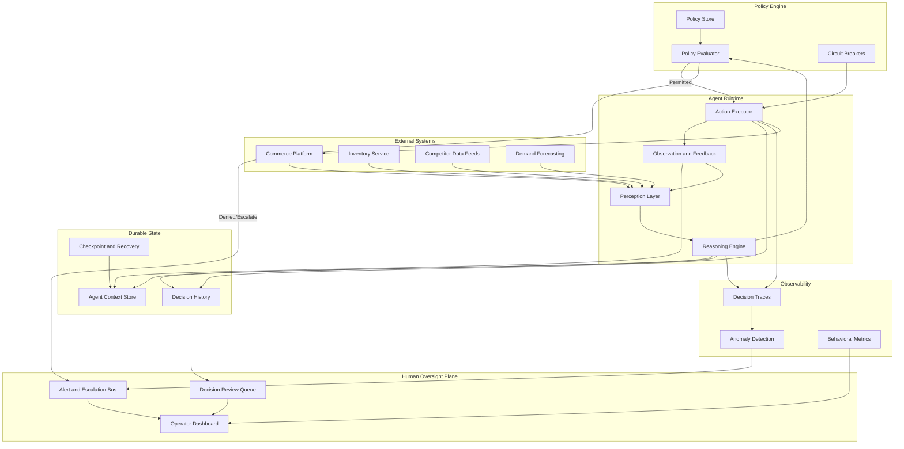

## Archetype 4: Autonomous, policy-guided agents

*Persistence changes everything. When an agent does not stop, your architecture and governance cannot either.*

### What changes here

A goal-directed agent receives a task, works out how to accomplish it, and finishes. Clear start, clear end. An autonomous, policy-guided agent does not wait for assignments. It persists. It monitors a domain, detects conditions that warrant action, decides what to do, acts, observes the result, and self-corrects. Continuously. Without a human in the loop for each decision.

This is a difference in kind, not degree. The moment an agent operates independently over extended durations, four problems arrive at once:

- **Identity becomes infrastructure.** The agent needs a durable machine identity with its own lifecycle, provisioned, rotated, scoped, and revocable independently of any human session.
- **State becomes critical path.** The agent accumulates context over hours, days, or weeks. Losing that state mid-operation is a correctness failure that corrupts every decision after it.
- **Accountability becomes continuous.** You cannot reconstruct why the agent took action X at time T from a post-mortem, so decision trails must be first-class infrastructure rather than afterthought logging.
- **Policy becomes the operating system.** Without task-by-task human approval, the policies you define are the supervision. They have to be precise, enforceable, and auditable.

### Running example: pricing the spring line through the season

The spring line is live. Now Meridian has to price it across a full season of shifting demand, weather, competitor moves, and inventory levels, on thousands of SKUs at once. That is more repricing than a merchandising team can do by hand, so Meridian runs a revenue optimization agent over the category. Unlike the catalog agent in Chapter 3, this one does not finish. It:

- **Monitors** pricing signals, inventory levels, competitor pricing, demand forecasts, and margin targets. Continuously.
- **Decides** when to adjust pricing, trigger promotions, or flag conditions for human review.
- **Acts** by pushing price changes to commerce platforms, updating promotion engines, or escalating to merchandising.
- **Self-corrects** when it observes that an action produced an unexpected result, such as a price change that tanked conversion instead of improving margin.

This agent runs around the clock. It does not wait for an "optimize pricing" task. It watches, reasons, and acts within the boundaries its operators define.

### Architecture

Every proposed action passes through policy evaluation before execution. There is no path from reasoning to action that skips this gate. Durable state preserves context across cycles. Observability detects drift. Human oversight keeps final authority.

During a single cycle the agent perceives signals, loads accumulated context, reasons, and proposes an action. The policy evaluator produces one of three outcomes: permit and execute, escalate for approval, or halt via circuit breaker. That is the full decision space.

**Persistent machine identity and lifecycle.** The agent runs as a persistent entity that authenticates to commerce platforms, pricing engines, and data feeds continuously, rather than a function that fires when called. That requires a dedicated machine identity of its own, distinct from any shared service account or delegated human credential. Permissions are granular and auditable: the agent may read pricing data from all channels but write price changes only to specific SKU categories. Credentials rotate automatically, on schedule, without interrupting operation. If the agent is compromised or misbehaving, its identity can be revoked in one operation, severing access to all downstream systems.

**Long-running durable state.** The agent builds context over time: which strategies have worked, how competitors respond, which SKUs are sensitive, what time-of-day patterns matter. Checkpointing persists its full context periodically, so a crash resumes from the last checkpoint rather than from zero. State versioning retains prior versions for rollback and forensic reconstruction. Short-term working memory is kept distinct from long-term learned context, with different retention guarantees. Common implementations use durable execution frameworks (Temporal, AWS Step Functions, Restate), event-sourced state stores, or custom checkpoint and restore against object storage.

**Memory and model management.** Durable state raises two architecture decisions that a bounded agent never had to make. The first is memory: an agent that accumulates weeks of observations cannot hold them all in a context window, so it needs a retrieval layer that decides what to surface for the current decision, and a policy for what to keep, summarize, and forget. Poor retrieval is a silent correctness problem, because the agent reasons confidently over whatever it was given. The second is the model itself. Prompts are versioned in earlier archetypes; here the underlying model is also a managed dependency, because a model swap can shift behavior across the whole running fleet at once. Pin model versions, test a change against recorded decisions before rolling it out, and treat a model upgrade as the behavior-altering event it is.

**Behavioral anomaly detection.** An agent that runs continuously can drift, slowly or suddenly. Establish baseline behavioral profiles: frequency of actions, magnitude of changes, distribution of decision types. Compare every action against the baseline. A pricing agent that normally makes 5 to 15 adjustments per hour suddenly making 200 is anomalous regardless of whether each individual action passes policy. Graduated response escalates from logging to alerts to circuit breakers. Watch semantic drift too: are the rationales in the decision traces becoming repetitive, circular, or disconnected from the observations that triggered them?

The economics and evaluation of running continuously, along with the data-residency questions a persistent agent raises, are treated in full under Cross-cutting concerns in Part Three; they are first-order design constraints at this archetype.

**Untrusted signals and exfiltration.** A continuous agent lives on a diet of external data: competitor pages, supplier feeds, demand signals. Any of it can carry a prompt-injection payload aimed at steering the agent, and because no human approves each action, a successful injection acts at machine speed. The exposure runs both ways. An agent with broad read access and an external action can be turned into an exfiltration path, reading something sensitive and writing it somewhere it should not. Defenses are architectural: separate instructions from data, keep the agent's read scope and write scope as narrow as the job allows, and route any action that moves data across a trust boundary through the policy engine rather than trusting the reasoning that proposed it. The circuit breakers below are the backstop when an injection gets through.

**Auditable decision trails.** Every decision must be reconstructable after the fact, including why. Structured decision records capture the triggering observation, the reasoning, the proposed action, the policy result, the outcome, and the post-action observation. Causal chains preserve the links between decisions: "I raised the price on SKU-4521 because my earlier reduction on SKU-4519 shifted demand, and the margin target required rebalancing." Storage is append-only and tamper-evident, and the trail is queryable, so an operator can ask for every pricing decision in a category over 48 hours where the margin impact exceeded 2 percent.

### Policy

**Identity governance.** Machine identity here means full lifecycle management. Creating a service account and forgetting it is the anti-pattern.

| Lifecycle stage | What happens | Responsible |
|---|---|---|
| Provisioning | Identity created with scoped permissions | Platform team and agent owner |
| Authentication | Agent authenticates using its own credentials | Agent runtime |
| Rotation | Credentials rotated on schedule without interruption | Automated by platform |
| Monitoring | Authentication patterns watched for anomalies | Security / observability |
| Revocation | Identity revoked, all sessions terminated | Security team or automated |
| Decommissioning | Identity retired, audit trail preserved | Platform team |

**Permission boundaries and escalation tiers.** The agent operates within a defined action space; anything outside it escalates.

- **Tier 1, autonomous:** adjust prices within ±5% for non-flagged SKUs. No approval.
- **Tier 2, notify:** adjust prices ±5–15%. Execute immediately but notify merchandising.
- **Tier 3, approve:** adjust beyond ±15%, or touch flagged or regulated SKUs. Queue for approval before execution.
- **Tier 4, prohibited:** actions that cross compliance boundaries, such as pricing below cost where that is illegal. Hard block, no override without legal review.

These tiers live in a policy store rather than in code, so they can be adjusted as trust grows or conditions change without redeploying the agent.

**Kill switches and circuit breakers.** When things go wrong at machine speed, you need machine-speed safeguards. Rate limiters cap actions per time window. Magnitude limiters cap cumulative impact: moving total revenue exposure past a threshold in an hour triggers a pause regardless of individual action validity. A dead man's switch pauses the agent if it has not checked in with oversight within a defined interval, covering the case where the agent runs but observability is broken. A manual kill switch gives operators an immediate, unconditional halt that preserves state.

**Drift detection and compliance.** Watch both sides. Agent drift: is the agent still within its boundaries, or has it found edge cases that pass policy checks but violate intent? Policy drift: are the policies still appropriate, or is the agent faithfully following outdated ones? Periodic compliance attestation verifies that actual behavior matches declared boundaries, and gaps trigger review.

### Readiness checklist

Architecture:
- [ ] Dedicated, durable machine identity with granular scoped permissions
- [ ] Automated credential rotation that does not interrupt operation
- [ ] Checkpointing and state versioning for durable, recoverable context
- [ ] Baseline behavioral profiles with real-time anomaly comparison, including semantic drift
- [ ] Append-only, tamper-evident, queryable decision trail with causal chains
- [ ] Policy evaluation gates every action; no reasoning-to-action path skips it

Policy:
- [ ] Full identity lifecycle owned and documented, provisioning through decommissioning
- [ ] Permission tiers defined in a policy store, adjustable without redeploy
- [ ] Rate limiters, magnitude limiters, dead man's switch, and manual kill switch in place
- [ ] Agent-drift and policy-drift detection running
- [ ] Periodic compliance attestation against declared boundaries

### Bridging to archetype 5

Everything above assumes a single agent inside a single organization's boundary. The patterns hold until the agent must interact with agents it does not control. Then new questions emerge: how does your agent verify a supplier's agent is reporting accurate data, what protocol lets agents on different stacks interact reliably, who arbitrates when your margin-optimizing agent meets a partner's volume-optimizing agent, and whose decision trail matters when two organizations' agents produce an outcome neither operator intended. Those questions define the final archetype. The durable identity, decision trails, and policy enforcement you built here become the foundation for operating across trust boundaries. You do not throw them away. You extend them.
