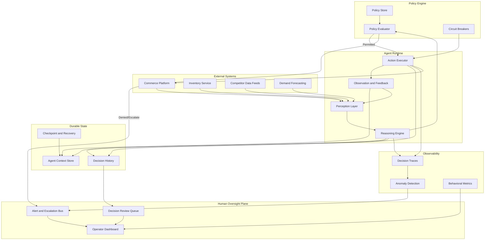

## Archetype 4: Autonomous, policy-guided agents — *autonomous*

*Persistence changes everything. When an agent does not stop, your architecture and governance cannot either.*

### What changes here

A goal-directed agent gets a task, works out how to do it, and finishes. Clear start, clear end. An autonomous, policy-guided agent does not wait to be given work. It keeps running. It watches a domain, spots conditions that call for action, decides what to do, acts, checks the result, and corrects itself. Continuously. With no human in the loop for each decision.

This is a difference in kind, not degree. The moment an agent runs on its own for long stretches, four problems arrive at once:

- **Identity becomes infrastructure.** The agent needs a lasting machine identity with its own lifecycle: created, rotated, scoped, and revocable on its own, apart from any human session.
- **State becomes critical path.** The agent builds up context over hours, days, or weeks. Losing that state mid-run is a correctness failure that poisons every decision after it.
- **Accountability becomes continuous.** A post-mortem will not tell you why the agent took action X at time T, so decision trails have to be built-in infrastructure rather than logging bolted on later.
- **Policy becomes the operating system.** Without human approval task by task, the policies you write are the supervision. They have to be precise, enforceable, and auditable.

The value: continuous tuning of a domain that moves faster and wider than a team can watch by hand. The price is a standing governance and identity function that has to run as continuously as the agent does.

### Running example: pricing the spring line through the season

The spring line is live. Now Meridian has to price it across a full season of shifting demand, weather, competitor moves, and inventory levels, on thousands of SKUs at once. That is more repricing than a merchandising team can do by hand, so Meridian runs a revenue optimization agent over the category. Unlike the catalog agent in archetype 3, this one does not finish. It:

- **Monitors** pricing signals, inventory levels, competitor pricing, demand forecasts, and margin targets. Continuously.
- **Decides** when to adjust pricing, run a promotion, or flag conditions for human review.
- **Acts** by pushing price changes to commerce platforms, updating promotion engines, or escalating to merchandising.
- **Self-corrects** when an action turns out badly, such as a price change that tanked conversion instead of improving margin.

This agent runs around the clock. It does not wait for an "optimize pricing" task. It watches, reasons, and acts within the boundaries its operators set.

### Architecture

Every proposed action goes through policy evaluation before it runs. No path from reasoning to action skips that gate. Durable state carries context across cycles. Observability catches drift. Human oversight keeps the final say.

```mermaid
graph TB
    subgraph "Human Oversight Plane"
        HUD[Operator Dashboard]
        ALERTS[Alert and Escalation Bus]
        REVIEW[Decision Review Queue]
    end

    subgraph "Policy Engine"
        POLICIES[Policy Store]
        EVAL[Policy Evaluator]
        CIRCUIT[Circuit Breakers]
    end

    subgraph "Agent Runtime"
        PERCEIVE[Perception Layer]
        REASON[Reasoning Engine]
        ACT[Action Executor]
        OBSERVE[Observation and Feedback]
    end

    subgraph "Durable State"
        CONTEXT[Agent Context Store]
        HISTORY[Decision History]
        CHECKPOINT[Checkpoint and Recovery]
    end

    subgraph "Observability"
        TRACES[Decision Traces]
        ANOMALY[Anomaly Detection]
        METRICS[Behavioral Metrics]
    end

    subgraph "External Systems"
        COMMERCE[Commerce Platform]
        INVENTORY[Inventory Service]
        COMPETITORS[Competitor Data Feeds]
        DEMAND[Demand Forecasting]
    end

    PERCEIVE --> REASON
    REASON --> EVAL
    EVAL -->|Permitted| ACT
    EVAL -->|Denied/Escalate| ALERTS
    ACT --> OBSERVE
    OBSERVE --> CONTEXT
    OBSERVE --> PERCEIVE

    POLICIES --> EVAL
    CIRCUIT --> ACT

    REASON --> CONTEXT
    REASON --> HISTORY
    ACT --> HISTORY
    CHECKPOINT --> CONTEXT

    REASON --> TRACES
    ACT --> TRACES
    TRACES --> ANOMALY
    ANOMALY --> ALERTS
    METRICS --> HUD

    COMMERCE --> PERCEIVE
    INVENTORY --> PERCEIVE
    COMPETITORS --> PERCEIVE
    DEMAND --> PERCEIVE
    ACT --> COMMERCE

    ALERTS --> HUD
    HISTORY --> REVIEW
    REVIEW --> HUD
```

In a single cycle the agent reads signals, loads the context it has built up, reasons, and proposes an action. The policy evaluator returns one of three answers: allow and run, escalate for approval, or halt through a circuit breaker. That is the whole decision space.

**Standing machine identity and lifecycle.** The agent runs as a standing participant that signs in to commerce platforms, pricing engines, and data feeds continuously, rather than a function that fires when called. That takes a machine identity of its own, separate from any shared service account or borrowed human credential. Permissions are fine-grained and auditable: the agent may read pricing data from all channels but write price changes only to certain SKU categories. Credentials rotate automatically, on schedule, without interrupting the work. If the agent is compromised or misbehaving, its identity can be revoked in one step, cutting off access to every downstream system.

**Long-running durable state.** The agent builds context over time: which strategies have worked, how competitors respond, which SKUs are sensitive, what time-of-day patterns matter. Checkpoints save its full context at intervals, so a crash resumes from the last one rather than from zero. Versioned state keeps earlier copies for rollback and for piecing together what happened. Short-term working memory is kept apart from long-term learned context, and the two are held for different lengths of time.

**Memory and model management.** Durable state raises two design decisions a bounded agent never had to make. The first is memory. An agent that piles up weeks of observations cannot hold them all in a context window. It needs a retrieval layer that picks what to surface for the decision at hand, and a rule for what to keep, what to summarize, and what to drop. Poor retrieval is a silent correctness problem, because the agent reasons confidently over whatever it was handed. The second is the model itself. Earlier archetypes version their prompts; here the model is a managed dependency too, because swapping it can shift behavior across every running instance at once. Pin model versions, test a change against recorded decisions before rolling it out, and treat a model upgrade as the behavior-changing event it is.

**Watching for odd behavior.** An agent that runs continuously can drift, slowly or suddenly. Build a baseline profile of normal: how often it acts, how large the changes are, what mix of decision types it makes. Compare every action against that baseline. A pricing agent that normally makes 5 to 15 adjustments an hour and suddenly makes 200 is off, whether or not each single action passes policy. Step the response up from logging to alerts to circuit breakers. Watch the reasoning too: are the explanations in the decision traces getting repetitive, circular, or disconnected from what set them off?

What it costs to run continuously is covered in full under Cross-cutting concerns in Part Three. How to evaluate a system whose behavior has to be watched rather than tested is covered in "Evaluating agentic systems." Both are first-order design constraints here.

**Untrusted signals and data leaks.** A continuous agent lives on a diet of outside data: competitor pages, supplier feeds, demand signals. Any of it can carry a prompt-injection payload meant to steer the agent, and because no human approves each action, a successful injection acts at machine speed. The exposure runs both ways. An agent with broad read access and any outward action can be turned into a leak, reading something sensitive and writing it somewhere it should not go. The defenses are architectural. Keep instructions separate from data. Keep read scope and write scope as narrow as the job allows. Route any action that moves data across a trust boundary through the policy engine rather than trusting the reasoning that proposed it. The circuit breakers below are the backstop when an injection gets through.

**Auditable decision trails.** You have to be able to rebuild every decision after the fact, including the why. Structured decision records capture the observation that triggered it, the reasoning, the proposed action, the policy result, the outcome, and what was observed afterward. The links between decisions are kept, so the chain of cause survives: "I raised the price on SKU-4521 because my earlier cut on SKU-4519 shifted demand, and the margin target needed rebalancing." Storage is append-only and tamper-evident. The trail can be queried too, so an operator can ask for every pricing decision in a category over 48 hours where margin moved more than 2 percent.

### Policy

**Identity governance.** Machine identity here means managing the whole lifecycle. Creating a service account and forgetting it is the anti-pattern.

| Lifecycle stage | What happens | Responsible |
|---|---|---|
| Provisioning | Identity created with scoped permissions | Platform team and agent owner |
| Authentication | Agent signs in with its own credentials | Agent runtime |
| Rotation | Credentials rotated on schedule without interruption | Automated by platform |
| Monitoring | Sign-in patterns watched for anomalies | Security / observability |
| Revocation | Identity revoked, all sessions ended | Security team or automated |
| Decommissioning | Identity retired, audit trail preserved | Platform team |

**Permission boundaries and escalation tiers.** The agent works inside a defined action space; anything outside it escalates.

- **Tier 1, autonomous:** adjust prices within ±5% for non-flagged SKUs. No approval.
- **Tier 2, notify:** adjust prices ±5–15%. Run it immediately, but notify merchandising.
- **Tier 3, approve:** adjust beyond ±15%, or touch flagged or regulated SKUs. Queue for approval before it runs.
- **Tier 4, prohibited:** actions that cross compliance lines, such as pricing below cost where that is illegal. Hard block, no override without legal review.

These tiers live in a policy store rather than in code, so they can be adjusted as trust grows or conditions change without redeploying the agent.

**Kill switches and circuit breakers.** When things go wrong at machine speed, you need safeguards that work at machine speed. Rate limiters cap actions per time window. Size limiters cap the total impact: if total revenue at stake passes a threshold within an hour, the agent pauses, however valid each single action was. A dead man's switch pauses the agent if it has not checked in with oversight inside a set interval, which covers the case where the agent is running but observability is broken. A manual kill switch gives operators an immediate, unconditional halt that keeps state.

**Drift detection and compliance.** Watch both sides. Agent drift: is the agent still inside its boundaries, or has it found edge cases that pass the policy checks but break the intent behind them? Policy drift: are the policies still right, or is the agent faithfully following ones that have gone stale? A regular compliance check confirms that real behavior matches the declared boundaries, and any gap triggers review.

### Other examples that fit archetype 4

Inventory replenishment that reorders continuously within policy. Fraud and anomaly monitoring that acts on what it finds. Infrastructure agents that watch a fleet and correct drift. Continuous bid and budget tuning in paid media. Supply-chain monitoring that reroutes shipments as conditions change. In each, nobody assigns the work: the agent decides that a condition calls for action and acts within the boundaries its operators set.

### Readiness checklist

Architecture — minimum to launch:
- [ ] Dedicated, durable machine identity with fine-grained scoped permissions
- [ ] Policy evaluation gates every action; no reasoning-to-action path skips it
- [ ] Checkpoints and versioned state for durable, recoverable context
- [ ] Append-only, tamper-evident decision records

Architecture — required at scale:
- [ ] Automated credential rotation that does not interrupt the work
- [ ] Baseline behavior profiles with real-time comparison, including drift in the reasoning itself
- [ ] Decision trail queryable, with the links between decisions preserved
- [ ] Model versions pinned, with changes tested against recorded decisions before rollout

Policy — minimum to launch:
- [ ] Identity lifecycle owned through revocation, with a named owner for the agent
- [ ] Permission tiers defined in a policy store, adjustable without redeploy
- [ ] Rate limiters, size limiters, and a manual kill switch in place
- [ ] On-call coverage and a runbook for pausing the agent and rebuilding what it did

Policy — required at scale:
- [ ] Full lifecycle documented through decommissioning
- [ ] Dead man's switch covering the case where the agent runs but oversight is blind
- [ ] Agent-drift and policy-drift detection running
- [ ] Regular compliance checks against declared boundaries

### Bridging to archetype 5

Everything here assumes a single agent inside one organization's boundary. Archetype 5 begins where the agent has to deal with agents it does not control, and it extends the identity and decision trails you built here rather than replacing them.
