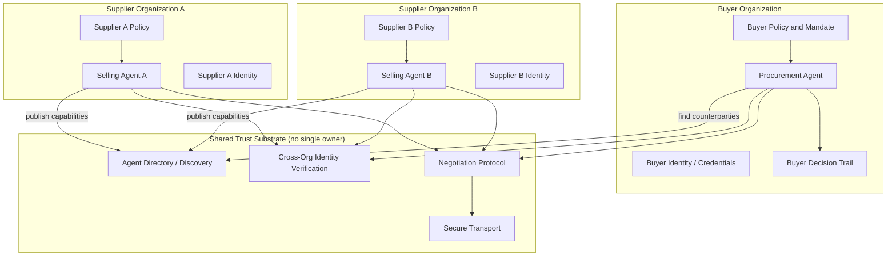

## Archetype 5: Collaborating, self-directed agents — *collaborating*

*The orchestrator is gone. When no single party controls the system, trust has to be built into the architecture itself.*

### What changes here

Every archetype before this one assumes a boundary. An LLM-assisted workflow runs inside your pipeline. A goal-directed agent works on your task with your tools. An autonomous agent persists and self-corrects, but inside your trust domain, under your policies, with your machine identity. There is always a single operator who can answer who is in charge.

This archetype removes that assumption. Agents collaborate across teams, vendors, and organizational lines, and at the far end they do so on behalf of parties with opposing interests. A buyer's agent optimizing for landed cost talks directly to a seller's agent optimizing for margin. There is no shared orchestrator, no single party in control, and no one who can see the whole decision trail.

It deliberately collapses two ideas that are separable in theory. Coordinated multi-agent systems are independently built agents working toward a shared objective: different teams or vendors, aligned intent. Discoverable, self-interested agents are independent agents with their own goals interacting across organizational lines: different parties, opposed intent. They sit on a continuum of trust and intent, and the infrastructure runs in the same direction. As you move from agents built to cooperate toward agents representing rival interests, every assumption you could leave implicit inside one organization has to become an explicit, verifiable protocol.

Four questions become unavoidable the moment an agent must interact with an agent it does not control:

- **Discovery.** How does your agent find a counterparty, learn what it can do, and decide whether to engage, without a human wiring them together first?
- **Identity and trust.** How does your agent prove who it is, and verify the same of a counterparty issued by a different organization on a different stack?
- **Protocol.** What shared message contract lets independently built agents negotiate, counteroffer, and settle across a network neither side owns?
- **Accountability.** When two organizations' agents produce an outcome neither operator intended, whose decision trail is authoritative, and how is the dispute resolved?

Part Three walks Meridian's replenishment through all five archetypes, from a model extracting purchase-order data to a procurement agent negotiating a reorder with outside suppliers. The shift to this archetype happens on the last step: through archetype 4 the work is something one organization's agent does to its own systems, and here it becomes something multiple organizations' agents do with each other.

### Running example: sourcing a spring-line reorder across organizations

A hero product from the spring line, a lightweight three-season tent, sells through far faster than forecast. Meridian's pricing agent from Chapter 4 can protect margin, but it cannot conjure more stock. Meridian needs to reorder fast, and the original supplier cannot cover the full quantity in time. Every step so far has lived inside Meridian's own walls. This one crosses the boundary: Meridian's procurement agent must source the shortfall and negotiate terms with several independent suppliers' selling agents, none of which it controls. The procurement agent:

- **Discovers** candidate supplier agents through a directory rather than a hardcoded list of endpoints.
- **Verifies** each counterparty's identity and its claims before exchanging anything of value.
- **Negotiates** with agents optimizing for the other side: issues an RFQ, receives quotes, and trades counteroffers on price, quantity, lead time, and delivery terms.
- **Settles** on terms within its mandate, escalates anything outside it, and records a decision trail it can defend even though it can see only its own half of the exchange.

### Architecture

No box in this picture is owned by both organizations. The trust substrate in the middle is shared infrastructure, open protocols and a directory that no single party controls. Each organization runs its own agent, its own policy engine, and its own decision store, and they meet only through verified, mediated exchange.

```mermaid
graph TB
    subgraph "Buyer Organization"
        BAGENT[Procurement Agent]
        BPOLICY[Buyer Policy and Mandate]
        BIDENT[Buyer Identity / Credentials]
        BLEDGER[Buyer Decision Trail]
    end

    subgraph "Shared Trust Substrate (no single owner)"
        DIR[Agent Directory / Discovery]
        IDV[Cross-Org Identity Verification]
        PROTO[Negotiation Protocol]
        SLIM[Secure Transport]
    end

    subgraph "Supplier Organization A"
        SAGENT[Selling Agent A]
        SPOLICY[Supplier A Policy]
        SIDENT[Supplier A Identity]
    end

    subgraph "Supplier Organization B"
        SAGENT2[Selling Agent B]
        SPOLICY2[Supplier B Policy]
        SIDENT2[Supplier B Identity]
    end

    BAGENT -->|find counterparties| DIR
    SAGENT -->|publish capabilities| DIR
    SAGENT2 -->|publish capabilities| DIR

    BAGENT --> IDV
    SAGENT --> IDV
    SAGENT2 --> IDV

    BAGENT --> PROTO
    SAGENT --> PROTO
    SAGENT2 --> PROTO
    PROTO --> SLIM

    BPOLICY --> BAGENT
    SPOLICY --> SAGENT
    SPOLICY2 --> SAGENT2
    BAGENT --> BLEDGER
```

The buyer's internal stack (policy, identity, decision trail) is the archetype 4 architecture, intact. What is new is the substrate: a directory for discovery, identity verification that works across organizations, a secure transport for messages crossing a network neither side owns, and a shared negotiation protocol that gives both agents the same vocabulary for offers and counteroffers. Each agent consults its own policy engine privately; neither can see the other's mandate, reservation price, or escalation rules. Three terminal branches make up the decision space: settle within mandate, escalate beyond it, or walk away. Walk-away matters here in a way it never did inside one organization, because a counterparty can refuse, stall, or behave adversarially, and your agent has to disengage cleanly rather than concede.

A word on maturity, and on how to read the diagram, before the specifics. The boxes above name *capabilities*, not products: discovery, cross-organization identity, a shared negotiation contract, secure transport, and correlatable accountability. Those capabilities are what matter and will persist. The specific standards and implementations that fill each slot are still moving, and no enterprise should treat any of them as settled infrastructure yet.

The examples we name below are drawn mostly from AGNTCY because it is open, concrete, and spans every slot in one place, which makes it easy to reason about — but it is one approach among several, not the reference implementation, and each slot has real alternatives worth evaluating:

- **Discovery:** AGNTCY's Agent Directory and OASF; also emerging registry conventions layered on A2A Agent Cards.
- **Cross-organization identity:** AGNTCY Identity; also W3C Decentralized Identifiers (DIDs) and Verifiable Credentials, and established federation such as OIDC/OAuth applied to agents.
- **Negotiation protocol:** A2A, and vendor agent frameworks that speak it — or their own equivalent — over a chosen transport. (The Model Context Protocol is *not* an alternative here: it exposes tools and context to a single agent, a different layer, and complements A2A rather than competing with it.)
- **Secure transport:** SLIM; also plain gRPC/HTTP and message buses such as NATS.
- **Accountability:** AGNTCY's Observe SDK; also OpenTelemetry as the open standard most agent telemetry builds on.

Two of these differ sharply in governance, and a buyer should know which is which. A2A began at Google and was donated to the Linux Foundation in 2025, where it is now governed by a technical steering committee spanning AWS, Cisco, Google, IBM, Microsoft, Salesforce, SAP, and ServiceNow, with well over a hundred organizations participating — it is a genuinely multi-vendor standard. The AGNTCY-specific pieces (OASF, SLIM, the Observe SDK, AGNTCY Identity) are open and now under Linux Foundation stewardship too, but are single-origin and far younger. Treat a broadly adopted standard and a single-ecosystem stack as different bets with different lock-in profiles, not interchangeable "leading candidates." Track the maturity of each closely instead of assuming it.

**Discovery.** Inside one organization you wire agents together by hand. Across organizations that does not scale: Meridian's procurement agent has no standing list of suppliers who can cover the tent shortfall, and waiting for someone to wire one up defeats the point. Agents need to find each other and learn what a counterparty can do before engaging. An agent directory provides this. In the AGNTCY model, as one example, agents describe themselves using the [Open Agentic Schema Framework (OASF)](https://docs.agntcy.org/), a machine-readable description of capabilities and identity independent of the framework or vendor, and the Agent Directory lets organizations announce and discover those descriptions; A2A carries a similar idea in its Agent Cards. A supplier's selling agent publishes what it can offer — product lines, available quantities, lead times — and Meridian's agent queries for the ones that match its shortfall. Capability descriptions function as contracts: your agent decides whether to engage based on a structured, verifiable description rather than a PDF integration guide. Discovery must be filtered by policy, because finding a supplier's agent is not the same as being cleared to buy from it.

**Identity and trust across boundaries.** Archetype 4 gave your agent a durable, scoped, revocable credential. This archetype adds the harder half: verifying the identity of an agent someone else issued. The general technique is decentralized identity — W3C Decentralized Identifiers and Verifiable Credentials — so claims can be checked cryptographically instead of on faith; the [AGNTCY Identity](https://github.com/agntcy/identity) model is one implementation of that idea. Before Meridian's agent commits budget to a supplier it has never dealt with, it must answer whether the counterparty is who it says it is, whether its claims — capacity, certifications, on-time record — are verifiable or merely self-asserted, and whether the selling agent is actually authorized to commit its supplier to a deal. Trust is graduated: aligned teams may need only lightweight verification, while self-interested agents representing rival parties need verified identity, signed messages, and non-repudiable records, because the incentive to misrepresent is real.

**Protocol.** Two agents built on different stacks cannot negotiate unless they share a message contract. [A2A](https://a2a-protocol.org) — now a Linux Foundation project with broad multi-vendor backing — defines how agents exchange structured messages and take turns, independent of how either is implemented. (The Model Context Protocol sits at a different layer — exposing tools and context to a single agent, not connecting two agents to negotiate — so it complements A2A rather than substituting for it.) SLIM (Secure Low-Latency Interactive Messaging) is one encrypted transport that can sit beneath the protocol, supporting request-reply, fire-and-forget, and group communication; plain gRPC or a message bus such as NATS can play the same role. A2A can run over any of them without changing, showing that the negotiation contract and the transport are separable. For Meridian's reorder, the protocol layer must encode, at minimum, the structure of an offer — the RFQ and each supplier's quote — how counteroffers on price, quantity, and lead time reference prior turns, how a deal is committed and confirmed, and how either party signals walk-away. Ambiguity here produces a disputed tent order, with money attached.

**Accountability when no one sees the whole picture.** In archetype 4, one operator could reconstruct the full trail. Across organizations, Meridian sees only its own half of the reorder — the RFQ it sent, the quotes it received, the terms it accepted — never the supplier's internal reasoning. This forces non-repudiable exchange, signed offers and acceptances tied to verified identities so a settled tent order is provable by either party independently; correlatable trails, shared correlation identifiers on every message so two half-trails can be lined up if the delivery is later disputed; and cross-organization observability, where you instrument your side fully and rely on protocol-level evidence for the counterparty's. Telemetry here is conventional observability applied to agents — most implementations build on OpenTelemetry; AGNTCY's Observe SDK, which provides telemetry across a multi-agent application, is one such example.

### Policy

**Mandates: policy that travels to the negotiating table.** Archetype 4's tiers governed what an agent could do to your own systems. Here, policy must govern what an agent may commit you to in a deal with an outside party. That is a mandate.

- **Tier 1, autonomous settle:** accept terms within a defined envelope (price at or below reservation, standard delivery, approved counterparties). Commit without approval.
- **Tier 2, notify on settle:** accept within a wider band but record and notify the buying team immediately.
- **Tier 3, approve before commit:** terms beyond the envelope, novel counterparties, or non-standard clauses queue for human approval.
- **Tier 4, prohibited:** commitments crossing legal or compliance lines, such as counterparties failing identity verification. Hard block, no override without legal review.

The reservation price, term limits, and approved-counterparty list live in a policy store the agent consults privately. The counterparty must never be able to infer your mandate. Leaking your reservation price to a self-interested seller's agent is a direct financial loss.

**Negotiating with an agent that does not share your interests.** An adversarial or buggy counterparty may stall, flood, misrepresent, or try to extract your bounds. Defenses: round and time budgets, so an agent that will not converge within N rounds triggers fallback to the next counterparty rather than looping forever; information minimization, revealing only what each turn requires; counterparty rate limits and reputation, down-weighting agents that repeatedly stall, renege, or probe; and walk-away as a safeguard, the clean disengagement that stops a hostile counterparty from holding your agent and your budget hostage.

**Inherited safeguards, extended outward.** The archetype 4 machinery now guards a more dangerous surface. A manual halt must sever active negotiations and revoke in-flight commitments, and magnitude limiters must cap total committed spend across all concurrent negotiations rather than per deal. If oversight connectivity drops, the agent suspends new commitments instead of dealing blind. Drift detection now watches the relationship: are settled terms with a given counterparty trending against you over time in a way that passes per-deal policy but signals systematic disadvantage?

**Dispute and arbitration.** When two organizations' agents produce an outcome neither operator intended, "whose policy wins?" has no local answer. Pre-agreed dispute terms should be referenced in the protocol exchange before either agent commits. Correlated, non-repudiable trails from both sides feed a defined arbitration path, human, contractual, or a trusted third party, rather than a stalemate of two partial logs. Liability mapping should be clear in advance, and an unverified or out-of-mandate commitment should be void by protocol, so it never reaches litigation.

### Readiness checklist

Architecture:
- [ ] Agent directory for discovery, with machine-readable capability descriptions (e.g., OASF, or A2A Agent Cards)
- [ ] Cross-organization identity verification, cryptographic rather than self-asserted (e.g., W3C DIDs and Verifiable Credentials, or AGNTCY Identity)
- [ ] Shared negotiation protocol (e.g., A2A) over secure transport (e.g., SLIM or gRPC), kept separable
- [ ] Non-repudiable, signed exchange with shared correlation identifiers
- [ ] Your side fully instrumented; protocol-level evidence relied on for the counterparty

Policy:
- [ ] Mandate tiers defining what the agent may commit you to, held in a private policy store
- [ ] Counterparty cannot infer your mandate or reservation price
- [ ] Round and time budgets, information minimization, and counterparty reputation in place
- [ ] Kill switch severs live negotiations and in-flight commitments; spend capped across all deals
- [ ] Pre-agreed dispute terms, arbitration path, and liability mapping defined before commitment

### Where this leaves the model

The five archetypes were never a ladder. Each is the right tool for a class of problem, and most production systems run several at once. This archetype is where the foundations earn their keep: durable identity, auditable decision trails, and enforceable policy were good engineering inside one organization, and across organizations, with no orchestrator to fall back on, they are what makes collaboration safe rather than reckless. The far end is already being built. [MIT Sloan's Sinan Aral](https://mitsloan.mit.edu/faculty/directory/sinan-aral) describes a marketplace of agents representing both sides of every transaction, which is the long-term vision behind efforts like the Linux Foundation's Agent2Agent project and the AGNTCY Internet of Agents. Early versions of the protocols exist today, though they are not yet settled infrastructure. What remains unsolved is harder than any single standard: trust between parties who do not share interests, accountability when no one sees the whole picture, and arbitration when two faithful agents reach an outcome both operators regret. The organizations that get there will be the ones that did archetypes 3 and 4 well, because in archetype 5 your internal rigor is the credential the rest of the ecosystem checks you against.
