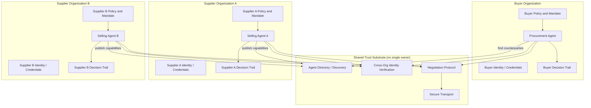

## Archetype 5: Collaborating, self-directed agents — *collaborating*

*The orchestrator is gone. When no single party controls the system, trust has to be built into the architecture itself.*

### What changes here

Every archetype before this one assumes a boundary. An LLM-assisted workflow runs inside your pipeline. A goal-directed agent works on your task with your tools. An autonomous agent keeps running and corrects itself, but inside your trust domain, under your policies, with your machine identity. There is always one operator who can say who is in charge.

This archetype removes that assumption. Agents work together across teams, vendors, and organizational lines, and at the far end they do so on behalf of parties whose interests are opposed. A buyer's agent working for the lowest landed cost talks directly to a seller's agent working for margin. There is no shared orchestrator, no single party in control, and nobody who can see the whole decision trail.

It deliberately folds together two ideas that are separable in theory. Coordinated multi-agent systems are separately built agents working toward a shared goal: different teams or vendors, the same intent. Discoverable, self-interested agents are independent agents with their own goals, meeting across organizational lines: different parties, opposing intent. The two sit on one range of trust and intent, and the infrastructure runs in the same direction. The further you move from agents built to cooperate toward agents representing rival interests, the more of what you could leave unsaid inside one organization has to become an explicit, checkable protocol.

Four questions become unavoidable the moment an agent has to deal with an agent it does not control:

- **Discovery.** How does your agent find a counterparty, learn what it can do, and decide whether to engage, without a human wiring them together first?
- **Identity and trust.** How does your agent prove who it is, and check the same for a counterparty whose credentials came from a different organization on a different stack?
- **Protocol.** What shared message contract lets separately built agents negotiate, counteroffer, and settle across a network neither side owns?
- **Accountability.** When two organizations' agents produce an outcome neither operator wanted, whose decision trail counts, and how does the dispute get settled?

The value: reach beyond your own walls, to supply, demand, and terms your systems could never touch on their own. The price is depending on trust infrastructure the industry is still building, and on counterparties whose interests are not yours.

The shift into this archetype happens at one point. Through archetype 4, the work is something one organization's agent does to its own systems. Here it becomes something several organizations' agents do with each other.

### Running example: sourcing a spring-line reorder across organizations

A hero product from the spring line, a lightweight three-season tent, sells through far faster than forecast. Meridian's pricing agent from archetype 4 can protect margin, but it cannot conjure more stock. Meridian needs to reorder fast, and the original supplier cannot cover the full quantity in time. Every step so far has lived inside Meridian's own walls. This one crosses the boundary: Meridian's procurement agent has to source the shortfall and negotiate terms with several independent suppliers' selling agents, none of which it controls. The procurement agent:

- **Discovers** candidate supplier agents through a directory instead of a hardcoded list of endpoints.
- **Verifies** each counterparty's identity and its claims before exchanging anything of value.
- **Negotiates** with agents working for the other side: it issues an RFQ, takes in quotes, and trades counteroffers on price, quantity, lead time, and delivery terms.
- **Settles** on terms within its mandate, escalates anything outside it, and records a decision trail it can defend even though it can see only its own half of the exchange.

### Architecture

No box in this picture is under one party's control. The trust substrate in the middle is shared infrastructure: open protocols and a directory that no single party owns. Each organization runs its own agent, its own policy engine, and its own decision store, and they meet only through verified, mediated exchange.

```mermaid
graph TB
    subgraph "Buyer Organization"
        BAGENT[Procurement Agent]
        BPOLICY[Buyer Policy and Mandate]
        BIDENT[Buyer Identity / Credentials]
        BLEDGER[Buyer Decision Trail]
    end

    subgraph "Shared Trust Substrate (no single owner)"
        DIR[Agent Directory / Discovery]
        IDV[Cross-Org Identity Verification]
        PROTO[Negotiation Protocol]
        TRANSPORT[Secure Transport]
    end

    subgraph "Supplier Organization A"
        SAGENT[Selling Agent A]
        SPOLICY[Supplier A Policy and Mandate]
        SIDENT[Supplier A Identity / Credentials]
        SLEDGER[Supplier A Decision Trail]
    end

    subgraph "Supplier Organization B"
        SAGENT2[Selling Agent B]
        SPOLICY2[Supplier B Policy and Mandate]
        SIDENT2[Supplier B Identity / Credentials]
        SLEDGER2[Supplier B Decision Trail]
    end

    BAGENT -->|find counterparties| DIR
    SAGENT -->|publish capabilities| DIR
    SAGENT2 -->|publish capabilities| DIR

    BAGENT --> IDV
    SAGENT --> IDV
    SAGENT2 --> IDV

    BAGENT --> PROTO
    SAGENT --> PROTO
    SAGENT2 --> PROTO
    PROTO --> TRANSPORT

    BPOLICY --> BAGENT
    SPOLICY --> SAGENT
    SPOLICY2 --> SAGENT2
    BAGENT --> BLEDGER
    SAGENT --> SLEDGER
    SAGENT2 --> SLEDGER2
```

The buyer's internal stack (policy, identity, decision trail) is the archetype 4 architecture, intact. What is new is the substrate. A directory for discovery. Identity checks that work across organizations. A secure transport for messages crossing a network neither side owns. And a shared negotiation protocol that gives both agents the same vocabulary for offers and counteroffers. Each agent consults its own policy engine privately. Neither can see the other's mandate, reservation price, or escalation rules. Every organization keeps its own decision trail, and the trails never merge. That is the structural reason accountability is hard here: there is no combined record, only halves that have to be matched up after the fact. The agent can settle within its mandate, escalate beyond it, or walk away. Walking away matters here in a way it never did inside one organization, because a counterparty can refuse, stall, or act against you, and your agent has to disengage cleanly rather than concede.

A word on maturity before the specifics. The boxes above name *capabilities*, not products: discovery, cross-organization identity, a shared negotiation contract, secure transport, and accountability records that can be matched across parties. Those capabilities are what matter and will last. The standards and products filling each slot are still moving, and no enterprise should treat any of them as settled infrastructure yet. That is why the sections below argue for the capability and name products only as examples.

**Discovery.** A directory pays off inside one organization and becomes unavoidable across several. Meridian's procurement agent has no standing list of suppliers who can cover the tent shortfall, and nobody to hand-wire it to. Suppliers publish machine-readable descriptions of what they offer, and the agent queries for matches. Those descriptions work as contracts: your agent decides whether to engage from a structured, checkable description instead of a PDF integration guide. A2A's Agent Cards are one form of this. Discovery has to be filtered by policy, because finding a supplier's agent is not the same as being cleared to buy from it.

**Identity and trust across boundaries.** Archetype 4 gave your agent a durable, scoped, revocable credential. This archetype adds the harder half: checking the identity of an agent someone else issued. The technique is decentralized identity, where identifiers and credentials issued by one party are checked cryptographically by another, so a claim is proved rather than taken at its word. Before Meridian's agent commits budget to a supplier it has never dealt with, three questions need answers. Is the counterparty who it says it is? Are its claims about capacity, certifications, and on-time record checkable, or merely asserted? And is this selling agent actually authorized to commit its supplier to a deal?

**Protocol.** Two agents built on different stacks cannot negotiate unless they share a message contract. [A2A](https://a2a-protocol.org) defines how agents trade structured messages and take turns, whatever either one is built on. It sits apart from the transport underneath and runs unchanged over whichever transport you pick. Keep that separation, because the transport is the piece most likely to be replaced. (The Model Context Protocol is not an alternative. It exposes tools and context to a single agent, a different layer, and it works alongside A2A rather than replacing it.) For Meridian's reorder, the contract has to carry four things at minimum: the shape of an offer, how counteroffers on price, quantity, and lead time refer back to earlier turns, how a deal is committed and confirmed, and how either party signals a walk-away. Vagueness in any of the four is what a disputed order is later argued over.

**Accountability when no one sees the whole picture.** In archetype 4, one operator could rebuild the full trail. Across organizations, Meridian sees only its own half of the reorder — the RFQ it sent, the quotes it received, the terms it accepted — never the supplier's internal reasoning. Three things follow. Neither side can be left able to deny what it agreed to, so sign offers and acceptances and tie them to verified identities, and either party can then prove a settled order on its own. The two trails have to line up, so put a shared identifier on every message and the two half-records can be matched if the delivery is later disputed. And observability stops at your boundary, so instrument your side fully and rely on what the protocol records for the counterparty's side. The telemetry itself is ordinary distributed tracing. What is new is matching it against a counterparty you cannot instrument.

### Policy

**Mandates: policy that travels to the negotiating table.** Archetype 4's tiers governed what an agent could do to your own systems. Here, policy has to govern what an agent may commit you to in a deal with an outside party. That is a mandate.

- **Tier 1, autonomous settle:** accept terms inside a defined envelope (price at or below reservation, standard delivery, approved counterparties). Commit without approval.
- **Tier 2, notify on settle:** accept inside a wider band, but record it and notify the buying team immediately.
- **Tier 3, approve before commit:** terms beyond the envelope, new counterparties, or non-standard clauses queue for human approval.
- **Tier 4, prohibited:** commitments that cross legal or compliance lines, such as dealing with counterparties that fail identity checks. Hard block, no override without legal review.

The reservation price, term limits, and approved-counterparty list live in a policy store the agent consults privately. The counterparty must never be able to work out your mandate. Leaking your reservation price to a self-interested seller's agent is a direct financial loss.

**Negotiating with an agent that does not share your interests.** A hostile or buggy counterparty may stall, flood you with messages, misrepresent itself, or probe for your limits. Four defenses. Round and time budgets, so an agent that will not converge within N rounds falls back to the next counterparty instead of looping forever. Information minimization, revealing only what each turn requires. Counterparty rate limits and reputation, down-weighting agents that repeatedly stall, renege, or probe. And walk-away as a safeguard: the clean disengagement that stops a hostile counterparty from holding your agent and your budget hostage.

**Inherited safeguards, extended outward.** The archetype 4 machinery now guards a more dangerous surface. A manual halt has to cut off live negotiations and revoke commitments still in flight, and size limiters have to cap total committed spend across all concurrent negotiations, not per deal. If the link to oversight drops, the agent stops making new commitments instead of dealing blind. Drift detection now watches the relationship: are settled terms with a given counterparty trending against you over time in a way that passes each per-deal check but adds up to a systematic disadvantage?

**Dispute and arbitration.** When two organizations' agents produce an outcome neither operator wanted, "whose policy wins?" has no local answer. Dispute terms should be agreed in advance and referenced in the protocol exchange before either agent commits. Matched, signed trails from both sides feed a defined arbitration path — human, contractual, or a trusted third party — instead of a stalemate of two partial logs. Who is liable for what should be clear in advance, and a commitment that fails verification or falls outside the mandate should be void under the protocol, so it never reaches court.

### Other examples that fit archetype 5

An outside AI assistant discovering and buying from your catalog on a shopper's behalf. Freight and logistics capacity booked agent-to-agent across carriers. Insurance claims settled between a carrier's agent and a repair network's. Advertising inventory negotiated between buy-side and sell-side agents. And, at the cooperative end of the range, agents built by different vendors or internal teams working to a shared goal across systems neither team owns. The cooperative cases are the realistic near-term work. The adversarial ones are where the trust infrastructure has to be complete.

### Readiness checklist

Architecture — minimum to launch:
- [ ] Cross-organization identity checks that are cryptographic rather than self-asserted
- [ ] Shared negotiation protocol (e.g., A2A) over secure transport, kept separable
- [ ] Signed exchange neither side can later deny, with shared correlation identifiers
- [ ] Your side fully instrumented

Architecture — required at scale:
- [ ] Agent directory for discovery, with machine-readable capability descriptions (e.g., A2A Agent Cards) — a first deployment can run against a short vetted counterparty list instead
- [ ] Protocol-level evidence collected and matchable against the counterparty's half of the trail

Policy — minimum to launch:
- [ ] Mandate tiers defining what the agent may commit you to, held in a private policy store
- [ ] Counterparty cannot work out your mandate or reservation price
- [ ] Round and time budgets, and information minimization per turn
- [ ] Kill switch cuts off live negotiations and in-flight commitments; spend capped across all deals
- [ ] Dispute terms, arbitration path, and liability all agreed before commitment

Policy — required at scale:
- [ ] Counterparty reputation tracked, down-weighting agents that stall, renege, or probe
- [ ] Relationship-level drift detection on terms settled with each counterparty over time

### Where this leaves the framework

The five archetypes were never a ladder, and most production systems run several at once. This is where the foundations earn their keep. Durable identity, auditable decision trails, and enforceable policy were good engineering inside one organization. Across organizations, with no orchestrator to fall back on, they are what separates collaboration from recklessness. The far end is already being built: [MIT Sloan's Sinan Aral](https://mitsloan.mit.edu/faculty/directory/sinan-aral) describes a marketplace of agents representing both sides of every transaction. But what is still unsolved is harder than any standard. Trust between parties who do not share interests. Accountability when no one sees the whole picture. Arbitration when two faithful agents reach an outcome both operators regret. The organizations that get there will be the ones that did archetypes 3 and 4 well, because here your internal rigor is the credential the rest of the ecosystem checks you against.
