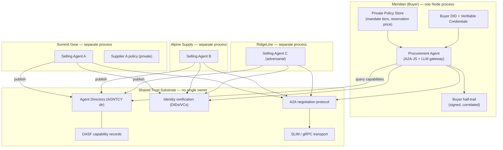

# Meridian Crossing — Prototype Spec (Overview)

> A hackathon-ready reference prototype for **Archetype 5: Collaborating, self-directed agents**,
> the final chapter of *From Orchestration to Autonomy*. Built on the real **AGNTCY** stack and the
> **A2A** protocol, with the agents themselves written in **TypeScript**.

---

## 1. What this is

Every earlier archetype in the book assumes a single operator who owns the whole system. Archetype 5
removes that assumption: agents from **different organizations, with opposed interests**, negotiate a
real commercial outcome across a **trust substrate no single party controls**.

**Meridian Crossing** makes that concrete and watchable. It implements the book's running example —
Meridian Outfitters' procurement agent sourcing an urgent spring-line tent reorder from independent
supplier agents it does not control — as a small, runnable, multi-process system.

The name is deliberate: every other archetype does work *inside Meridian's walls*. This one is the
first time the work **crosses the boundary** between organizations.

## 2. The scenario (the demo story)

> The hero product of the spring line — a lightweight three-season tent (SKU `MER-TENT-3S`) — sells
> through **far faster than forecast**. Meridian's autonomous pricing agent (Archetype 4) can protect
> margin but cannot conjure stock. The original supplier can cover only part of the shortfall in time.
> Meridian's **procurement agent** must source the rest by negotiating with several independent
> suppliers' **selling agents**, none of which it controls.

Meridian needs **5,000 units within 21 days**. The original supplier covers 2,000. The procurement
agent must source the remaining **3,000 units** on the open exchange.

Three mock supplier agents are seeded to trigger the three terminal branches the book names as the
whole decision space — **settle within mandate, escalate beyond it, walk away**:

| Supplier agent | Behaviour | Outcome it forces |
|---|---|---|
| **Summit Gear Co.** (verified, cooperative) | Quotes above reservation, concedes over 2–3 rounds to land inside the mandate envelope | **Settle within mandate** — committed autonomously |
| **Alpine Supply Ltd.** (verified, firm) | Best capacity, but final price/lead-time sits just outside the envelope | **Escalate** — queued for human approval |
| **RidgeLine Trading** (adversarial / unverifiable) | Fails or partially fails identity verification, then stalls and probes for the reservation price | **Walk away** — disengaged cleanly, never committed to |

That table *is* the demo. An audience watches the buyer's agent discover the three, verify them,
run parallel negotiations, and reach a different, defensible outcome with each — all while the buyer
and sellers run as **separate processes that can only see their own half of the exchange.**

## 3. The four unavoidable questions → milestones

The chapter says four questions "become unavoidable the moment an agent must interact with an agent
it does not control." They map almost one-to-one onto the milestones, with a policy layer, an
accountability layer, and a demo layer on top of the book's foundation.

| # | Chapter capability | AGNTCY / standard component | Milestone file |
|---|---|---|---|
| 0 | *(foundation)* | A2A-JS runtime + transport + seed data | `01-milestone-0-foundation.md` |
| 1 | **Discovery** | Agent Directory + OASF capability records | `02-milestone-1-discovery.md` |
| 2 | **Identity & trust** | AGNTCY Identity (W3C DIDs + Verifiable Credentials) | `03-milestone-2-identity-trust.md` |
| 3 | **Protocol** | A2A negotiation contract over SLIM / gRPC | `04-milestone-3-negotiation-protocol.md` |
| — | **Policy (mandate)** | Private policy store + mandate tiers | `05-milestone-4-mandate-policy.md` |
| 4 | **Accountability** | Signed, correlated trails + Observe SDK / OTel | `06-milestone-5-accountability.md` |
| — | *(demo experience)* | Dual half-trail dashboard + runbook | `07-milestone-6-demo-experience.md` |
| — | **Settlement** *(optional extension)* | Stripe Machine Payments Protocol + stablecoin financial account | `08-milestone-7-settlement.md` |

Read the milestones in order — each adds **exactly one thing** to the one before it, and each ends at
a **demoable checkpoint** so a team can stop at any milestone and still show something real. Milestone 7
(settlement) is an optional extension: it turns the `SETTLE` state from a no-op into real money moving
across the boundary, and is only worth building once M0–M5 work.

## 4. Architecture

No box below is owned by both organizations. The buyer's internal stack is the intact Archetype 4
architecture (policy engine, identity, decision trail). What is new is the **substrate** in the
middle: discovery, cross-org identity, a shared negotiation contract, and secure transport, none of
which any single party controls.



**Hard rule that makes the prototype honest:** the buyer process and each supplier process share
**no memory, no database, and no logger**. They communicate *only* through A2A messages over the
transport. Each keeps its own half-trail. The demo dashboard reconstructs the full picture *after the
fact* by lining up correlation IDs across the two half-trails — exactly the accountability problem the
chapter describes, not a shortcut around it.

## 5. Stack

| Layer | Choice | Why |
|---|---|---|
| Agent reasoning | **TypeScript**, calling an **LLM gateway** (provider-agnostic — set base URL + model via env; e.g. an OpenAI-compatible gateway) | Agents author RFQs, evaluate quotes, and choose counteroffers with an LLM; no code is tied to a specific model or vendor |
| Agent-to-agent protocol | **`@a2a-js/sdk`** (official A2A JS SDK, Linux Foundation) | The real, multi-vendor negotiation contract; TS-native |
| Transport | **SLIM** via `slim-a2a-node`, with **gRPC/HTTP** fallback | Protocol and transport are separable — spec supports both so a team is never blocked on transport-binding maturity |
| Discovery | **AGNTCY Agent Directory** (`dir`) + **OASF** (`oasf-sdk`) capability records | Real federated, content-addressed, signed capability registry |
| Identity | **AGNTCY Identity** — W3C **DIDs** + **Verifiable Credentials** | Cryptographic, cross-org, not self-asserted |
| Accountability | **OpenTelemetry-JS** emitting spans on the **AGNTCY observability schema**; AGNTCY **Observe** for collection | OTel is the open standard all agent telemetry builds on |
| Persistence | SQLite (or flat signed JSONL) per organization | Two independent stores, never shared — this is the point |
| Demo UI | **Next.js** dashboard, SSE from each org's event stream | Shows the two half-trails side by side |

> **Fidelity note.** Use the real SDKs. Where a TypeScript binding for an AGNTCY component is still
> immature (SLIM node binding, dir JS SDK, Identity), the spec names an explicit fallback (gRPC/HTTP
> transport; call the directory/identity **services** over their REST/gRPC APIs from TS instead of a
> native SDK). The book itself stresses these standards are *moving and not yet settled
> infrastructure* — pin exact versions up front (see `01-milestone-0-foundation.md`) and treat any
> binding gap as a fallback, not a blocker.

## 6. Repository layout

```
meridian-crossing/
├── packages/
│   ├── protocol/        # shared A2A message schemas (OFFER, QUOTE, COUNTER, SETTLE, WALKAWAY) + zod validators
│   ├── agent-runtime/   # TS harness: A2A server/client, transport factory, LLM-gateway reasoning loop, OTel spans
│   ├── buyer/           # Meridian procurement agent + private policy store + buyer half-trail
│   ├── supplier-summit/ # cooperative selling agent   (settles)
│   ├── supplier-alpine/ # firm selling agent          (escalates)
│   ├── supplier-ridge/  # adversarial selling agent   (walk-away)
│   ├── dashboard/       # dual half-trail viewer + kill switch
│   └── settlement/      # (M7, optional) Stripe MPP client + stablecoin financial account adapter
├── infra/
│   ├── slim/            # local SLIM node (docker-compose) + gRPC fallback config
│   ├── dir/             # AGNTCY Agent Directory (docker-compose)
│   └── identity/        # AGNTCY Identity service + issued DIDs/VCs seed
├── seed/                # SKU, shortfall, mandate, supplier catalogs, credential fixtures
└── spec/                # this folder
```

Each organization is its own package with its own process and its own store. The `protocol` package is
the *only* code the buyer and suppliers share — a shared vocabulary, never shared state.

## 7. End-to-end demo script (target: ~4 minutes)

1. **Setup on screen (10s).** Three supplier processes and the buyer process start in separate panes.
   Directory and Identity services are up. Nobody is wired to anybody by hand.
2. **Discovery (M1).** Buyer queries the directory for agents whose OASF record advertises
   `three-season-tent` capacity ≥ 3,000 with lead time ≤ 21 days. Three candidates come back. Policy
   filters out none yet — being *findable* is not being *cleared to buy*.
3. **Verification (M2).** Buyer verifies each candidate's DID and checks its Verifiable Credentials
   (business identity, on-time-delivery attestation). **Summit and Alpine verify; RidgeLine fails.**
   RidgeLine is dropped before anything of value is exchanged — the dashboard shows the hard block.
4. **Negotiation (M3 + M4).** Buyer opens **parallel** A2A negotiations with Summit and Alpine. The
   audience watches offers and counteroffers stream. Summit converges inside the mandate →
   **auto-settle**. Alpine's best terms land outside the envelope → **escalate to the approval queue**.
5. **Adversarial defense (M4).** RidgeLine (if re-admitted for demo) stalls and probes; the round
   budget and information-minimization rules fire; buyer **walks away**. Reservation price never leaks.
6. **Accountability (M5).** Split-screen: buyer's signed half-trail on the left, Summit's on the right.
   They share correlation IDs and match on the settled terms — a deal **either side can prove
   independently**. Hit the **kill switch**: the live Alpine negotiation is severed and in-flight
   commitments revoked.

## 8. Scope boundaries (say these out loud at the hackathon)

**In scope:** discovery, cross-org identity verification, a real A2A negotiation contract, a private
mandate policy engine, adversarial-counterparty defenses, dual signed decision trails, and a dashboard.

**Optional in-scope (Milestone 7):**
- **Settlement rails.** Base build stops at `CONFIRM` (no payment). The optional settlement milestone
  moves real money across the boundary via **Stripe** — card/ACH or, more interestingly, **stablecoin**
  — always in Stripe **test mode** / testnet, never live funds.

**Out of scope (and why it's fine):**
- **Real supplier ERPs.** Suppliers are mock agents with seeded catalogs (the book's "integration is
  the real cost" point is acknowledged in `01`, not solved here).
- **Production dispute arbitration.** We *reference* pre-agreed dispute terms in the protocol and
  produce the correlated trails an arbitrator would need, but implement no arbitration service.
- **Multi-round reputation learning.** Reputation is a static seeded score with a documented hook for
  where learning would attach.

State the boundary explicitly: this prototype demonstrates that the **four questions can be answered
with real, open standards today** — not that the ecosystem is settled. It isn't, and the book says so.
The business scenario (an urgent cross-supplier reorder) is one any procurement team recognizes; what
is deliberately *near-future* is an agent **autonomously committing** the company to a deal. That gap
is the point of Archetype 5, not a flaw in the demo — show that the plumbing is buildable now, and be
honest that enterprises are not yet running this unattended in production.

## 9. Build order and fallback scope

Build the milestones in order — each adds exactly one thing to the one before it. M0 (foundation)
unblocks everything else, so start there; M1/M2 and M5/M6 each pair up naturally if more than one
person is building.

The **minimum credible demo is M0→M3** — discover, verify, negotiate to a settle. Everything past
that is additive: M4's walk-away and M5's dual-trail split-screen are the highest-impact things to add
next, and M6 is what makes it all watchable. Stop at any milestone and you still have something real
to show.

## 10. Glossary

- **Mandate** — policy that governs what the agent may *commit you to* in a deal, as opposed to what
  it may do to your own systems. Lives in a private store; the counterparty must never infer it.
- **Reservation price** — the worst price the buyer will accept. Leaking it to a self-interested
  seller is a direct financial loss, so it is never sent on the wire.
- **Half-trail** — one organization's signed record of its side of the exchange. Neither party sees
  the other's internal reasoning; accountability comes from lining up two half-trails by correlation ID.
- **Walk-away** — clean disengagement. New in this archetype because a counterparty can refuse, stall,
  or behave adversarially, and the agent must disengage rather than concede.
- **OASF** — Open Agentic Schema Framework; the machine-readable capability description a supplier
  publishes and a buyer queries. Functions as a contract, not a PDF integration guide.
