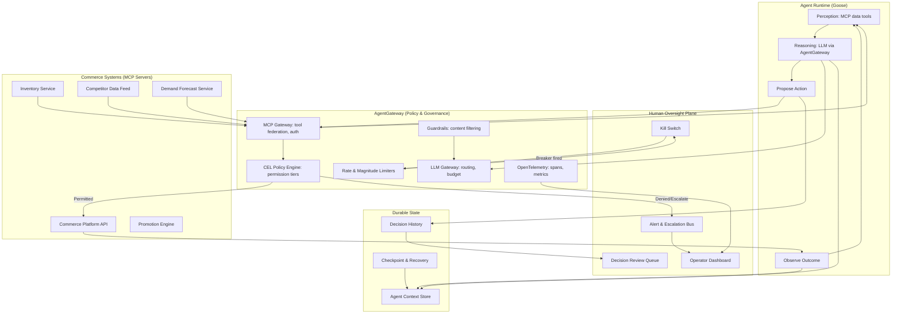

# Meridian Pulse: Prototype Spec (Overview)

> A hackathon-ready reference prototype for **Archetype 4: Autonomous, policy-guided agents**.
> Built on the **Agentic AI Foundation (AAIF)** stack: **Goose** as the agent runtime,
> **AgentGateway** as the policy/governance/observability layer, and **MCP** for tool connectivity.

---

## 1. What this is

Every earlier archetype finishes. Archetype 3 hands an agent a task, it works out the steps, and
it stops. Archetype 4 removes that assumption: the agent **persists**. It monitors a domain,
detects conditions that warrant action, decides what to do, acts, observes the result, and
self-corrects. Continuously. Without a human in the loop for each decision.

**Meridian Pulse** makes that concrete and watchable. It implements a running example, Meridian
Outfitters' **revenue optimization agent** pricing the spring outdoor line through a full season of
shifting demand, as a continuously-running system with real policy gates, circuit breakers, anomaly
detection, and an auditable decision trail.

The name is deliberate: a pulse is continuous, rhythmic, and the first thing you check to know
whether something is alive. Every other archetype produces artifacts and finishes; this one has a
heartbeat.

## 2. The scenario (the demo story)

> Meridian Outfitters' spring outdoor line is live. Thousands of SKUs across tents, packs,
> footwear, and apparel need continuous pricing across a season of shifting demand, weather events,
> competitor moves, and inventory constraints. The merchandising team cannot reprice at the speed
> the market moves. A **revenue optimization agent** watches the domain and acts within policy.

The agent manages a category of **~50 seeded SKUs** (a representative slice). The demo runs an
accelerated "season" where market signals arrive every few seconds instead of hours, making the
continuous behavior visible in a 4-minute demo.

Three seeded market scenarios force the three terminal outcomes an archetype 4 agent must handle,
**autonomous action, escalation, and circuit-breaker halt**:

| Market scenario | What happens | Outcome it forces |
|---|---|---|
| **Competitor undercut on hero tent** | A competitor drops price on `MER-TENT-3S` by 8%; demand signal suggests elastic response | **Autonomous action**: agent reprices within ±5% tier, no approval needed |
| **Weather-driven demand spike** | Unexpected heatwave drives demand spike on hydration packs; optimal price exceeds ±15% threshold | **Escalation**: queued for merchandising approval before execution |
| **Flash crash / anomalous data** | A data feed glitch reports competitor prices at $0; agent proposes cascade of deep cuts across 30 SKUs | **Circuit breaker**: rate/magnitude limiter fires, agent halts, operator alerted |

That table *is* the demo. An audience watches the agent perceive signals, reason about responses,
hit the policy gate, and reach a different outcome for each, all while the operator dashboard shows
the decision trail, behavioral metrics, and kill switch in real time.

## 3. The four problems persistence creates → milestones

Four problems arrive at once the moment an agent persists. They map directly onto the milestones,
with a foundation layer and a demo layer around them.

| # | Problem | AAIF component | Milestone file |
|---|---|---|---|
| 0 | *(foundation)* | Goose agent + AgentGateway + MCP tools + seed data | `01-milestone-0-foundation.md` |
| 1 | **Identity** | AgentGateway auth (JWT/API keys) + scoped MCP tool permissions | `02-milestone-1-identity.md` |
| 2 | **Durable state** | Goose session persistence + checkpoint store | `03-milestone-2-state.md` |
| 3 | **Policy as the OS** | AgentGateway CEL policy engine + rate limiting + guardrails | `04-milestone-3-policy.md` |
| 4 | **Continuous accountability** | OpenTelemetry spans + structured decision trail | `05-milestone-4-accountability.md` |
| 5 | **Anomaly detection & circuit breakers** | AgentGateway rate/magnitude limiters + behavioral baseline | `06-milestone-5-circuit-breakers.md` |
| demo | *(demo experience)* | Dashboard + kill switch + accelerated scenario runner | `07-milestone-6-demo.md` |

Read the milestones in order. Each adds **exactly one thing** to the one before it, and each ends at
a **demoable checkpoint** so a team can stop at any milestone and still show something real.

## 4. Architecture

The agent runtime (Goose) reasons and proposes actions. **Every** tool call passes through
AgentGateway before reaching external systems. AgentGateway is the policy gate: it evaluates
permissions, enforces rate limits, applies guardrails, and emits telemetry. There is no path from
reasoning to action that skips it.



**Hard rule that makes the prototype honest:** the agent *never* calls a commerce system directly.
Every tool invocation routes through AgentGateway, which evaluates it against the policy engine
before forwarding. This makes the "no path from reasoning to action that skips the policy gate" rule
physical rather than aspirational.

## 5. Stack

| Layer | Choice | Why |
|---|---|---|
| Agent runtime | **Goose** (AAIF) | Open source, MCP-native, session management, multi-provider, permission system, recipes for agent config |
| Policy & governance | **AgentGateway** (AAIF) | CEL policy engine for permission tiers, rate limiting for circuit breakers, guardrails for content safety, OpenTelemetry for observability, all without changing agent code |
| Tool connectivity | **MCP** (AAIF) | Universal standard for connecting the agent to commerce systems, data feeds, and actions |
| LLM | Any OpenAI-compatible provider via AgentGateway LLM routing | Provider-agnostic; set via env var |
| State persistence | SQLite (checkpoint store) + JSONL (decision trail) | Simple, file-based, inspectable |
| Demo UI | Web dashboard (SSE from agent event stream) | Shows decision trail, behavioral metrics, escalation queue, kill switch |
| Scenario driver | TypeScript script feeding accelerated market signals | Makes continuous behavior visible in minutes |

> **Why AAIF?** The four projects (Goose, AgentGateway, MCP, AGENTS.md) map directly onto the four
> archetype 4 requirements. Goose provides the autonomous agent loop. AgentGateway provides
> policy-as-the-operating-system and circuit breakers. MCP provides scoped tool access (the action
> surface). AGENTS.md provides project-level guidance for reproducible behavior. No single project
> covers archetype 4 alone; the composition does.

## 6. Repository layout

This build guide lives in the **Hackathon in a Box** (`deliverables/projects/agent-build-lab/archetype-4-meridian-pulse/`). The prototype you build from it lives as a sibling project, `deliverables/projects/archetype-4-meridian-pulse/`, laid out like this:

```
archetype-4-meridian-pulse/          # the runnable prototype (sibling project)
├── packages/
│   ├── agent/              # Goose agent: recipe, system prompt, perception -> reason -> act loop
│   ├── mcp-commerce/       # MCP server: mock commerce platform (read prices, write prices, read promos)
│   ├── mcp-market-data/    # MCP server: competitor prices, demand signals, inventory levels
│   ├── control-plane/      # Operator dashboard: decision trail, metrics, escalation queue, kill switch
│   └── policy/             # AgentGateway CEL policies + permission tier definitions
├── infra/
│   ├── agentgateway/       # AgentGateway config: LLM routing, MCP gateway, policies, rate limits
│   └── otel/               # OpenTelemetry collector config
├── seed/                   # SKU catalog, mandate, baseline metrics, scenario events
└── AGENTS.md               # Project-level agent guidance (the AAIF standard)
```

The milestone files in this folder (this build guide) are what you read to build that prototype.

## 7. End-to-end demo script (target: ~4 minutes)

1. **Startup (10s).** Agent process, AgentGateway, MCP servers, and dashboard start. The agent
   begins its perception loop, reading current prices, inventory, and market data.
2. **Normal operation (30s).** The scenario driver feeds steady-state signals. The agent makes small
   autonomous adjustments within Tier 1 (±5%). Dashboard shows green: actions permitted, decision
   trail growing, behavioral metrics within baseline.
3. **Competitor undercut (M3, 45s).** Hero tent competitor price drops 8%. Agent perceives, reasons
   ("elastic demand, respond with 4% reduction"), proposes via MCP. AgentGateway policy: Tier 1,
   **permitted**. Price change executes. Trail records the reasoning and outcome.
4. **Demand spike (M3, 60s).** Heatwave signal. Hydration packs demand up 40%. Optimal price exceeds
   the ±15% threshold. AgentGateway policy: Tier 3, **escalation required**. Action queued in the
   approval panel. Operator approves on screen; change executes.
5. **Flash crash (M5, 45s).** Glitch: competitor prices report $0 across 30 SKUs. Agent proposes a
   cascade of deep cuts. Rate limiter: "30 actions in one cycle exceeds the 15/hour cap." Magnitude
   limiter: "cumulative revenue impact exceeds $50K threshold." **Circuit breaker fires.** Agent
   halts. Dashboard goes red. Kill-switch button lit.
6. **Recovery & close (30s).** Operator reviews the trail, sees the anomalous signal, hits
   "Resume with data filter." Agent restarts from checkpoint, ignores the glitch, returns to
   normal operation. Dashboard goes green.

## 8. Scope boundaries (say these out loud at the hackathon)

**In scope:** a continuously-running agent with real policy gates (AgentGateway CEL), real circuit
breakers (rate/magnitude limiting), durable state (checkpoints), a tamper-evident decision trail
(OTel + JSONL), anomaly detection, and a kill switch.

**Out of scope (and why it's fine):**
- **Real commerce systems.** MCP servers are mocks with seeded catalogs. The cost and risk of
  integrating with real legacy systems is acknowledged, not solved here.
- **Real market data feeds.** A scenario driver simulates signals at accelerated pace.
- **Machine identity with full lifecycle.** AgentGateway auth (JWT/API keys) provides scoped
  identity; full provisioning/rotation/revocation is documented as the production extension.
- **Multi-agent composition.** This prototype is one agent, one domain. A composition example
  (pricing + content generation + routing) is a documented extension, not built here.

State the boundary explicitly: this prototype demonstrates that **persistence, policy, circuit
breakers, and accountability can be assembled from open AAIF components today**, and that the
archetype's hard parts (what happens when the agent does not stop?) have concrete, buildable
answers.

## 9. Build order and fallback scope

Build the milestones in order. Each adds exactly one thing to the one before it. M0 (foundation)
unblocks everything else, so start there.

The **minimum credible demo is M0 through M3**: a running agent with real policy gates that permit,
escalate, or deny. Everything past that is additive: M4's decision trail makes behavior
reconstructable, M5's circuit breakers make the flash-crash demo possible, and M6 is what makes it
all watchable.

| Milestone | What it adds | Demo value |
|---|---|---|
| M0 | Agent perceives and reasons via AgentGateway | "It's alive: watching and thinking" |
| M1 | Scoped identity, tool permissions | "It can only touch what we allowed" |
| M2 | Checkpointed state, recovery | "It remembers, and survives a restart" |
| M3 | Permission tiers, escalation | "It asks when it should ask" |
| M4 | Decision trail, OTel | "We can reconstruct every decision" |
| M5 | Rate/magnitude limiters, anomaly | "It stops itself before damage" |
| M6 | Dashboard, kill switch, scenario runner | "Watch the whole thing live" |

## 10. Glossary

- **Permission tier**: a policy level defining what the agent may do without approval.
  Tier 1 (autonomous), Tier 2 (notify), Tier 3 (approve), Tier 4 (prohibited).
- **Circuit breaker**: a rate or magnitude limiter that halts the agent when cumulative behavior
  exceeds a threshold, independent of individual action validity.
- **Decision trail**: a structured, append-only record of every action, capturing the trigger,
  reasoning, proposed action, policy result, outcome, and post-action observation. Queryable and
  tamper-evident.
- **Kill switch**: an immediate, unconditional halt. The agent preserves state and waits for human
  review.
- **Mandate**: the full set of boundaries, being permission tiers, rate limits, magnitude caps, and
  prohibited actions. Held in AgentGateway's policy store, adjustable without redeploying the agent.
- **Checkpoint**: a persisted snapshot of the agent's full context (working memory, learned
  patterns, active hypotheses). Enables resume-from-last-known-good after a crash or halt.
- **CEL**: Common Expression Language, the policy language AgentGateway uses to evaluate whether an
  action is permitted, denied, or escalated.
