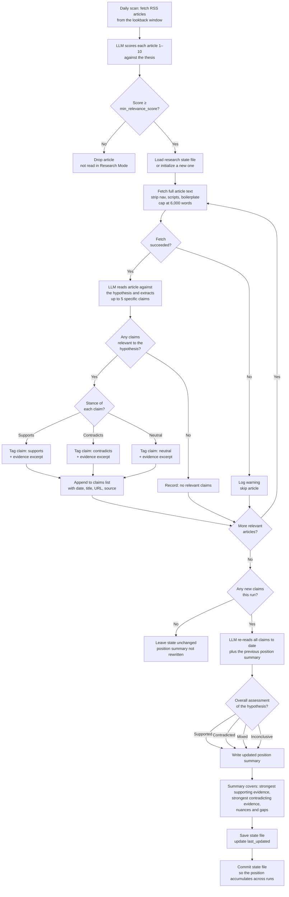

# News Watcher

A GitHub Actions agent that scans RSS feeds daily, scores articles against a configurable thesis using an LLM, and posts matches to Slack. Optionally saves the digest as a GitHub Issue and runs Research Mode to catalog claims against a hypothesis over time.

## How it works

1. Reads a JSON config file describing a thesis, keywords, themes, and a list of publications with RSS feed URLs
2. Fetches articles published in the last 24 hours from each feed
3. Sends article titles and summaries to the configured LLM, which scores each 1–10 for relevance to the thesis
4. Posts articles scoring above the configured threshold to a Slack channel
5. Optionally creates a GitHub Issue with the digest and/or runs Research Mode

## Setup

### Prerequisites

- A GitHub repository with Actions enabled
- An [Anthropic API key](https://console.anthropic.com/), an [OpenAI API key](https://platform.openai.com/api-keys), **or** a [Vercel AI Gateway API key](https://vercel.com/docs/ai-gateway)
- At least one output configured — Slack, GitHub Issues, or Research Mode (see below)

### 1. Add secrets

In your GitHub repository go to **Settings → Secrets and variables → Actions → Repository secrets** and add whichever secrets match your chosen outputs:

| Secret | When required | Value |
|--------|---------------|-------|
| `ANTHROPIC_API_KEY` | If using Anthropic (default) | Your Anthropic API key |
| `OPENAI_API_KEY` | If using OpenAI | Your OpenAI API key |
| `AI_GATEWAY_API_KEY` | If using Vercel AI Gateway | Your Vercel AI Gateway API key |
| `SLACK_WEBHOOK_URL` | If posting to Slack | Your Slack [Incoming Webhook](https://api.slack.com/messaging/webhooks) URL |
| `GITHUB_TOKEN` | If creating GitHub Issues | Provided automatically by Actions — no manual setup needed |

### 2. Configure your watcher

Edit or create a config file in `config/`. See [Configuration](#configuration) below.

### 3. Schedule

The workflow runs automatically at **9:00 AM UTC** every day. You can also trigger it manually from the **Actions** tab using the **Run workflow** button, where you can override the config path, lookback window, AI provider, and optional features.

## Development

### Install git hooks

After cloning, create the virtual environment with the project dependencies plus `pytest`, then install the pre-commit hook that runs unit tests before every commit:

```bash
./run.sh test                      # creates .venv and installs requirements.txt
.venv/bin/pip install pytest
./scripts/install-hooks.sh
```

The hook runs the tests with `.venv/bin/python` when the venv exists, so it sees the same dependencies as the app. If `.venv` is missing it falls back to `python3` on your PATH. When dependencies are missing it fails with the install command to run rather than a stack trace.

Re-run `./scripts/install-hooks.sh` after pulling changes to anything in `scripts/hooks/`, since the hook is copied into `.git/hooks`, not linked.

To run the tests directly at any time:

```bash
.venv/bin/python -m pytest src/test_watcher.py -v
```

Tests also run automatically on every push and pull request via GitHub Actions (`.github/workflows/test.yml`).

## Running locally

Create a `.env` file in the repo root (it is gitignored) with your credentials and any runtime overrides:

```bash
# AI provider — pick one
ANTHROPIC_API_KEY=sk-ant-...      # default provider
# OPENAI_API_KEY=sk-...           # set AI_PROVIDER=openai to use this instead
# AI_GATEWAY_API_KEY=vck_...      # set AI_PROVIDER=vercel to use this instead

# Outputs — configure at least one
SLACK_WEBHOOK_URL=https://hooks.slack.com/services/...   # optional
SAVE_AS_GITHUB_ISSUE=false                               # set true to create an issue each run
GITHUB_TOKEN=ghp_...                                     # needed if SAVE_AS_GITHUB_ISSUE=true
RESEARCH_MODE=false                                      # set true to track claims over time

# Optional overrides (defaults shown)
CONFIG_PATH=config/ai-structured-content.json
LOOKBACK_HOURS=24
AI_PROVIDER=anthropic     # or: openai, vercel
AI_MODEL=claude-sonnet-4-6
```

Before your first run, verify your credentials are working:

```bash
./run.sh test
```

This sends a test message to your Slack channel and makes a minimal LLM API call. If both pass, run the full scan:

```bash
./run.sh
```

`run.sh` loads `.env` automatically, creates a virtual environment on the first run, and reuses it after that.

## Configuration

Each watcher is a JSON file in `config/`. Fields:

```jsonc
{
  // Display name used in Slack messages and GitHub Issues
  "name": "AI + Structured Content Watcher",

  // The core argument the LLM evaluates articles against
  "thesis": "AI functions better when pulling information from structured content",

  // Terms that signal relevance — used to guide scoring
  "keywords": ["RAG", "knowledge graph", "structured data", ...],

  // Broader thematic statements used for context
  "themes": [
    "Structured formats reduce AI hallucination",
    ...
  ],

  // Minimum relevance score (1–10) to include an article
  "min_relevance_score": 6,

  // Post to Slack even when no articles meet the threshold
  "notify_on_empty": false,

  // Publications to scan
  "publications": [
    {
      "name": "VentureBeat AI",
      "rss_url": "https://venturebeat.com/category/ai/feed/"
    }
  ],

  // ── AI provider ──────────────────────────────────────────────────────────

  // Which LLM provider to use. Can also be set via the AI_PROVIDER env var,
  // which takes precedence over this field.
  // Options: "anthropic" (default) | "openai" | "vercel"
  "ai_provider": "anthropic",

  // Model to use. Defaults to "claude-sonnet-4-6" (Anthropic), "gpt-4o"
  // (OpenAI), or "anthropic/claude-sonnet-4-6" (Vercel AI Gateway — model
  // names are prefixed with the upstream provider). Can also be set via the
  // AI_MODEL env var.
  "ai_model": "claude-sonnet-4-6",

  // ── GitHub Issues ─────────────────────────────────────────────────────────

  // When enabled, each run creates a GitHub Issue titled
  // "Daily digest — YYYY-MM-DD" containing the full digest in markdown.
  // Can also be enabled via the SAVE_AS_GITHUB_ISSUE=true env var.
  // Requires GITHUB_TOKEN and GITHUB_REPOSITORY to be set.
  "github_issues": {
    "enabled": false,

    // GitHub username to assign the issue to.
    // Defaults to the repository owner if omitted.
    "assignee": "your-github-username",

    // Labels to apply to the issue (must already exist in the repo).
    "labels": ["daily-digest"]
  },

  // ── Research Mode ─────────────────────────────────────────────────────────

  // When enabled, the watcher fetches the full text of each relevant article,
  // extracts specific claims related to the hypothesis, and maintains a
  // cumulative position summary in a state file. The summary is updated on
  // every run and reflects how the body of evidence supports or contradicts
  // the hypothesis over time.
  // Can also be enabled via the RESEARCH_MODE=true env var.
  "research_mode": {
    "enabled": false,

    // The specific hypothesis to catalog claims against. This is distinct
    // from "thesis" — the thesis guides article filtering, the hypothesis
    // guides claim extraction and position tracking.
    "hypothesis": "AI accuracy improves significantly when retrieval systems are built on well-structured, semantically rich content.",

    // Path (relative to repo root) where the research state is persisted.
    // Commit this file to keep the position summary across runs.
    // In GitHub Actions, the workflow commits it back automatically.
    "state_file": "research/state.json"
  }
}
```

### Research Mode decision tree

When Research Mode is enabled, the agent runs the following decision tree after the daily relevance scan. Only articles that cleared `min_relevance_score` are read in full; everything else is dropped before Research Mode starts.



Key decision points:

- **Relevance gate** — the thesis, keywords, and themes decide which articles are worth reading. Research Mode never sees articles below the threshold.
- **Claim extraction** — each article is judged against the `hypothesis`, not the thesis. An article can be relevant to the thesis yet yield no claims about the hypothesis, in which case it contributes nothing to the state.
- **Stance tagging** — every claim is labelled `supports`, `contradicts`, or `neutral`, and stored with an evidence excerpt so the position can later be audited back to its source.
- **Position synthesis** — the summary is only rewritten when at least one new claim was added. It always weighs the full claim history, so a single day's articles can shift but not erase the accumulated position.

### Research state file

When Research Mode is active, `state_file` is written after each run. It contains:

- **`hypothesis`** — the hypothesis being tracked
- **`position_summary`** — a synthesized narrative of the current overall assessment, updated every run
- **`claims`** — all extracted claims to date, each with `date`, `article_title`, `article_url`, `claim`, `stance` (`supports` / `contradicts` / `neutral`), and `evidence`
- **`last_updated`** — ISO 8601 timestamp of the last update

Commit this file to your repository so the position accumulates across runs. In GitHub Actions, the daily scan workflow commits it back automatically when Research Mode is enabled.

## Adding a new watcher

1. Create a new config file in `config/`, e.g. `config/climate-tech.json`
2. To run it on the same daily schedule, add a second step (or a matrix) to `.github/workflows/daily-scan.yml`:

```yaml
- name: Run climate tech watcher
  env:
    ANTHROPIC_API_KEY: ${{ secrets.ANTHROPIC_API_KEY }}
    SLACK_WEBHOOK_URL: ${{ secrets.SLACK_WEBHOOK_URL }}
    CONFIG_PATH: config/climate-tech.json
  run: python src/watcher.py
```

Or trigger a one-off run manually from the Actions tab with a custom `config_path` input.
