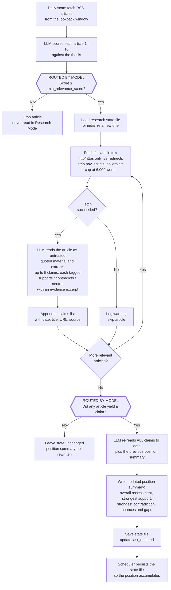

# News Watcher

A research agent for **archetype 2: LLM-directed workflows**. A person writes
the structure: scan these feeds, score against this thesis, read what clears the
bar, catalog claims against this hypothesis. The model then picks which branch
each article takes through it.

It scans RSS feeds on a schedule, scores articles against a configurable thesis
using an LLM, and posts matches to Slack. It can also save the digest as a
GitHub Issue and run Research Mode, which reads the articles that cleared the
bar and builds up a position on a hypothesis across runs.

To present it, see [`HOW-TO-DEMO.md`](./HOW-TO-DEMO.md). For its accepted
limits, see [`docs/known-limitations.md`](./docs/known-limitations.md).

> **This is an unmaintained demo — do not deploy it, and use it at your own
> risk.** No security patches, no advisories, no support, and it is provided
> "as is" under MIT. See [`SECURITY.md`](./SECURITY.md).

## Why this is archetype 2 and not 1

Archetype 1 is a fixed flow where the model generates or transforms at certain
steps. Archetype 2 is a human-authored structure where the model chooses the
path within it. This project sits near that boundary, so it is worth being
precise about which side it falls on.

Two decisions belong to the model, and each sends an item down a different
path:

| | The model decides | The code then does |
|---|---|---|
| **Relevance gate** | how relevant each article is to the thesis, 1–10 | fetches, reads and catalogs it — or drops it and never looks again |
| **Synthesis gate** | how many claims an article yields, where zero is a legitimate answer | rewrites the position summary from the full claim history — or leaves it untouched |

Everything else is authored and fixed across runs: the step order, the word
caps, the three permitted stances, resynthesising from the whole history instead
of today's articles.

**Where this is weak:** each of those two decisions is a yes/no over a single
downstream path. A central archetype-2 example would let the model pick among
branches that do genuinely different work, so this is the thin end of the
category. `docs/known-limitations.md` §1 records what would move it inward.

## How it works

1. Reads a JSON config file describing a thesis, keywords, themes, and a list of publications with RSS feed URLs
2. Fetches articles published in the last 24 hours from each feed
3. Sends article titles and summaries to the configured LLM, which scores each 1–10 for relevance to the thesis
4. Posts articles scoring above the configured threshold to a Slack channel
5. Optionally creates a GitHub Issue with the digest and/or runs Research Mode

## Where the archetype's requirements land in code

| The requirement | Where it lives |
|---|---|
| The structure is human-authored and fixed | `src/watcher.py` `main()`, where the step order is an ordinary function body |
| The model chooses the path within it | `evaluate_relevance()` scores → the relevance gate; `_extract_claims()` returns 0–5 claims → the synthesis gate in `run_research_mode()` |
| That structure is declared where people can read it | `config/*.json` holds the thesis, keywords, themes, threshold and hypothesis, all outside the code |
| Fetched text is treated as data | `_extract_claims()` fences the article body and says it is untrusted; `_fetch_bytes()` pins the scheme and caps redirects |
| The path taken is auditable afterwards | `research/*.json` `claims[]`, where every claim carries date, source, URL, stance and an evidence excerpt |
| State survives between runs | `_load_research_state()` / `_save_research_state()`; the summary is rebuilt from the full claim history each time |
| Recurrence is a deployment concern | no scheduler in this repo: a cron line in [Schedule](#3-schedule), and `./run.sh demo` for three runs against fixtures |

## Setup

### Prerequisites

- Python 3.12+
- One model credential: any **OpenAI-compatible endpoint** via `LLM_BASE_URL` (see [Model routing](#model-routing)), or an [Anthropic API key](https://console.anthropic.com/), an [OpenAI API key](https://platform.openai.com/api-keys), or a [Vercel AI Gateway API key](https://vercel.com/docs/ai-gateway)
- At least one output configured — Slack, GitHub Issues, or Research Mode (see below)

### 1. Set credentials

Put whichever of these match your chosen outputs in a `.env` file at the project root (gitignored), or in the environment of whatever runs the watcher:

| Variable | When required | Value |
|--------|---------------|-------|
| `LLM_BASE_URL` | To use any OpenAI-compatible endpoint | Its base URL, e.g. `https://us.openrouter.ai/api/v1`. Set, it overrides `AI_PROVIDER` entirely |
| `LLM_MODEL` | When `LLM_BASE_URL` is set | A model id in that endpoint's namespace. Required — there is no default |
| `LLM_API_KEY` | When `LLM_BASE_URL` is set | That endpoint's credential. Optional where a proxy attaches it for you |
| `ANTHROPIC_API_KEY` | If using Anthropic (default) | Your Anthropic API key |
| `OPENAI_API_KEY` | If using OpenAI | Your OpenAI API key |
| `AI_GATEWAY_API_KEY` | If using Vercel AI Gateway | Your Vercel AI Gateway API key |
| `SLACK_WEBHOOK_URL` | If posting to Slack | Your Slack [Incoming Webhook](https://api.slack.com/messaging/webhooks) URL |
| `GITHUB_TOKEN` | If creating GitHub Issues | A token with `issues: write` on the target repository |
| `GITHUB_REPOSITORY` | If creating GitHub Issues | `owner/repo` to file the issue against |

### Model routing

`LLM_BASE_URL` wins over everything. Set it and the agent speaks the OpenAI
Chat Completions format to whatever is at that URL:

```bash
LLM_BASE_URL=https://us.openrouter.ai/api/v1
LLM_MODEL=anthropic/claude-sonnet-4.5
LLM_API_KEY=...            # optional where a proxy attaches the credential
```

This is the same `LLM_BASE_URL` / `LLM_MODEL` / `LLM_API_KEY` contract
archetypes 3, 4 and 5 use, so one credential runs all four prototypes. `LLM_MODEL`
has no default on purpose: a model id only means something inside its own
endpoint's namespace, and falling back to whatever this project happens to ship
would send a name to an endpoint that has never heard of it.

Leave `LLM_BASE_URL` unset to use the `AI_PROVIDER` path instead — `anthropic`
(default), `openai`, or `vercel` — each with its own key and its own default
model.

### 2. Configure your watcher

Edit or create a config file in `config/`. See [Configuration](#configuration) below.

### 3. Schedule

Run it on whatever timer you already have — cron, a CI schedule, a systemd
timer. The watcher is a single command with its configuration in the
environment, so scheduling is deployment rather than architecture, and this
repository deliberately ships none of it:

```cron
0 9 * * *  cd /path/to/news-watcher && ./run.sh
```

When Research Mode is enabled, persist `state_file` between runs — commit it, or
put it on a volume. The accumulated position is the point, and a scheduler that
discards it reduces the agent to a daily digest.

## Demo

```bash
./run.sh demo
```

Three consecutive daily runs against fixture feeds in `demo/feeds/`. No live
feeds, no Slack webhook, no GitHub token; the only network call is to your model
endpoint, because the scoring and claim-extraction calls are real and only the
sources are fixtures. Day 1's evidence supports the hypothesis, day 2's
challenges it, and day 3 complicates both, so three runs show the position being
reconciled rather than overwritten — which a single run cannot show. The talk
track is in [`HOW-TO-DEMO.md`](./HOW-TO-DEMO.md).

## Development

Setup and conventions are in [`GETTING-STARTED.md`](./GETTING-STARTED.md) and
[`AGENTS.md`](./AGENTS.md). To run the tests:

```bash
.venv/bin/pip install pytest
.venv/bin/python -m pytest src/test_watcher.py src/test_env_docs.py -v
```

No API key needed — every model call is mocked, which is also the limit of what
they prove. `./run.sh test` is a different thing: a live credential check that
makes real API calls and posts to Slack.

## Running locally

Create a `.env` file in the repo root (it is gitignored) with your credentials and any runtime overrides:

```bash
# AI provider — pick one
ANTHROPIC_API_KEY=sk-ant-...      # default provider
# OPENAI_API_KEY=sk-...           # set AI_PROVIDER=openai to use this instead
# AI_GATEWAY_API_KEY=vck_...      # set AI_PROVIDER=vercel to use this instead

# Outputs — configure at least one
SLACK_WEBHOOK_URL=https://hooks.slack.com/services/...   # optional
SAVE_AS_GITHUB_ISSUE=false                               # set true to create an issue each run
GITHUB_TOKEN=ghp_...                                     # needed if SAVE_AS_GITHUB_ISSUE=true
RESEARCH_MODE=false                                      # set true to track claims over time

# Optional overrides (defaults shown)
CONFIG_PATH=config/ai-structured-content.json
LOOKBACK_HOURS=24
AI_PROVIDER=anthropic     # or: openai, vercel
AI_MODEL=claude-sonnet-4-6
```

Before your first run, verify your credentials are working:

```bash
./run.sh test
```

This sends a test message to your Slack channel and makes a minimal LLM API call. If both pass, run the full scan:

```bash
./run.sh
```

`run.sh` loads `.env` automatically, creates a virtual environment on the first run, and reuses it after that.

## Configuration

Each watcher is a JSON file in `config/`. Fields:

```jsonc
{
  // Display name used in Slack messages and GitHub Issues
  "name": "AI + Structured Content Watcher",

  // The core argument the LLM evaluates articles against
  "thesis": "AI functions better when pulling information from structured content",

  // Terms that signal relevance — used to guide scoring
  "keywords": ["RAG", "knowledge graph", "structured data", ...],

  // Broader thematic statements used for context
  "themes": [
    "Structured formats reduce AI hallucination",
    ...
  ],

  // Minimum relevance score (1–10) to include an article
  "min_relevance_score": 6,

  // Post to Slack even when no articles meet the threshold
  "notify_on_empty": false,

  // Publications to scan
  "publications": [
    {
      "name": "VentureBeat AI",
      "rss_url": "https://venturebeat.com/category/ai/feed/"
    }
  ],

  // ── AI provider ──────────────────────────────────────────────────────────

  // Which LLM provider to use. Can also be set via the AI_PROVIDER env var,
  // which takes precedence over this field.
  // Options: "anthropic" (default) | "openai" | "vercel"
  "ai_provider": "anthropic",

  // Model to use. Defaults to "claude-sonnet-4-6" (Anthropic), "gpt-4o"
  // (OpenAI), or "anthropic/claude-sonnet-4-6" (Vercel AI Gateway — model
  // names are prefixed with the upstream provider). Can also be set via the
  // AI_MODEL env var.
  "ai_model": "claude-sonnet-4-6",

  // ── GitHub Issues ─────────────────────────────────────────────────────────

  // When enabled, each run creates a GitHub Issue titled
  // "Daily digest — YYYY-MM-DD" containing the full digest in markdown.
  // Can also be enabled via the SAVE_AS_GITHUB_ISSUE=true env var.
  // Requires GITHUB_TOKEN and GITHUB_REPOSITORY to be set.
  "github_issues": {
    "enabled": false,

    // GitHub username to assign the issue to.
    // Defaults to the repository owner if omitted.
    "assignee": "your-github-username",

    // Labels to apply to the issue (must already exist in the repo).
    "labels": ["daily-digest"]
  },

  // ── Research Mode ─────────────────────────────────────────────────────────

  // When enabled, the watcher fetches the full text of each relevant article,
  // extracts specific claims related to the hypothesis, and maintains a
  // cumulative position summary in a state file. The summary is updated on
  // every run and reflects how the body of evidence supports or contradicts
  // the hypothesis over time.
  // Can also be enabled via the RESEARCH_MODE=true env var.
  "research_mode": {
    "enabled": false,

    // The specific hypothesis to catalog claims against. This is distinct
    // from "thesis" — the thesis guides article filtering, the hypothesis
    // guides claim extraction and position tracking.
    "hypothesis": "AI accuracy improves significantly when retrieval systems are built on well-structured, semantically rich content.",

    // Path (relative to the working directory) where the research state is
    // persisted. Commit it, or put it on a volume — whatever runs the
    // watcher on a schedule has to carry it between runs.
    "state_file": "research/example-state.json"
  }
}
```

### Research Mode control flow

The flow below is authored here, in Python, and does not vary between runs.
What varies is which branch each article takes, and two of those branches are
chosen by the model rather than by a rule — **C** and **R**, drawn with thick
borders. Everything else is an `if` statement whose answer was fixed when the
code was written.



**The two model-routed branches.**

- **C — the relevance gate.** The model scores each article against the thesis.
  That score decides whether the article is fetched in full, read for claims and
  folded into persistent state, or dropped and never seen again.
- **R — the synthesis gate.** The model decides how many claims each article
  yields, and zero is a legitimate answer. If a run produces none, the position
  summary is left alone; the quiet day is the model's judgement rather than a
  threshold firing.

Every other box is authored: the step order, the 6,000-word cap, the redirect
limit, the three permitted stances, the decision to resynthesise from the whole
claim history. A person chose all of it and no run can change any of it. See
[Why this is archetype 2 and not 1](#why-this-is-archetype-2-and-not-1) for what
that split is worth, and `docs/known-limitations.md` §2 for the threshold, which
is currently enforced by instructing the model rather than in code.

### Research state file

When Research Mode is active, `state_file` is written after each run. It contains:

- **`hypothesis`** — the hypothesis being tracked
- **`position_summary`** — a synthesized narrative of the current overall assessment, updated every run
- **`claims`** — all extracted claims to date, each with `date`, `article_title`, `article_url`, `claim`, `stance` (`supports` / `contradicts` / `neutral`), and `evidence`
- **`last_updated`** — ISO 8601 timestamp of the last update

Persist this file between runs so the position accumulates — commit it, or keep it on a volume your scheduler mounts. It is the agent's only memory; discard it and every run starts from nothing.

> **What this file is, and is not.** `position_summary` is written by a language
> model from the full text of pages it fetched off third-party RSS feeds. Nobody
> verified those sources, checked whether a publication is reputable, or
> confirmed that a claim attributed to an article appears in it. The model is
> instructed to treat article bodies as untrusted quoted material rather than as
> instructions, and the fetcher will only open `http(s)` URLs and follows at
> most three redirects — but neither of those makes the *content* true. Read the
> summary as a reading trail, not a finding, and use the `evidence` excerpt on
> each claim to walk any sentence back to the article that produced it. Nothing
> here should be cited without opening the source.

## Adding a new watcher

1. Create a new config file in `config/`, e.g. `config/climate-tech.json`
2. Point `CONFIG_PATH` at it — each watcher is one invocation, so a second
   watcher is a second line in your scheduler:

```cron
0 9 * * *  cd /path/to/news-watcher && CONFIG_PATH=config/ai-structured-content.json ./run.sh
5 9 * * *  cd /path/to/news-watcher && CONFIG_PATH=config/climate-tech.json ./run.sh
```

Give each watcher its own `research_mode.state_file`; two theses sharing one
state file would interleave their claims into a single incoherent position.

For a one-off run, set `CONFIG_PATH` inline: `CONFIG_PATH=config/climate-tech.json ./run.sh`.

## What is real, and what is modelled

A demo that blurs these teaches the wrong lesson, so:

| Real | Modelled |
|---|---|
| The RSS fetching, parsing and lookback filtering: point it at live feeds and it reads them | The demo's six articles and three feeds in `demo/`, written for this repository and not reporting |
| The relevance scoring and claim extraction — real model calls, and in the demo too; only the sources are fixtures | The demo's evidence arc (support → challenge → nuance), which is arranged so three runs show reconciliation |
| The accumulation: the position summary is rebuilt from the entire claim history plus the previous summary on every run | Nothing about the *quality* of that summary — no evaluation, no ground truth, no measurement of whether it is any good |
| The untrusted-content fence, the scheme allow-list, the redirect cap, the `DEMO_FIXTURES` gate | A hostile page. Nothing here has been tested against a real prompt-injection attempt |
| `example.json`'s thesis and hypothesis, which are the working group's own | The example config's ten publications — real feeds, but chosen as a plausible set rather than a researched one |

And the one that matters most — how far the verification actually goes.

*Verified:* the scheme allow-list and the `DEMO_FIXTURES` gate refuse what they
claim to refuse; `_parse_json_response` raises rather than crashing the run;
every fixture feed parses and every fixture article resolves; `.env.example`
names exactly the variables the code reads, in both directions; and 58 unit
tests cover provider selection and custom-endpoint routing, the fetch guards,
GitHub issue creation, research state I/O, claim extraction, relevance scoring
and output routing. Each guard below was additionally checked by breaking it and
confirming the test that names it goes red.

*Not verified:* **the agent's behaviour is unmeasured.** Every model call in the
test suite is mocked, so no test has ever seen a real provider response. There
is no evaluation of whether the scores are sensible, whether the extracted
claims appear in the articles, or whether the position summary is a fair reading
of them. Identical inputs legitimately produce different outputs, and the honest
instrument would be a distribution over many runs. Until that exists: everything
under *What it proves* is tested, and every claim about the agent's *judgement*
is a claim about what the structure permits, not about what a model chose.

## What it proves

`pytest src/test_watcher.py src/test_env_docs.py` runs **62** tests across two
files. Each guarantee below is backed by a named test.

**The two model-routed branches exist and route.** `test_scores_and_attaches_to_articles`
and `test_returns_empty_when_nothing_relevant` cover the relevance gate in both
directions. `test_saves_state_when_claims_found`,
`test_does_not_overwrite_existing_file_when_no_claims` and
`test_initializes_file_on_first_run_even_with_no_claims` cover the synthesis
gate — the last of these pins the case that matters, where a run with zero
claims still initialises state but does not rewrite the position.

**The position accumulates rather than resets.** `test_save_and_load_round_trip`
and `test_load_returns_existing_state` check the state survives a run;
`test_returns_placeholder_when_no_claims` checks the empty case does not
fabricate a position.

**Provider selection respects precedence.** `test_env_overrides_config_provider`,
`test_ai_model_env_override` and `test_config_ai_model_override` pin that the
environment beats the config file, for both the provider and the model. The
three `test_missing_*_key_exits` cases check that each provider fails loudly
when its key is absent.

**One article failing does not end Research Mode.** `test_continues_after_fetch_error`
asserts the loop survives a fetch that raises.

**Outputs are independent.** `test_slack_only`, `test_research_mode_only_no_slack`,
`test_github_issues_only_no_slack`, `test_all_outputs_together` and
`test_no_outputs_configured_does_not_raise` cross the three outputs, including
the case where none is configured.

**`.env.example` cannot drift from the code.** `test_every_variable_the_code_reads_is_documented`
and `test_every_documented_variable_is_read_by_the_code` run the comparison in
both directions, and `test_the_regexes_actually_match_something` stops the pair
from passing vacuously on two empty sets. This test found `GITHUB_REPOSITORY`
undocumented on its first run.

**The fetch boundary holds.** `_fetch_bytes` is the single choke point for every
outbound fetch, and four tests pin what it refuses:
`test_file_url_is_refused_without_the_demo_gate`;
`test_non_http_schemes_are_refused_before_any_network_call`, which replaces
`requests` with `None` so it cannot pass by accidentally making a request;
`test_the_redirect_chain_is_capped`; and
`test_a_redirect_that_lands_off_http_is_refused`, which covers where a chain
*ends*, something the scheme check at the top cannot see.
`test_a_feedparser_mangled_file_url_still_resolves` guards a bug that shipped:
feedparser rewrites `file:///a/b` as `file://a/b`, and the naive slice it
replaced turned every demo fixture into a warning.

**Untrusted article text stays quoted.** `test_the_body_sits_between_untrusted_markers`
asserts the body is inside the fence rather than merely near it;
`test_the_system_prompt_says_the_article_is_never_an_instruction` pins the
instruction itself; and `test_a_page_reproducing_the_fence_cannot_close_it_early`
feeds a page containing the fence marker followed by an injection attempt and
asserts the marker count is still exactly the four belonging to the two real
markers.

**A malformed reply costs one batch.** `_parse_json_response` raises
`LLMResponseError` carrying an excerpt of what the model actually said, and
`evaluate_relevance` skips that batch and carries on.
`test_one_bad_batch_does_not_discard_the_batches_already_scored` runs two
batches where the first returns prose, then asserts the second's result survives
and the warning names the batch that did not.

**The shared routing contract behaves.** `test_base_url_beats_ai_provider_and_the_config_file`
pins the precedence, `test_a_base_url_without_a_model_exits_rather_than_guessing`
pins that `LLM_MODEL` has no default, `test_the_key_is_optional_so_a_proxy_can_attach_it`
and `test_the_key_is_used_when_it_is_set` cover both credential paths, and
`test_leaving_base_url_unset_falls_back_to_the_provider_path` checks the old
behaviour is untouched.

**None of the above is vacuous.** Each of those twelve guards was broken in
turn: the gate removed, the allow-list dropped, the cap raised, the fence
stripping disabled, the precedence inverted. In every case the test that names
the guard failed. `test_filters_by_min_score` is the counter-example, and is
documented as one — it asserts that a one-item mock returns one item, which
would pass however the threshold behaved.

**What no test covers:** any real model response, the relevance threshold
(enforced in the prompt, not in code), the shape of malformed-but-valid JSON,
and the Slack block-chunking path. See
[`docs/known-limitations.md`](./docs/known-limitations.md).

## Layout

```
archetype-2-news-monitor-researcher/
├── README.md                  # this file
├── GETTING-STARTED.md         # clone to green run
├── HOW-TO-DEMO.md             # the three-minute talk track
├── SECURITY.md                # unmaintained-demo statement
├── VERSIONS.md                # why every dependency is pinned exactly
├── AGENTS.md                  # conventions and load-bearing invariants
├── LICENSE                    # MIT
├── run.sh                     # scan | test | test-payload | demo
├── requirements.txt           # exact pins, justified in VERSIONS.md
├── .env.example               # every variable the code reads
├── src/
│   ├── watcher.py             # the whole agent: fetch, score, route, extract,
│   │                          #   synthesize, output
│   ├── test_watcher.py        # 58 unit tests, every model call mocked
│   ├── test_env_docs.py       # .env.example ↔ code, both directions
│   ├── test_config.py         # MANUAL live credential check (./run.sh test)
│   └── test_slack_payload.py  # MANUAL live Slack post
├── config/
│   └── example.json           # the authored structure: thesis, keywords,
│                              #   themes, threshold, feeds, hypothesis
├── demo/
│   ├── run-demo.sh            # three runs over fixtures; the house demo pattern
│   ├── config.json.tmpl       # {{DEMO_DIR}} / {{DAY}}, rendered at run time
│   ├── feeds/day{1,2,3}.xml.tmpl   # support → challenge → nuance
│   └── articles/*.html        # six synthetic articles
├── research/
│   └── example-state.json     # a state file from a real run, for reference
└── docs/known-limitations.md  # twelve accepted items — read before refactoring
```

`config/example.json` is the file to read first. It is the authored structure —
everything the model is not allowed to decide — and it is the only place a
person states what this watcher is for.

## License

MIT — see [LICENSE](./LICENSE). "As is", no warranty, and no maintenance: see
[SECURITY.md](./SECURITY.md).

