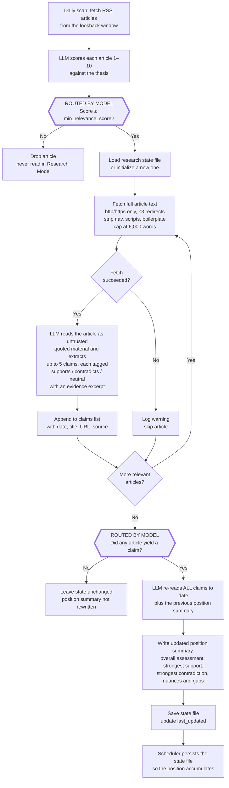

# News Watcher

A research agent for **archetype 2: LLM-directed workflows**. A person authors
the structure — scan these feeds, score against this thesis, read what clears
the bar, catalog claims against this hypothesis — and the model picks which
branch each article takes through it.

It scans RSS feeds on a schedule, scores articles against a configurable thesis
using an LLM, and posts matches to Slack. Optionally saves the digest as a
GitHub Issue and runs Research Mode, which reads the articles that cleared the
bar and accumulates a position on a hypothesis across runs.

To present it, see [`HOW-TO-DEMO.md`](./HOW-TO-DEMO.md); for what it
deliberately does not do, see
[`docs/known-limitations.md`](./docs/known-limitations.md).

> **This is an unmaintained demo — do not deploy it, and use it at your own
> risk.** No security patches, no advisories, no support, and it is provided
> "as is" under MIT. See [`SECURITY.md`](./SECURITY.md).

## Why this is archetype 2 and not 1

Archetype 1 is a fixed flow where the model generates or transforms at certain
steps. Archetype 2 is a human-authored structure where the model chooses the
path within it. The distinction is worth being precise about, because this
project sits near the boundary.

Two decisions here are the model's, and each one routes an item down a
structurally different path:

| | The model decides | The code then does |
|---|---|---|
| **Relevance gate** | how relevant each article is to the thesis, 1–10 | fetches, reads and catalogs it — or drops it and never looks again |
| **Synthesis gate** | how many claims an article yields, where zero is a legitimate answer | rewrites the position summary from the full claim history — or leaves it untouched |

Everything else — the step order, the word caps, the three permitted stances,
resynthesising from the whole history rather than today's articles — is authored
and cannot vary between runs.

**The honest caveat:** both branches are booleans over one downstream path
rather than a choice among qualitatively different ones, which makes this the
thin end of archetype 2 rather than a central example. `docs/known-limitations.md`
records what would move it toward the middle.

## How it works

1. Reads a JSON config file describing a thesis, keywords, themes, and a list of publications with RSS feed URLs
2. Fetches articles published in the last 24 hours from each feed
3. Sends article titles and summaries to the configured LLM, which scores each 1–10 for relevance to the thesis
4. Posts articles scoring above the configured threshold to a Slack channel
5. Optionally creates a GitHub Issue with the digest and/or runs Research Mode

## Where the archetype's requirements land in code

| The requirement | Where it lives |
|---|---|
| The structure is human-authored, and fixed | `src/watcher.py` `main()` — the step order is a function body, not a plan |
| The model chooses the path within it | `evaluate_relevance()` scores → the relevance gate; `_extract_claims()` returns 0–5 claims → the synthesis gate in `run_research_mode()` |
| The authored structure is declared, not implied | `config/*.json` — thesis, keywords, themes, threshold, hypothesis, all outside the code |
| Model output is data, never instruction | `_extract_claims()` fences the article body and states it is untrusted; `_fetch_bytes()` pins the scheme and caps redirects |
| The path taken is auditable after the fact | `research/*.json` `claims[]` — every claim carries date, source, URL, stance and an evidence excerpt |
| State accumulates across runs rather than within one | `_load_research_state()` / `_save_research_state()`; the summary is rebuilt from the full claim history each time |
| Recurrence is deployment, not architecture | no scheduler in this repo — a cron line in [Schedule](#3-schedule), and `./run.sh demo` for three runs offline |

## Setup

### Prerequisites

- Python 3.12+
- An [Anthropic API key](https://console.anthropic.com/), an [OpenAI API key](https://platform.openai.com/api-keys), **or** a [Vercel AI Gateway API key](https://vercel.com/docs/ai-gateway)
- At least one output configured — Slack, GitHub Issues, or Research Mode (see below)

### 1. Set credentials

Put whichever of these match your chosen outputs in a `.env` file at the project root (gitignored), or in the environment of whatever runs the watcher:

| Variable | When required | Value |
|--------|---------------|-------|
| `ANTHROPIC_API_KEY` | If using Anthropic (default) | Your Anthropic API key |
| `OPENAI_API_KEY` | If using OpenAI | Your OpenAI API key |
| `AI_GATEWAY_API_KEY` | If using Vercel AI Gateway | Your Vercel AI Gateway API key |
| `SLACK_WEBHOOK_URL` | If posting to Slack | Your Slack [Incoming Webhook](https://api.slack.com/messaging/webhooks) URL |
| `GITHUB_TOKEN` | If creating GitHub Issues | A token with `issues: write` on the target repository |
| `GITHUB_REPOSITORY` | If creating GitHub Issues | `owner/repo` to file the issue against |

### 2. Configure your watcher

Edit or create a config file in `config/`. See [Configuration](#configuration) below.

### 3. Schedule

Run it on whatever timer you already have — cron, a CI schedule, a systemd
timer. The watcher is a single command with its configuration in the
environment, so scheduling is deployment rather than architecture, and this
repository deliberately ships none of it:

```cron
0 9 * * *  cd /path/to/news-watcher && ./run.sh
```

When Research Mode is enabled, persist `state_file` between runs — commit it, or
put it on a volume. The accumulated position is the point, and a scheduler that
discards it reduces the agent to a daily digest.

## Demo

```bash
./run.sh demo
```

Three consecutive daily runs against fixture feeds in `demo/feeds/`, with no
network and no Slack or GitHub credentials. The scoring and claim-extraction
calls are real; only the sources are fixtures. Day 1's evidence supports the
hypothesis, day 2's challenges it, and day 3 complicates both — so the demo
shows the position being reconciled across runs rather than overwritten, which
is the part a single run cannot show. The talk track is in
[`HOW-TO-DEMO.md`](./HOW-TO-DEMO.md).

## Development

Create the virtual environment with the project dependencies plus `pytest`, then
run the tests:

```bash
./run.sh test                      # creates .venv and installs requirements.txt
.venv/bin/pip install pytest
.venv/bin/python -m pytest src/test_watcher.py -v
```

## Running locally

Create a `.env` file in the repo root (it is gitignored) with your credentials and any runtime overrides:

```bash
# AI provider — pick one
ANTHROPIC_API_KEY=sk-ant-...      # default provider
# OPENAI_API_KEY=sk-...           # set AI_PROVIDER=openai to use this instead
# AI_GATEWAY_API_KEY=vck_...      # set AI_PROVIDER=vercel to use this instead

# Outputs — configure at least one
SLACK_WEBHOOK_URL=https://hooks.slack.com/services/...   # optional
SAVE_AS_GITHUB_ISSUE=false                               # set true to create an issue each run
GITHUB_TOKEN=ghp_...                                     # needed if SAVE_AS_GITHUB_ISSUE=true
RESEARCH_MODE=false                                      # set true to track claims over time

# Optional overrides (defaults shown)
CONFIG_PATH=config/ai-structured-content.json
LOOKBACK_HOURS=24
AI_PROVIDER=anthropic     # or: openai, vercel
AI_MODEL=claude-sonnet-4-6
```

Before your first run, verify your credentials are working:

```bash
./run.sh test
```

This sends a test message to your Slack channel and makes a minimal LLM API call. If both pass, run the full scan:

```bash
./run.sh
```

`run.sh` loads `.env` automatically, creates a virtual environment on the first run, and reuses it after that.

## Configuration

Each watcher is a JSON file in `config/`. Fields:

```jsonc
{
  // Display name used in Slack messages and GitHub Issues
  "name": "AI + Structured Content Watcher",

  // The core argument the LLM evaluates articles against
  "thesis": "AI functions better when pulling information from structured content",

  // Terms that signal relevance — used to guide scoring
  "keywords": ["RAG", "knowledge graph", "structured data", ...],

  // Broader thematic statements used for context
  "themes": [
    "Structured formats reduce AI hallucination",
    ...
  ],

  // Minimum relevance score (1–10) to include an article
  "min_relevance_score": 6,

  // Post to Slack even when no articles meet the threshold
  "notify_on_empty": false,

  // Publications to scan
  "publications": [
    {
      "name": "VentureBeat AI",
      "rss_url": "https://venturebeat.com/category/ai/feed/"
    }
  ],

  // ── AI provider ──────────────────────────────────────────────────────────

  // Which LLM provider to use. Can also be set via the AI_PROVIDER env var,
  // which takes precedence over this field.
  // Options: "anthropic" (default) | "openai" | "vercel"
  "ai_provider": "anthropic",

  // Model to use. Defaults to "claude-sonnet-4-6" (Anthropic), "gpt-4o"
  // (OpenAI), or "anthropic/claude-sonnet-4-6" (Vercel AI Gateway — model
  // names are prefixed with the upstream provider). Can also be set via the
  // AI_MODEL env var.
  "ai_model": "claude-sonnet-4-6",

  // ── GitHub Issues ─────────────────────────────────────────────────────────

  // When enabled, each run creates a GitHub Issue titled
  // "Daily digest — YYYY-MM-DD" containing the full digest in markdown.
  // Can also be enabled via the SAVE_AS_GITHUB_ISSUE=true env var.
  // Requires GITHUB_TOKEN and GITHUB_REPOSITORY to be set.
  "github_issues": {
    "enabled": false,

    // GitHub username to assign the issue to.
    // Defaults to the repository owner if omitted.
    "assignee": "your-github-username",

    // Labels to apply to the issue (must already exist in the repo).
    "labels": ["daily-digest"]
  },

  // ── Research Mode ─────────────────────────────────────────────────────────

  // When enabled, the watcher fetches the full text of each relevant article,
  // extracts specific claims related to the hypothesis, and maintains a
  // cumulative position summary in a state file. The summary is updated on
  // every run and reflects how the body of evidence supports or contradicts
  // the hypothesis over time.
  // Can also be enabled via the RESEARCH_MODE=true env var.
  "research_mode": {
    "enabled": false,

    // The specific hypothesis to catalog claims against. This is distinct
    // from "thesis" — the thesis guides article filtering, the hypothesis
    // guides claim extraction and position tracking.
    "hypothesis": "AI accuracy improves significantly when retrieval systems are built on well-structured, semantically rich content.",

    // Path (relative to the working directory) where the research state is
    // persisted. Commit it, or put it on a volume — whatever runs the
    // watcher on a schedule has to carry it between runs.
    "state_file": "research/state.json"
  }
}
```

### Research Mode control flow

The flow below is authored here, in Python, and does not vary between runs.
What varies is which branch each article takes, and two of those branches are
chosen by the model rather than by a rule — **C** and **R**, drawn with thick
borders. Everything else is an `if` statement whose answer was fixed when the
code was written.



**The two model-routed branches.**

- **C — the relevance gate.** The model scores each article against the thesis,
  and that score decides whether the article is fetched in full, read for
  claims, and folded into persistent state, or dropped and never seen again.
  One model output, two structurally different downstream paths.
- **R — the synthesis gate.** The model decides how many claims each article
  yields, and zero is a legitimate answer. That decision is what determines
  whether the position summary is rewritten this run or left alone. A quiet day
  is a quiet day because the model said so, not because a rule fired.

**Everything else is authored.** The order of the steps, the 6,000-word cap, the
redirect limit, the three permitted stances, the decision to resynthesise from
the whole claim history rather than from today's articles — a person chose all
of it, and no run can change any of it. That split is the archetype: the
structure is fixed by people, the path through it is picked by the model.

Two honest caveats, since this sits at the boundary with archetype 1. Both
branches are booleans over a single downstream path rather than a choice among
qualitatively different ones, which makes this the thin end of archetype 2. And
the relevance threshold is currently enforced only by instructing the model in
the prompt — see `docs/known-limitations.md`.

### Research state file

When Research Mode is active, `state_file` is written after each run. It contains:

- **`hypothesis`** — the hypothesis being tracked
- **`position_summary`** — a synthesized narrative of the current overall assessment, updated every run
- **`claims`** — all extracted claims to date, each with `date`, `article_title`, `article_url`, `claim`, `stance` (`supports` / `contradicts` / `neutral`), and `evidence`
- **`last_updated`** — ISO 8601 timestamp of the last update

Persist this file between runs so the position accumulates — commit it, or keep it on a volume your scheduler mounts. It is the agent's only memory; discard it and every run starts from nothing.

> **What this file is, and is not.** `position_summary` is written by a language
> model from the full text of pages it fetched off third-party RSS feeds. Nobody
> verified those sources, checked whether a publication is reputable, or
> confirmed that a claim attributed to an article appears in it. The model is
> instructed to treat article bodies as untrusted quoted material rather than as
> instructions, and the fetcher will only open `http(s)` URLs and follows at
> most three redirects — but neither of those makes the *content* true. Read the
> summary as a reading trail, not a finding, and use the `evidence` excerpt on
> each claim to walk any sentence back to the article that produced it. Nothing
> here should be cited without opening the source.

## Adding a new watcher

1. Create a new config file in `config/`, e.g. `config/climate-tech.json`
2. Point `CONFIG_PATH` at it — each watcher is one invocation, so a second
   watcher is a second line in your scheduler:

```cron
0 9 * * *  cd /path/to/news-watcher && CONFIG_PATH=config/ai-structured-content.json ./run.sh
5 9 * * *  cd /path/to/news-watcher && CONFIG_PATH=config/climate-tech.json ./run.sh
```

Give each watcher its own `research_mode.state_file`; two theses sharing one
state file would interleave their claims into a single incoherent position.

For a one-off run, set `CONFIG_PATH` inline: `CONFIG_PATH=config/climate-tech.json ./run.sh`.
