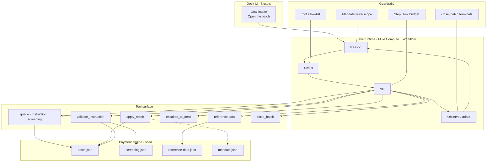

# Bucket 3 Agent example

A working **archetype 3** reference prototype: a goal-directed, task-oriented agent that is handed a bounded goal and a scoped toolset, invents its own steps, and then **stops**.

The scenario is one failed outbound payment batch. The desk inspects the failures, investigates against standing reference data, repairs what is uniquely determined, escalates what is not, re-validates after every write, and must finish with an explicit terminal. Nobody authored a flowchart.

This is the first of the five archetypes that is an agent in the working group's sense — the model directs its own process — and the last that reliably ends. The specification it implements is [`archetype-3-goal-directed-agents.md`](../../what-is-an-agent/archetype-3-goal-directed-agents.md).

**Live demo:** [https://meridian-terminus-eight.vercel.app](https://meridian-terminus-eight.vercel.app) · [architecture](https://meridian-terminus-eight.vercel.app/architecture)

The product name in the UI is **Bucket 3 / Agent example**. The seed data still uses a fictional debtor (Meridian Financial) so the ISO 20022 codes and screening holds read as a real operations case. The directory is named `archetype-3-meridian-terminus` to sit next to Pulse and Crossing.

---

## The hard rule

**The path is gone. The session still ends.** You author the goal and the tools. The order of operations is invented at runtime and will differ from one run to the next. What you *do* author is the bound: a finite batch, an allow-listed toolset, a mandate that makes some fields unreachable, a budget, and three terminals. An agent that cannot decide it is finished is an archetype-4 problem you did not mean to take on.

The model does not get to declare a repair successful. The payment engine is ground truth. `close_batch` refuses `GOAL_ACHIEVED` if anything is unaccounted for. Budget is enforced in the tool layer (`agent/lib/toolkit.ts`), not in the prompt.

| Terminal | Meaning |
|---|---|
| `GOAL_ACHIEVED` | Every instruction either passes validation or carries a reason code and a named owner. |
| `BLOCKED` | Work remains that needs a decision the agent cannot make. |
| `BUDGET_EXHAUSTED` | A step, tool-call, or wall-clock ceiling was hit. Close with what you have. |

---

## What it is

A payment-repair desk is given batch `MERIDFIN-20260824-001` — twelve outbound instructions that failed the engine's validation gate. The goal is:

> Find out why each one failed, repair what can be repaired safely, hand the rest to the right human with a reason they can act on, and release the session.

The agent is not asked to monitor the batch, redesign the validation rules, or decide whether the client relationship continues. One messy batch, the authority to clean what is safely cleanable, and a definite stop.

---

## Architecture

The agent controls the loop. The loop runs inside a sandbox. Same perceive → reason → act → observe core as archetype 4, without durable machine identity, a standing policy engine, or circuit breakers.



- **Next.js desk** posts the goal same-origin to `/eve/v1/session`. `withEve` rewrites those routes onto the agent service.
- **eve** runs the model-directed loop on Vercel Fluid Compute / Workflow. Durable turns survive a parked Tier B approval.
- **AI Gateway** routes `anthropic/claude-sonnet-5` via project OIDC. No provider key lives in the repo.
- **Session identity** is the ephemeral `wrun_*` id created when the goal arrives and released at `close_batch`. There is no standing machine identity — that would be archetype 4.

### Operational loop

| Step | What the agent does | Ground truth |
|---|---|---|
| Inspect | `list_repair_queue`, `get_screening_status` | The opening queue is not a prescribed path |
| Investigate | `get_instruction`, `lookup_reference_data`, `validate_instruction` | Standing data, not a guess |
| Act | `apply_repair` or `escalate_to_desk` | Mandate write-scope; screening is denied |
| Adapt | Re-validate after every write | A new finding is a new step, not a failure |
| Finish | `close_batch` | `GOAL_ACHIEVED` · `BLOCKED` · `BUDGET_EXHAUSTED` |

Vercel hosts one origin. The in-browser [architecture page](https://meridian-terminus-eight.vercel.app/architecture) is the same diagram in product language.

---

## Tiers

Every instruction lands in exactly one tier. The tier decides what the agent may do, not how confident it feels.

| Tier | Meaning | What happens |
|---|---|---|
| **A** | The correct value follows from standing reference data and there is only one of them | Auto-repair, cited. A repair without a citation is refused. |
| **B** | The failure turns on identity or commercial intent | Maker-checker. The agent proposes; a human confirms. |
| **C** | Screening hold | Denied. Not offered as an approval. Do not touch an unrelated field on the same instruction. |

Tier C is load-bearing. Repairing the field that caused an interdiction and resubmitting is the conduct that produced the largest sanctions penalties in the industry's history. The tools refuse it; the agent is not supposed to make them.

---

## Tools

Eight payment tools. The framework shell (`bash`, `read_file`, `write_file`, `web_fetch`, `web_search`) is `disableTool()` so authority cannot grow by omission.

| Tool | Role |
|---|---|
| `list_repair_queue` | Opening view of the batch |
| `get_instruction` | One instruction, findings included |
| `get_screening_status` | Interdiction / disclosure codes |
| `lookup_reference_data` | Citations for Tier A |
| `validate_instruction` | Engine is ground truth |
| `apply_repair` | Write inside the mandate, then re-validate |
| `escalate_to_desk` | Park with a reason and an owner |
| `close_batch` | The only ending. Success is refused while anything is unaccounted for. |

Budget (step and tool-call ceilings) lives in `seed/mandate.json` and is enforced in `agent/lib/toolkit.ts`. Exhausted tools return `BUDGET_EXHAUSTED`.

---

## Quick start

Requires **Node 24**. Tests and the offline replay also run on Node 22.6+ (native type stripping). A live model run needs an [AI Gateway](https://vercel.com/docs/ai-gateway) credential.

```bash
cd deliverables/projects/archetype-3-meridian-terminus
npm install
cp .env.example .env.local
npm test                 # policy, tools, codes, terminals
npm run replay           # dry-run the batch without a model
npm run dev              # desk at http://localhost:3000
```

| command | what it does |
|---|---|
| `npm test` | Policy, tool, code, and termination suite |
| `npm run replay` | Deterministic dry-run against the seed batch |
| `npm run replay:commit` | Same run, writes committed to the working copy |
| `npm run replay:starved` | Forces the `BUDGET_EXHAUSTED` branch (`MAX_STEPS=4`) |
| `npm run verify:trail` | Re-hash a trail file |
| `npm run dev` | Next.js desk + eve web channel |
| `npm run typecheck` | `tsc --noEmit` |

For a live local agent, set `AI_GATEWAY_API_KEY` in `.env.local` (or run `eve link` so OIDC is pulled in). `npm test` and `npm run replay` do not call a model.

`REPAIR_MODE=dry-run` (default) computes repairs, re-validates against a projection, and traces them, but does not commit. That is how the desk earns its write scope.

---

## Deploy

The committed `vercel.json` is a stub. The production demo is the Vercel project `mach-x/meridian-terminus`:

```bash
npx vercel --prod --scope team_dJAgzAMPbn3rYCgtHgJqFQBr
```

On Vercel the runtime authenticates to AI Gateway with project OIDC. Seed JSON is statically imported so the payment engine resolves in the serverless bundle. Trails write to `/tmp/trails` when `VERCEL` is set. Run state is in-memory — a restart loses the working copy. That is accepted: durable state is the thing archetype 4 has to solve.

The public demo allows anonymous access (`none()` in `agent/channels/eve.ts`) so anyone can open the seeded batch. The data is fiction. Do not point that auth at a real payment store.

---

## Package layout

```
archetype-3-meridian-terminus/
├── agent/
│   ├── agent.ts              # model, token limits, session timeout
│   ├── instructions.md       # goal, loop, three tiers, three terminals
│   ├── channels/eve.ts       # web channel
│   ├── hooks/trail.ts        # step counter + hash-chained JSONL
│   ├── lib/                  # store, policy, validation, mandate, toolkit
│   ├── tools/                # the eight tools + five disableTool() stubs
│   └── skills/               # triage-payment-exception
├── app/                      # Next.js desk + /architecture
├── seed/                     # batch, mandate, reference data, screening
├── infra/                    # replay + trail verifier
├── tests/                    # policy, tools, codes, termination
└── docs/known-limitations.md # accepted prototype scope
```

---

## What it deliberately does not do

See [`docs/known-limitations.md`](docs/known-limitations.md). The short version:

- Escalation is a row in the outcome record, not a case in a real queue.
- Tier B maker-checker is exercised by the live agent; the offline replay records the proposal and moves on.
- There is no standing machine identity, policy engine, or circuit breaker. Those are archetype 4.
- Payment systems are mocks. `seed/batch.json` is a JSON projection of a pain.001, not a message on the wire.

Several items that look like bugs are the demonstration. Do not "fix" the invariants at the bottom of that file while working on something else.

---

## Spec mapping

| Bucket 3 component | This example |
|---|---|
| Goal intake | Desk → `POST /eve/v1/session` |
| Reasoning engine | `agent/agent.ts` + `agent/instructions.md` |
| Tool selector | Model-chosen calls against the allow-list |
| Action executor | `apply_repair` / `escalate_to_desk` |
| Ground truth | `validate_instruction` after every write |
| Catalog-systems analog | `seed/batch.json`, `screening.json`, `reference-data.json` |
| Ephemeral identity | `wrun_*` session, released at close |
| Reasoning traces | `agent/hooks/trail.ts` + hash-chained JSONL |
| Outcome record | `close_batch` writes `*.outcome.json` |

The three terminals are the full decision space: **done**, **stuck**, or **out of budget**. Each is an explicit `close_batch` call. An agent that keeps working after the goal is met, or stops before every instruction is accounted for, has made the same mistake in opposite directions.

What this is *not*: a long-running policy-guided process (that is [Meridian Pulse](../archetype-4-meridian-pulse/)) and not a multi-party negotiation (that is [Meridian Crossing](../archetype-5-meridian-crossing/)).

---

## Troubleshooting

- **`402 quota_for_entity_exceeded`.** AI Gateway exhausted the team's budget. Tests and replay are unaffected. Map this onto `BUDGET_EXHAUSTED` if you extend the prototype — that path is described, not handled.
- **Seed files missing on a serverless deploy.** Import JSON statically (`with { type: "json" }`). `readFileSync` via `import.meta.url` resolves to `/seed/...` on the function and fails with `ENOENT`.
- **Typecheck cannot find `History`.** `tsconfig.json` sets `"types": ["node"]`, which drops the DOM lib's `History`. Do not name that global; go through `window.history`.
- **Deleting the `disableTool()` files "cleans up" the repo.** It also restores bash and web fetch. Leave them.
