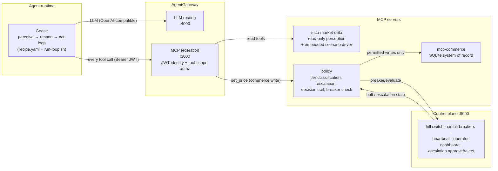

# Meridian Pulse

Meridian Pulse is a hackathon reference prototype for **Archetype 4: Autonomous, policy-guided agents**. A single revenue-optimization agent continuously monitors ~50 SKUs of Meridian Outfitters' spring outdoor line and reprices them within policy — perceiving market signals, reasoning about responses, acting through a policy gate, and self-correcting, without a human in the loop for each decision. It is built entirely on the open Agentic AI Foundation (AAIF) stack: **Goose** as the agent runtime, **AgentGateway** as the policy/governance/observability layer, and **MCP** for tool connectivity. The step-by-step build guide (milestones M0–M6) lives in the Hackathon in a Box at [`../agent-build-lab/archetype-4-meridian-pulse/`](../agent-build-lab/archetype-4-meridian-pulse/) (start with [`00-overview.md`](../agent-build-lab/archetype-4-meridian-pulse/00-overview.md)); this README documents the prototype as actually built.

---

## The hard rule

**The agent never calls a commerce system directly.** Every tool invocation routes through AgentGateway, which authenticates the agent's machine identity and scopes tool access, then forwards writes to the policy server, which classifies each price change into a tier before it can touch the commerce system of record. There is no path from reasoning to action that skips the policy gate — it is physical, not aspirational.

## Architecture

The request path — every arrow is enforced, and the write path (`set_price`) can only reach commerce through the policy server:



- **Goose** reasons and proposes actions, reaching the LLM and all tools *only* through AgentGateway.
- **AgentGateway** runs as a real binary. It exposes an OpenAI-compatible LLM endpoint on `:4000` and a federated MCP endpoint on `:3000`. On `:3000` it enforces `jwtAuth` (strict — every MCP call needs a valid Bearer token) and `mcpAuthorization` (read tools open to any authenticated identity; `set_price` requires the `commerce:write` scope). Argument-level rules (per-SKU/per-category) live in the policy server because the gateway authorizes by tool identity, not by tool arguments.
- **policy** is an MCP server that sits in the write path: it classifies every `set_price` into a tier (permit / notify / escalate / deny), holds escalations, records the decision trail, checks the control-plane circuit breakers, and forwards only permitted writes to **mcp-commerce**. It also exposes `report_anomaly`, which the agent calls to flag implausible market data it has chosen not to act on — recording that judgment to the decision trail and surfacing it on the operator dashboard, rather than letting a good "decision not to act" vanish silently.
- **mcp-commerce** is the SQLite-backed mock system of record.
- **mcp-market-data** is read-only perception (competitor prices, demand signals, inventory) with the embedded scenario driver that plays the demo timeline.
- **control-plane** (Express, `:8090`) is the human oversight plane: kill switch, circuit breakers (rate/magnitude/anomaly), the heartbeat dead-man's-switch, the operator dashboard HTML, and escalation approve/reject.

**Observability:** AgentGateway emits OTLP traces (one span per tool call and policy eval) to the OTel Collector on `:4317` → Tempo; it exposes Prometheus metrics on `:15020`, scraped by Prometheus; Grafana renders both on `:3001`. The stack runs as containers via `finch compose`.

## Prerequisites

Pinned versions are in [`infra/VERSIONS.md`](infra/VERSIONS.md). Install:

| Tool | Version | Install |
|---|---|---|
| Node.js | 20+ (tested on 24.11.1) | nvm / nodejs.org |
| pnpm | 9.15.0 | `corepack use pnpm@9.15.0` |
| Goose CLI | 1.46.0 | `brew install block-goose-cli` |
| AgentGateway | 1.4.1 | GitHub release binary (see below) |
| Finch | 1.14.1 | `brew install --cask finch` |

**AgentGateway** is a downloaded binary, not a package. From the [agentgateway releases](https://github.com/agentgateway/agentgateway/releases), download the `darwin` / `linux` / `windows` binary for version 1.4.1, then:

```bash
# verify the download against the published checksum
shasum -a 256 agentgateway-<platform>      # compare to the release's sha256
chmod +x agentgateway-<platform>
# macOS only: clear the quarantine attribute so Gatekeeper allows it to run
xattr -d com.apple.quarantine agentgateway-<platform>
# put it on PATH
sudo mv agentgateway-<platform> /usr/local/bin/agentgateway
```

**Finch** provides the container runtime for the observability stack (Docker-compose compatible). Start its VM once before running the stack: `finch vm start`.

## Setup

Run all commands from the `meridian-pulse` repo root.

1. **Configure the LLM provider.** Copy the example env file and fill in your provider details:
   ```bash
   cp .env.example .env
   ```
   Set `LLM_BASE_URL`, `LLM_MODEL`, and `LLM_API_KEY` for any OpenAI-compatible endpoint (the committed default), or switch the gateway to Bedrock — see [LLM provider configuration](#llm-provider-configuration).

2. **Install and build all packages:**
   ```bash
   pnpm install
   pnpm -r build
   ```

3. **Generate the agent's machine identity (M1).** This creates an RSA keypair under `seed/identity/` and mints a scoped JWT. `jwks.json` is public and committed; `priv.pem` and `agent-credential.json` are gitignored:
   ```bash
   node packages/agent/dist/identity.js keygen   # once — writes priv.pem + jwks.json
   node packages/agent/dist/identity.js mint       # mint / refresh the token
   ```

4. **Point Goose at the gateway LLM endpoint.** These are set in `.env` (the run loop reads them); the gateway holds the real credential, so `OPENAI_API_KEY` here can be any non-empty value:
   ```bash
   GOOSE_PROVIDER=openai
   GOOSE_MODEL=default
   OPENAI_HOST=http://localhost:4000
   OPENAI_BASE_PATH=v1/chat/completions
   OPENAI_API_KEY=<any-nonempty>
   ```

## Running the demo

One command brings up the whole system — observability stack, gateway, control plane, and the agent loop — and starts driving the scenario:

```bash
pnpm demo
```

Then open the dashboard at **http://localhost:8090** and Grafana at **http://localhost:3001**, and follow the beat-by-beat narration in **[`packages/control-plane/RUNBOOK.md`](packages/control-plane/RUNBOOK.md)**. `Ctrl-C` tears everything down (including the container stack).

> Prerequisites, checked by the script: `goose`, `agentgateway`, and `node` on PATH; `pnpm -r build` already run; the agent identity minted (`pnpm identity:setup`); and `.env` filled in (or the gateway config switched to Bedrock). Set `NO_OBSERVABILITY=1 pnpm demo` to skip the container stack.

Under the hood, `pnpm demo` runs these steps in order (you can also run them by hand for debugging):

```bash
# 1. observability stack (Grafana :3001, Tempo, Prometheus, Loki, OTel Collector :4317)
finch compose -f infra/observability-compose.yaml up -d      # or: pnpm observability:up

# 2. AgentGateway (LLM :4000, MCP :3000, admin :15000, metrics :15020)
agentgateway -f infra/agentgateway/config.yaml

# 3. control plane (dashboard at http://localhost:8090)
node packages/control-plane/dist/index.js

# 4. the agent's continuous loop (mints the token, resumes state, cycles)
packages/agent/run-loop.sh
```

The demo narrative is driven automatically by the scenario timeline in [`seed/scenario-timeline.json`](seed/scenario-timeline.json), replayed by the scenario driver embedded in `mcp-market-data`.

### Ports

| Port | Service |
|---|---|
| 3000 | AgentGateway — federated MCP endpoint (`/mcp`) |
| 4000 | AgentGateway — OpenAI-compatible LLM endpoint |
| 8090 | Control plane — operator dashboard + API |
| 15000 | AgentGateway — admin |
| 15020 | AgentGateway — Prometheus metrics |
| 4317 | OTel Collector — OTLP gRPC (gateway traces) |
| 3001 | Grafana |

## Package layout

```
meridian-pulse/
├── packages/
│   ├── agent/            # Goose recipe.yaml, run-loop.sh, machine identity, checkpoint store
│   ├── mcp-commerce/     # MCP server: pricing/margin/promo, SQLite system of record
│   ├── mcp-market-data/  # MCP server: read-only perception + embedded scenario driver
│   ├── policy/           # Tier classification, escalation queue, decision trail, breaker check
│   └── control-plane/    # Express API + dashboard HTML: kill switch, breakers, heartbeat, approvals
├── infra/
│   ├── agentgateway/     # AgentGateway config (identity, LLM routing, MCP federation, telemetry)
│   ├── otel/             # OpenTelemetry collector config
│   ├── prometheus/       # Prometheus scrape config
│   ├── tempo/            # Tempo config
│   ├── grafana/          # Provisioned datasources + dashboards
│   └── observability-compose.yaml   # finch compose stack (Grafana/Tempo/Prometheus/Loki/OTel)
├── seed/                 # catalog.json, competitors.json, scenario-timeline.json, mandate.json, identity/
└── docs/                 # known-limitations.md and other prototype notes
```

The step-by-step build guide (milestones M0–M6) lives separately in the Hackathon in a Box at [`../agent-build-lab/archetype-4-meridian-pulse/`](../agent-build-lab/archetype-4-meridian-pulse/) — read those in order to build this prototype from scratch.

Milestones **M0–M6** were built in order, each adding exactly one thing and ending at a demoable checkpoint: **M0** foundation → **M1** identity → **M2** state → **M3** policy → **M4** accountability → **M5** circuit breakers → **M6** demo.

### Useful CLIs

Run from repo root after `pnpm -r build`:

- **Decision trail** (`packages/policy`): `node packages/policy/dist/query-trail.js <list|why|verify|stats>` — inspect the append-only decision trail, explain why a decision reached its tier, verify trail integrity, or print summary stats. (Also exposed as `pnpm --filter @meridian-pulse/policy trail`.)
- **Approvals** (`packages/policy`): `node packages/policy/dist/approvals-cli.js <list|approve|reject> [id]` — manage the escalation queue from the CLI (the dashboard's Approve/Reject buttons call the same path). (Also `pnpm --filter @meridian-pulse/policy approvals`.)
- **Checkpoints** (`packages/agent`): `node packages/agent/dist/checkpoint-cli.js <status|verify>` — report the latest checkpoint / verify checkpoint integrity. (Also `checkpoint:status` / `checkpoint:verify` scripts.)
- **Identity** (`packages/agent`): `node packages/agent/dist/identity.js <keygen|mint|token>` — create keys, mint a fresh token, or print just the token. (Also `identity:keygen` / `identity:mint` scripts.)

## LLM provider configuration

The provider is intentionally swappable and lives entirely in AgentGateway — the agent and MCP servers never see provider credentials. It is selected in [`infra/agentgateway/config.yaml`](infra/agentgateway/config.yaml).

**Default — generic OpenAI-compatible endpoint.** The committed `llm:` block routes to whatever `LLM_BASE_URL` / `LLM_MODEL` / `LLM_API_KEY` you set in `.env`. Point it at OpenAI, a local model, or any OpenAI-compatible server.

**Alternative — Amazon Bedrock (Claude).** The config file contains a commented Bedrock block. To use it, comment out the default `llm:` block and uncomment the Bedrock one, setting the model (e.g. `us.anthropic.claude-sonnet-5`) and `awsRegion`. Credentials come from the standard AWS chain (`AWS_PROFILE`, environment keys, or SSO) — no keys in the config.

Either way, Goose always points at the gateway on `:4000`; which provider actually serves the request is decided in the gateway config, so the agent stays provider-agnostic.

## Scope boundaries

This prototype demonstrates that persistence, identity, policy, circuit breakers, and accountability can be assembled from open AAIF components today. To keep the focus there, the following are deliberately mocked or out of scope (mirroring [`../agent-build-lab/archetype-4-meridian-pulse/00-overview.md` §8](../agent-build-lab/archetype-4-meridian-pulse/00-overview.md)):

- **Commerce systems are mocks.** `mcp-commerce` is a SQLite-backed stand-in with a seeded catalog. Integrating real legacy commerce systems is acknowledged, not solved here.
- **Market data is simulated.** `mcp-market-data` and its embedded scenario driver replay accelerated signals from `seed/scenario-timeline.json` instead of consuming real feeds.
- **Machine identity is scoped, not full-lifecycle.** AgentGateway's JWT auth gives the agent a scoped, verifiable credential the gateway checks on every call, with short-lived tokens re-minted each cycle. Full provisioning, rotation, and revocation lifecycle is the documented production extension.
- **Single agent, single domain.** No multi-agent composition; that is a documented extension, not built here.
- **No auth, mobile, or production styling on the dashboard.** It is a stage prop for the demo, not a product.

## Troubleshooting

- **`temperature is deprecated for this model` (HTTP 400).** Claude Sonnet 5 and some other newer models reject the OpenAI `temperature` parameter outright. The Goose recipe therefore sets **no** `temperature`. If your model rejects a different parameter the same way, remove that parameter from the recipe `settings` too — the fix is to omit the offending param, not to change its value.
- **The agent surveys too many SKUs / cycles feel slow.** The recipe deliberately instructs the agent to act on **at most 3 SKUs per cycle** and to prioritize acting over surveying, so it stays decisive within its per-cycle time budget. If it drifts into scanning everything, that instruction in `packages/agent/recipe.yaml` is what keeps it bounded — the demo does not require exhaustive coverage.
- **Gateway starts fine without the OTel collector.** AgentGateway simply tries the OTLP endpoint (`:4317`) and continues if the collector is absent. You can bring the gateway and agent up before (or without) the `finch compose` observability stack; traces just won't be recorded until the collector is running. Grafana panels will be empty until then, but the demo's core behavior (policy, escalation, circuit breaker, kill switch) is unaffected.
