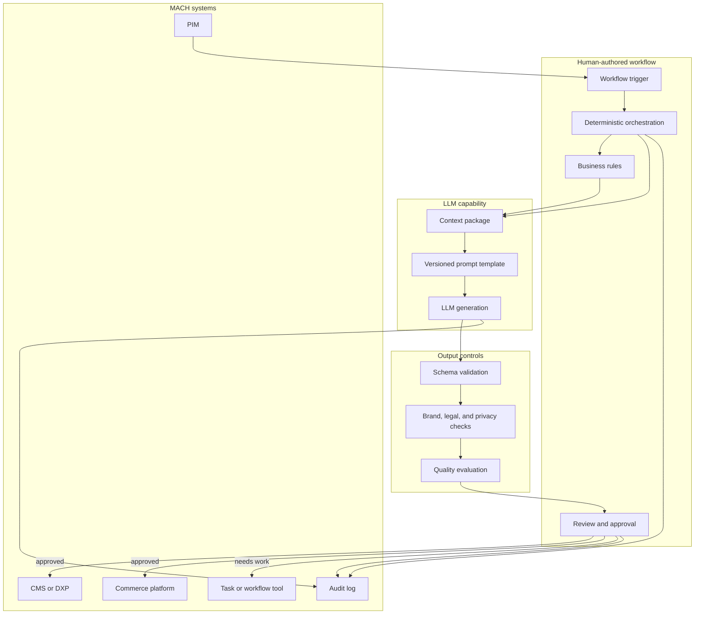
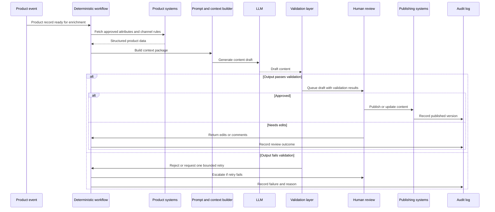

# Bucket 1: LLM-assisted workflows (not yet agents)

*The model helps with language and structure. The workflow still decides everything.*

**By the [Enterprise Agent Architecture Working Group](https://github.com/machalliance/wg-enterprise-agent-architecture) of the [Agent Ecosystem](https://agentecosystem.org)**

---

## What changes here

Bucket 1 is the simplest and most common place to start. A deterministic workflow calls an LLM to synthesize, extract, summarize, translate, classify, or draft content. The model is doing useful work, but it is not deciding what happens next.

A person or a human-authored system still defines the sequence, the routing, the checks, and the final action. The LLM is used like any other capability in the stack: given this context, produce this output. The workflow remains in charge.

That distinction matters. This bucket is powerful, but it is not agentic. The system does not cross the agency line because the model does not make decisions that shape the behavior of the system. It only generates or transforms information inside a path that was already designed.

The moment you adopt this bucket, a few practical concerns appear:

- **Prompting becomes implementation.** A prompt is no longer just a natural-language instruction. It is part of the workflow contract.
- **Context becomes product surface.** The quality of the output depends heavily on what data the workflow gathers, filters, and passes to the model.
- **Validation becomes the handoff.** A probabilistic model produces an output that deterministic systems need to trust, reject, or send for review.
- **Review stays human or rule based.** The model can draft, but it does not approve, publish, refund, reprice, or route.
- **Cost and latency matter early.** High-volume workflows can become expensive fast if every simple transformation is pushed through an LLM.

Bucket 1 is useful precisely because it gives teams the language capabilities of an LLM without introducing model-driven control flow.

## Running example: Product content enrichment workflow

Throughout this document we use a product content enrichment workflow in a retail or e-commerce context. The workflow receives a product record from a PIM, supplier feed, or ERP system. It then uses an LLM to generate better content for downstream channels.

The workflow:

- **Receives** product attributes such as title, category, material, dimensions, ingredients, images, and technical specifications.
- **Assembles** a controlled context package from approved data sources.
- **Generates** product descriptions, SEO titles, short bullets, comparison copy, accessibility text, or localized variants.
- **Validates** the output against schema, brand, policy, and compliance checks.
- **Queues** the result for human review or sends it into an existing publishing workflow.

The LLM is not deciding whether the product should be sold, which channel should receive it, whether legal review is needed, or whether the content should go live. Those decisions remain outside the model.

This is bucket 1: the model helps create the artifact, but the workflow path is fixed.

---

## Architecture

This section covers the system from two angles. First the component architecture: what exists in the workflow and where the LLM fits. Then the operational loop: how a single content enrichment request moves through the system.

The important thing to notice: the LLM is boxed in as a capability. It is not the orchestrator, the router, or the approver.

### Component architecture

The architecture is intentionally boring. That is the point. Existing workflow infrastructure remains responsible for control flow. The model is called for the one thing it is good at: producing a useful draft from messy or incomplete inputs.

### Operational loop

There is no step where the LLM chooses a route. The workflow may retry, reject, publish, or escalate, but those branches are determined by rules and human review, not by the model's judgment.

---

## Architecture deep dive

### Deterministic orchestration

Treat the LLM call as a step inside a workflow engine, not as the workflow engine itself. The application decides when to call the model, what data to send, how many retries are allowed, which validators run afterward, and who approves the result.

This makes bucket 1 attractive for enterprise teams. You get AI assistance while keeping the operational model familiar: queues, tasks, states, approvals, logs, and rollback.

### Context packaging is where quality comes from

The model only sees what the workflow gives it. Good bucket 1 systems invest heavily in context assembly:

- approved product attributes from PIM or ERP
- brand tone and terminology rules
- channel constraints such as title length or SEO fields
- localization requirements
- previous approved examples
- prohibited claims or regulated language

A weak context package produces weak output even with a strong model. A strong context package can make a basic generation step reliable enough for production use.

### Prompts are versioned workflow artifacts

Prompts should be treated like code or configuration. They need owners, version history, test cases, and release notes. A changed prompt can alter tone, risk, formatting, and compliance behavior without changing a single line of application code.

Practical requirements:

- version every prompt template
- store examples with expected outputs
- test prompts against representative product records
- roll back prompt versions when quality drops
- record which prompt version generated each output

### Output contracts and validators

A workflow cannot safely hand raw model output directly to downstream systems. Bucket 1 needs output contracts.

For product content, that might mean:

- valid JSON fields
- maximum character counts
- required fields present
- no unsupported claims
- no prohibited words or phrases
- no invented specifications
- no personally identifiable information
- channel-specific formatting rules

The validator is the bridge between probabilistic generation and deterministic systems.

### Human review and publishing controls

In bucket 1, the model drafts. It does not own the final business action.

For some low-risk fields, review can be lightweight. For regulated categories, sustainability claims, medical claims, financial claims, or brand-sensitive campaigns, review should stay explicit. The approval action belongs to a person or a separate deterministic governance process.

### Cost, latency, and repeatability

Not every transformation deserves an LLM call. Simple formatting, unit conversion, ID mapping, schema validation, deduplication, and field normalization are better handled by scripts or deterministic services.

Bucket 1 works best when the LLM is reserved for language-heavy work where it adds clear value. Cache outputs when inputs have not changed. Batch work when latency is not critical. Keep cheap deterministic steps outside the model.

---

## Policy deep dive

### Data access and privacy

The LLM call should receive the minimum data required to produce the requested output. A product description workflow does not need full customer history. A support reply draft may need order status, but not payment tokens or unrelated account data.

Policy should define:

- which data classes may be sent to the model
- which vendors or models are approved for which data classes
- how prompts and outputs are retained
- whether training on submitted data is disabled
- how sensitive fields are redacted before the call

### Approval ownership

The workflow should make it clear who owns the final artifact. The model generated the draft, but a product owner, merchandiser, support agent, local market reviewer, or compliance reviewer approves the final version.

Approval ownership prevents the classic failure mode where everyone treats the AI output as useful but nobody owns the consequence of publishing it.

### Claims and compliance

LLMs can phrase claims more confidently than the source data supports. In commerce and content workflows, this is a real risk.

Policy should distinguish between:

| Claim type | Example | Default control |
|---|---|---|
| Descriptive | "Made from cotton" | Validate against product attributes |
| Comparative | "Best in class" | Require approved source or block |
| Regulated | Health, financial, legal, or sustainability claims | Route to human or compliance review |
| Unsupported | Invented specs or guarantees | Reject automatically |

### Evaluation and regression tests

Bucket 1 systems need evaluation even though they are not agents. The failure mode is not a rogue autonomous system. The failure mode is quietly degraded output at scale.

Useful evaluation patterns:

- golden test sets for common inputs
- checks for hallucinated product facts
- tone and brand consistency scoring
- localization quality checks
- regression tests when prompts or models change
- sampling of published outputs for human review

### Observability

Observability should answer basic operational questions:

- Which model generated this output?
- Which prompt version was used?
- What source data was included?
- Which validators passed or failed?
- Who approved the final artifact?
- What was published, when, and to which channel?

This is not an agent decision trail yet. It is content provenance.

---

## Other examples that fit bucket 1

- **Customer support reply drafting.** The workflow gathers order, shipment, and policy context. The LLM drafts a response. The support agent decides what to send.
- **Localization and market adaptation.** The workflow sends approved source copy to the model for translation or adaptation, then routes output to local review.
- **Meeting and transcript summaries.** A deterministic workflow summarizes recordings, extracts decisions, and sends the result to a workspace or ticketing tool.
- **Release note drafting.** A workflow summarizes pull requests, tickets, or changelogs into a draft release note for engineering review.
- **Purchase-order extraction.** The model extracts structured fields from supplier emails or PDF text, then validators and humans confirm the result before downstream processing.

---

## Bridging to bucket 2

Bucket 1 stops at generation and transformation. It becomes bucket 2 when the model's output changes the path of the workflow.

A generated product description is bucket 1. A model deciding that a product should go to legal review instead of copy enrichment is bucket 2.

A drafted support reply is bucket 1. A model deciding whether the ticket should go to fraud, delivery investigation, refund review, or technical support is bucket 2.

The safest way to move from bucket 1 to bucket 2 is to promote one decision point at a time. Keep the paths explicit. Keep the allowed outputs structured. Keep deterministic execution where deterministic execution works.

---

## Where this leaves us

Bucket 1 is not a consolation prize. It is where most organizations can create immediate value with manageable risk. It gives teams a way to learn how prompts, context, validation, review, and observability work in production without asking the model to steer the system.

That foundation compounds. The same context packaging, prompt governance, output validation, audit logging, and human review patterns become the raw material for bucket 2. When you later let the model choose between designed paths, you will already have the controls needed to make that decision visible and reviewable.

---

**Authors**

This document was developed by the Enterprise Agent Architecture Working Group of the Agent Ecosystem. The working group's charter, members, and ongoing work are public at [github.com/machalliance/wg-enterprise-agent-architecture](https://github.com/machalliance/wg-enterprise-agent-architecture). Learn more about the broader agent ecosystem vision at [agentecosystem.org](https://agentecosystem.org).
