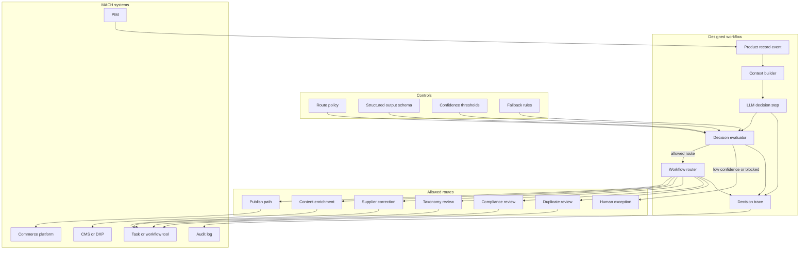
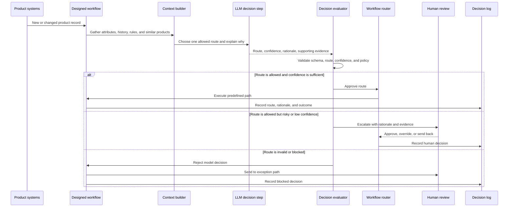

# Bucket 2: LLM-directed workflows

*The paths are designed by people. The model chooses which one to take.*

**By the [Enterprise Agent Architecture Working Group](https://github.com/machalliance/wg-enterprise-agent-architecture) of the [Agent Ecosystem](https://agentecosystem.org)**

---

## What changes here

Bucket 2 is where the system first crosses the agency line. The LLM is no longer only generating content inside a fixed path. It evaluates context and makes a decision that changes how the workflow behaves.

That decision takes one of two shapes: *choosing which path to take* — routing a record or request to one of several designed branches — or *deciding whether to continue* — judging an output and looping to refine it, or stopping. Routing is the most visible form, but a bounded refine-and-recheck loop is just as much a bucket 2 pattern. In both, the model directs control flow without escaping the structure people designed.

That decision is still constrained. People design the paths. People define the allowed routes, tools, thresholds, loops, and fallbacks. The model chooses from those options at runtime.

This is not a goal-directed agent. The system is not handed a broad objective and asked to invent its own plan. It does not freely decide which tools exist, how long to run, or what outcome to pursue. It makes decisions within a designed structure.

The moment the LLM chooses a path, new concerns appear:

- **The decision space must be explicit.** The model should choose from known routes, not invent new ones.
- **Outputs become control signals.** A classification, score, or route is no longer just text. It drives system behavior.
- **Fallbacks become part of safety.** Low confidence, ambiguity, unsupported routes, and policy conflicts need deterministic outcomes.
- **Decision traces become necessary.** Operators need to know why the workflow chose one path instead of another.
- **Deterministic work should stay deterministic.** Scripts, rules, APIs, and validators should do the repeatable work. The LLM should handle ambiguity, judgment, and language-heavy interpretation.

Bucket 2 is attractive because it gives teams adaptive behavior without giving the model open-ended control.

## Running example: Product data quality triage workflow

Throughout this document we use a product data quality triage workflow in a retail or e-commerce context. Product data enters the organization from suppliers, ERPs, spreadsheets, syndication tools, marketplaces, and PIM systems. The records are messy: missing attributes, inconsistent categories, unsupported claims, weak descriptions, duplicated SKUs, and ambiguous variants.

A bucket 1 workflow might use an LLM to rewrite the product description. A bucket 2 workflow asks the LLM to decide which predefined remediation path the product record should follow.

The LLM evaluates the product record and chooses a route such as:

- **Publish path.** The record is complete and low risk.
- **Content enrichment path.** The structured attributes are good, but the copy is weak.
- **Supplier correction path.** Required fields are missing or contradictory.
- **Taxonomy review path.** The category or product type is ambiguous.
- **Compliance review path.** The record contains regulated, comparative, sustainability, medical, or financial claims.
- **Duplicate review path.** The record appears to overlap with an existing product.
- **Human exception path.** The model cannot make a confident decision.

The LLM chooses the route. The workflow executes the route with deterministic systems: validators, scripts, APIs, task creation, review queues, and publishing controls.

This is bucket 2: model-directed routing inside a human-designed workflow.

---

## Architecture

This section covers the system from two angles. First the component architecture: the designed workflow, the decision step, the allowed routes, and the controls around them. Then the operational loop: how a single product record moves through triage.

The important thing to notice: the model can influence the path, but it cannot escape the path set.

### Component architecture



The LLM decision step produces a structured route recommendation. The decision evaluator checks that recommendation before the router acts on it. There is no path from the model directly to execution.

### Operational loop



The three terminal outcomes are the full decision space: execute a permitted route, escalate an uncertain route, or block an invalid route. The workflow can be adaptive without being open-ended.

---

## Architecture deep dive

### Designed decision space

The route set is the architecture. If the route set is vague, the workflow will be vague. Bucket 2 systems should define the available decisions before the model is introduced.

For product data triage, that means defining:

- allowed routes
- required inputs for each route
- conditions that make a route unavailable
- confidence thresholds
- escalation rules
- retry limits
- what evidence must be recorded

The LLM chooses inside this space. It does not create the space.

### Structured outputs as contracts

The model's output should be machine-readable and narrow. Free text is useful for rationale, but it should not be the control signal.

A typical output might include:

```json
{
  "route": "compliance_review",
  "confidence": 0.86,
  "reason": "The description includes an environmental claim that is not supported by structured attributes.",
  "evidence": ["claim: 100% sustainable", "missing certification attribute"],
  "fallback_route": "human_exception"
}
```

The evaluator can validate this shape before anything else happens. If the route is not allowed, the workflow rejects it.

### LLM as router, deterministic components as executors

The LLM should not do work that a script, rule, or API can do more reliably.

Good bucket 2 design keeps deterministic work outside the model:

- schema checks
- required field validation
- ID mapping
- unit conversion
- duplicate lookup
- field normalization
- permission checks
- task creation
- API calls

The model is best used where the system needs judgment over messy context: ambiguous categories, unclear customer intent, contradictory supplier data, weak product copy, or claims that need interpretation.

### Confidence, thresholds, and fallbacks

A bucket 2 workflow needs a response for every kind of uncertainty.

Examples:

| Condition | Default outcome |
|---|---|
| High confidence and low risk | Execute route |
| Medium confidence | Send to human review or second evaluator |
| Low confidence | Human exception path |
| Unsupported route | Block and log |
| Conflicting evidence | Escalate with evidence |
| Missing required context | Request data or supplier correction |

The fallback path is not an error. It is part of the design.

### Evaluation loops with budgets

Not every bucket 2 decision is a choice between paths. The other common shape is a decision about whether to *continue*. Bucket 2 can include evaluation loops, but the loops must be bounded.

A generate-evaluate-revise loop is the clearest retail example, and it sits directly on top of bucket 1's content enrichment workflow. In bucket 1, the model drafts a product description once, and a human or a deterministic validator decides what happens next. Promote that one decision point and it becomes bucket 2:

1. A generator produces a product description from the approved attribute package.
2. An evaluator — a separate model call with its own rubric — scores the draft against brand voice, required attributes, reading level, and SEO completeness, and returns structured feedback.
3. If the draft passes, the workflow ships it or queues it for light human review. If it fails, the feedback returns to the generator for a revision, and the loop runs again.
4. The loop is bounded: a fixed maximum number of revisions. If the draft still fails on the last attempt, the record escalates to a human rather than looping forever.

The agency here is not *which path* — it is *whether to go again*. The evaluator's pass-or-fail judgment is a model-made decision that shapes control flow, exactly like a routing decision, but the structure is a loop rather than a branch. Everything that bounds it — the rubric, the revision cap, the escalation fallback — is human-designed. That is what keeps it in bucket 2 and out of bucket 3: the model decides whether the output is good enough, not what the goal is, which tools exist, or how many attempts it gets.

Useful patterns:

- bounded generate-evaluate-revise loops for generated content
- one bounded retry after invalid structured output
- second-pass evaluation for regulated categories
- disagreement routing when two classifiers choose different paths
- sampling of automatically routed records for human review
- offline evaluation against historical decisions

Loops without budgets drift toward bucket 3 behavior. Bucket 2 stays safe by limiting attempts, routes, and stop conditions.

### Decision traces and replay

Once the model chooses a route, the decision needs to be reconstructable. Operators should be able to answer:

- What context did the model see?
- Which route did it choose?
- What confidence score did it provide?
- What evidence did it cite?
- Which policy checks passed or failed?
- Did a human override the route?
- What happened after the route executed?

This does not require the full observability stack of a long-running autonomous agent, but it does require more than ordinary application logging. The workflow decision is now part of system behavior.

---

## Policy deep dive

### Route permissions

Not every route should be available to every workflow, model, brand, region, or product category. Policy should decide which routes the model may choose and which routes require human approval.

For product data quality triage:

| Route | Default control | Policy concern |
|---|---|---|
| Publish path | Allow only for complete, low-risk records | Prevent accidental publication |
| Content enrichment | Allow for approved categories | Avoid invented product facts |
| Supplier correction | Allow when required data is missing | Keep supplier feedback explainable |
| Taxonomy review | Allow when category confidence is low | Protect merchandising structure |
| Compliance review | Require for regulated or unsupported claims | Avoid legal exposure |
| Human exception | Always available | Provide safe fallback |

### Human escalation

Human review should be triggered by risk, novelty, ambiguity, or low confidence. The reviewer should receive the model's rationale and supporting evidence, not just the selected route.

Good escalation design helps humans move faster. Bad escalation design creates a queue of mysterious AI decisions that nobody trusts.

### Prompt and model change control

Changing the prompt or model can change routing behavior. Treat routing prompts like production decision logic.

Controls should include:

- prompt versioning
- model version tracking
- test sets with expected routes
- rollout by percentage or category
- rollback when route quality drops
- comparison between old and new routing behavior

### Data minimization

The model should see enough context to make the route decision, but no more. Product triage usually needs product attributes, category rules, prior catalog matches, and policy snippets. It usually does not need customer data, payment data, or unrelated internal notes.

Data minimization reduces privacy risk, cost, latency, and confusion.

### Monitoring route drift

Bucket 2 systems can drift even when every individual decision looks plausible. A workflow that used to send 5 percent of records to compliance review may suddenly send 40 percent. That may reflect a real change in supplier data, or it may reflect prompt drift, model drift, or a broken context builder.

Track:

- route distribution over time
- confidence distribution over time
- human override rates
- blocked route attempts
- downstream error rates
- route quality by supplier, category, brand, and region

### Audit and accountability

The audit log should capture both the model decision and the surrounding control checks. A useful record contains:

- input record identifier
- prompt and model versions
- route selected
- confidence
- rationale
- evidence
- policy evaluation result
- human override, if any
- downstream action taken
- final outcome

This is the start of decision accountability. It is not yet the continuous decision trail required by bucket 4, but it is the foundation.

---

## Other examples that fit bucket 2

- **Customer support ticket routing.** The LLM reads a ticket and routes it to delivery investigation, refund review, fraud, product defect, technical support, or human escalation.
- **Adaptive content review.** The LLM decides whether content needs editorial review, legal review, compliance review, accessibility review, localization review, or standard approval.
- **Commerce exception handling.** The LLM chooses a predefined path for failed payments, address mismatches, out-of-stock conflicts, suspicious orders, or shipment delays.
- **Order issue triage.** The LLM distinguishes between delivery failure, warehouse issue, payment problem, marketplace mismatch, and customer service escalation.
- **LLM-directed orchestration with deterministic execution.** The model decides whether a record needs a script, API call, validation service, review queue, or content generation step. The deterministic component does the actual work.

---

## Bridging to bucket 3

Bucket 2 ends where the designed path set ends. The workflow can choose between known branches, but it cannot invent a new plan.

A product record routed to compliance review is bucket 2. A system handed the goal "clean up this supplier catalog" that decides which records to inspect, which tools to call, which fixes to make, and when the task is complete is bucket 3.

A support ticket routed to delivery investigation is bucket 2. A system handed the goal "resolve this customer's delivery issue" that checks carrier status, drafts a response, requests a refund, creates a replacement order, and adapts as results come back is bucket 3.

The practical difference is control. In bucket 2, people design the paths and the model chooses. In bucket 3, the model controls the sequence of steps needed to reach a goal.

---

## Where this leaves us

Bucket 2 is the enterprise-friendly start of agency. It introduces model-driven decisions, but inside boundaries that architects, product owners, security teams, and legal teams can reason about.

It is also where sloppy language causes real trouble. Calling every content-generation workflow an agent hides the difference between assistance and decision-making. Calling every router an agent overstates its autonomy. Bucket 2 gives teams a more precise label: an LLM-directed workflow.

Done well, bucket 2 builds the foundations for later buckets: structured decisions, route policies, confidence handling, evaluation loops, decision traces, and escalation. Done badly, it creates invisible control flow that nobody can explain when something goes wrong.

---

**Authors**

This document was developed by the Enterprise Agent Architecture Working Group of the Agent Ecosystem. The working group's charter, members, and ongoing work are public at [github.com/machalliance/wg-enterprise-agent-architecture](https://github.com/machalliance/wg-enterprise-agent-architecture). Learn more about the broader agent ecosystem vision at [agentecosystem.org](https://agentecosystem.org).
