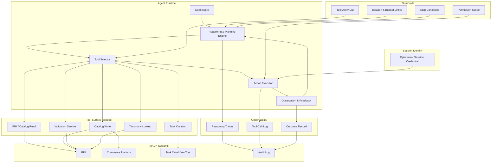
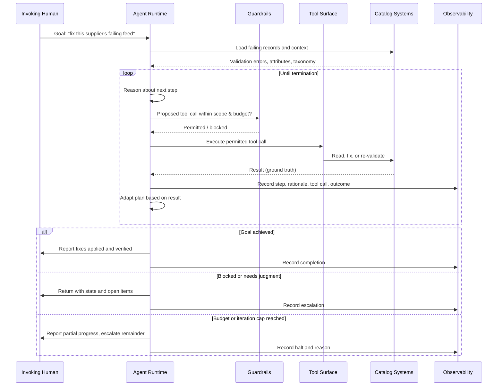

# Bucket 3: Goal-Directed, Task-Oriented Agents

*The path is gone. Hand the system a goal and tools, and it decides the steps &mdash; but it still stops.*

**By the [Enterprise Agent Architecture Working Group](https://github.com/machalliance/wg-enterprise-agent-architecture) of the [Agent Ecosystem](https://agentecosystem.org)**

---

## What changes here

An LLM-directed workflow (bucket 2) chooses among paths that people drew. Hand it a record and it picks a branch: enrich, escalate, correct, review. The branches are fixed; the model selects one. Bucket 3 removes the branches. You hand the system a goal and a set of tools, and it works out the steps itself. No predefined path. The agent inspects what it finds, decides what to do next, does it, looks at the result, and adjusts &mdash; until the goal is met or it runs out of room.

This is the first bucket that is genuinely an agent, and the last one that reliably *stops* &mdash; both halves matter. It maps to [Anthropic's](https://www.anthropic.com/engineering/building-effective-agents) definition of an agent: a system where the model "dynamically directs its own process and tool usage, maintaining control over how it accomplishes tasks," as opposed to a workflow, where the model is "orchestrated through predefined code paths." The agent perceives, reasons, acts, observes the result, and adapts; that feedback loop is what separates an agent from a workflow. But the task is bounded &mdash; a finite job, a scoped set of tools, a session that ends when the work does. The agent that does not stop is bucket 4, a different kind of system with a different cost of ownership. Bucket 3 is where most enterprises will do their first real agentic work, precisely because the blast radius is contained by the shape of the task.

The moment the model owns the sequence of steps, new concerns appear:

- **The plan is the model's, not yours.** You author the goal and the toolset. The order of operations is invented at runtime and will differ from one run to the next. You are no longer reviewing a flowchart; you are trusting a process.
- **Tools become the action surface.** Everything the agent can do is the union of the tools you give it. Scoping the toolset *is* scoping what the agent is permitted to touch. An over-broad toolset is a quietly over-broad grant of authority.
- **Reasoning traces stop being optional.** You need to reconstruct not just *what* the agent did but *why* it did it &mdash; which step led to which, and on what basis. Without that, an autonomous run is unreviewable.
- **Termination becomes a design decision.** Done, stuck, and out-of-budget all need explicit definitions. An agent that cannot decide it is finished is a bucket-4 problem you did not intend to take on.
- **Permissions are scoped and short-lived.** The agent typically runs under the credentials of the human who invoked it, for the duration of the task, and no longer. This is the seed of what becomes, in bucket 4, a standalone machine identity with its own lifecycle.

Bucket 3 is attractive because it buys real autonomy &mdash; the agent solves problems you did not script &mdash; without the open-ended commitment of an agent that runs forever.

## Running example: Catalog issue resolution agent

Throughout this document we use a **catalog issue resolution agent** in a retail or e-commerce context. A supplier's product feed has started failing validation. Instead of routing each bad record to a remediation queue, the organization hands an agent a goal:

> *"This supplier's product feed is failing validation. Find out why, and fix what you can safely fix."*

The agent:

- **Inspects** the failing records to see how they are failing &mdash; missing attributes, malformed values, category mismatches, unsupported claims.
- **Investigates** by querying the PIM, the validation service, and the taxonomy, forming a hypothesis about the underlying cause rather than treating each record in isolation.
- **Acts** by applying bounded fixes within its permitted scope &mdash; normalizing a malformed field, mapping a miscategorized product, correcting a unit &mdash; and re-running validation to check the result.
- **Adapts** when a fix does not work or a record turns out to need judgment it does not have, re-planning or setting that record aside.
- **Finishes** by reporting what it resolved, what it could not, and why &mdash; then releasing its session.

The scope is finite and the end is clear. The agent is not asked to monitor the feed forever, redesign the validation rules, or decide whether the supplier relationship should continue. It is given one messy feed and the authority to clean what it safely can.

This is bucket 3: the agent owns the sequence of steps; people own the goal, the tools, and the bounds. Goal-directed work spans more than catalog repair &mdash; the same shape covers "draft the purchase orders to restock store 142 for the weekend promo" or "resolve this customer's delivery complaint." What unites them is not the domain but the structure: a bounded goal, a scoped toolset, an emergent plan, and a definite stop.

---

## Architecture

This section covers the system from two angles. First the component architecture: the agent runtime, the tools it can reach, and the guardrails around it. Then the operational loop: how a single goal moves from intake to a finished result.

The important thing to notice: the agent controls the loop, but the loop runs inside a sandbox. The agent chooses its own steps; it cannot choose its own tools, exceed its own budget, or outlive its own session. The diagrams below are deliberately the bucket-4 runtime *without* the machinery of persistence &mdash; same perceive, reason, act, observe core, but no durable state, no policy engine standing between reasoning and every action, no circuit breakers, and an ephemeral session identity in place of a durable machine identity. What bucket 4 adds to this picture is exactly what persistence forces.

### Component architecture

The agent runtime sits at the center and runs its own loop. The guardrails do not participate in the reasoning &mdash; they bound it. The tool surface is the only way the agent reaches the outside world, which is why scoping the tools is the primary act of architecture here, the way defining the route set was the primary act of architecture in bucket 2.

### Operational loop

Unlike bucket 2's single-pass decision, this loop iterates: each tool result is real ground truth from the environment, and the agent's next step depends on what came back. Unlike bucket 4, the loop terminates by design. The three terminal branches &mdash; goal achieved, blocked, budget reached &mdash; are the full decision space. An agent with no path to "budget reached" is an agent with no guaranteed stop.

---

## Architecture deep dive

### The agent owns the plan

The defining move of bucket 3 is that the model decomposes the goal into steps at runtime. You do not write the sequence; you write the goal, hand over the tools, and set the bounds. The sequence is emergent and will not be identical across two runs against two different feeds &mdash; that variability is the feature, not a defect, because the whole point is to handle problems you could not enumerate in advance.

This is what Anthropic describes as an agent that plans and operates independently once the task is clear, gaining "ground truth from the environment at each step." The architectural consequence: you cannot validate a bucket-3 agent by reading its flowchart, because there is none. You validate it by constraining what it can reach, observing what it actually did, and testing it against representative inputs before trusting it with real ones.

### Tools are the action surface &mdash; scope them like permissions

An agent can only do what its tools let it do. This makes tool design the highest-leverage decision in the architecture. Two principles carry most of the weight.

First, separate reading from writing, and scope each independently. The catalog agent might read every product across all categories but write only to non-flagged SKUs in the supplier's own range. The read scope determines what it can understand; the write scope determines the worst case if its judgment is wrong.

Second, treat tool definitions with the same care as the prompt. Anthropic's guidance on the agent-computer interface is direct: a tool's description, its parameters, and its boundaries should be written as carefully as a docstring for a junior engineer, because the agent's competence is bounded by how well it understands the tools it holds. A poorly described tool is not a cosmetic problem; it is a reliability problem, because the agent will misuse it in ways you did not anticipate.

### The feedback loop and ground truth

Perceive, reason, act, observe, adapt. The loop only works because each action returns a real result the agent can react to: the validation service passes or fails, the write succeeds or errors, the taxonomy lookup returns a match or nothing. The agent uses that ground truth to decide its next step. This is the literal mechanism that separates an agent from a workflow &mdash; a workflow's path is fixed before it runs, while an agent's next step is chosen after it sees what the last step produced.

Error recovery is part of the loop, not an exception to it. When a fix fails validation, the agent should be able to re-plan &mdash; try a different correction, gather more context, or set the record aside for human judgment &mdash; rather than stalling or repeating the same failed action. An agent that cannot recover from a tool error is an agent that will get stuck on the first surprise, which in a messy supplier feed is immediate.

### Termination and budgets

If tools are the most important architectural decision, termination is the most important safety decision. A goal-directed agent must be able to declare one of three things: *done*, *stuck*, or *out of budget*. Each needs an explicit definition.

- **Success criteria** define *done*. For the catalog agent: the feed passes validation, or every remaining failure has been triaged to a reason and a recommended owner.
- **Iteration ceilings and time or cost budgets** define *out of budget*. Anthropic recommends including stopping conditions &mdash; such as a maximum number of iterations &mdash; specifically "to maintain control." The agent halts and reports partial progress rather than grinding indefinitely.
- **Blocking conditions** define *stuck*. When the agent hits something outside its scope or below its confidence, it returns to the human with state rather than forcing an action it should not take.

A missing stop condition is the exact failure that turns a bucket-3 agent into an unsupervised bucket-4 agent &mdash; one that persists without any of the durable-identity, durable-state, and continuous-accountability machinery bucket 4 needs to do so safely. The stop condition keeps the bucket boundary honest.

### Reasoning traces as first-class output

Bucket 2 needed a decision trace for a single routing choice. Bucket 3 needs a trace of the *whole sequence*: each step, the rationale behind it, the tool call it produced, the result that came back, and the reason the agent finally stopped. The trace is what makes an autonomous run reviewable after the fact &mdash; the difference between "the agent changed this product's category" and "the agent changed this product's category because the supplied value matched no node in the taxonomy and the description was an unambiguous match for the one it chose."

This is an episodic, per-task trace, reconstructable for the run that produced it. It is the foundation for &mdash; but deliberately lighter than &mdash; bucket 4's continuous, tamper-evident decision trail, which has to reconstruct *why action X at time T* across an agent that never stops. Bucket 3 earns its accountability one bounded run at a time.

### Scoped, ephemeral identity

The catalog agent runs under the session of the person who invoked it, with that person's permissions, for the life of the task. When the task ends, the credentials end with it. There is no standing identity to govern, rotate, or revoke, because there is no agent persisting between runs.

This is the single cleanest architectural fault line between bucket 3 and bucket 4. A bucket-4 agent cannot borrow a human session, because there is no human session to borrow &mdash; it runs continuously, on its own schedule, and therefore needs a durable machine identity with its own lifecycle. Naming the difference here is what makes bucket 4's "difference in kind, not degree" claim concrete: the moment the agent stops borrowing a session and needs its own, the entire identity-governance burden of bucket 4 arrives at once.

---

## Policy deep dive

The brief for this bucket names the two requirements that shift: you need to understand not just what the agent did but why, which makes reasoning traces and scoped permissions non-negotiable. Those two carry the most weight below; the surrounding sections support them.

### Scoped permissions and the blast radius of a goal

Handing an agent a goal is not handing it unlimited means to pursue that goal &mdash; the permission set defines the worst case, independent of how the agent reasons. This is the bucket-3-native form of what becomes, in bucket 4, a tiered policy store: simpler here because the task is bounded, identical in principle.

For the catalog agent, scoping means deciding, before the run: which tools are in the allow-list, what the agent may read, what it may write, and which records or categories are off-limits entirely. A goal as open as "fix what you can safely fix" is only safe because "safely" is enforced by the permission boundary, not left to the model's discretion.

### Human-in-the-loop checkpoints

Anthropic notes that agents can "pause for human feedback at checkpoints or when encountering blockers." The policy question is where those checkpoints belong. The answer follows reversibility and risk: the more consequential and the less reversible an action, the more it should require a human before execution.

| Action class | Example in the catalog agent | Default control |
|---|---|---|
| Reversible, low-risk | Normalize a malformed dimension or unit | Auto-execute, record in trace |
| Reversible, higher-volume | Re-categorize products against the taxonomy | Execute, notify the catalog owner |
| Consequential or low-confidence | Rewrite content, resolve an ambiguous variant | Require human approval before commit |
| Regulated or flagged | Touch a flagged SKU or a regulated claim | Prohibited within the task; escalate to a human |

The table is a default, not a constraint the agent negotiates. The agent proposes; the policy layer decides what proceeds without a human and what waits for one.

### Reasoning traces and after-the-fact review

Scoped permissions bound what the agent *can* do. Reasoning traces explain what it *did*. Both are required, because a permission boundary tells you the worst case but not whether a given action was sound. A useful trace lets a reviewer answer, for any change the agent made: what was the goal, what did the agent see at that step, why did it choose this action, which tool produced it, what came back, and why did the run end where it did.

This is review of a finite episode, not continuous monitoring of a persistent process. That is the right weight for bucket 3 and the reason its accountability burden is lighter than bucket 4's: you are reconstructing one bounded run, not standing up a continuous, tamper-evident decision trail for an agent that never stops.

### Tool governance

Because the toolset is the action surface, governing which tools an agent may hold is a policy concern, not just an engineering one. Adding a tool widens what the agent can do, silently, without changing a line of the agent's own logic. That makes tool additions a reviewable event: who approved this agent holding a write tool, and against what scope. An over-broad toolset is the quiet way an agent's authority grows past what anyone intended.

Prompt and model changes deserve the same change-control discipline that buckets 1 and 2 apply to prompts as versioned artifacts &mdash; a changed prompt or model can alter how the agent plans &mdash; but the heavier lever in bucket 3 is the toolset, because it bounds the agent's reach directly.

### Testing in sandboxes

Anthropic is explicit that autonomy raises the cost of error: agents mean higher costs and "the potential for compounding errors," and the recommendation is "extensive testing in sandboxed environments, along with the appropriate guardrails." For the catalog agent, that means a dry-run mode that proposes fixes without committing them, a sandboxed catalog that mirrors production structure, and evaluation against known-bad feeds with known-good resolutions &mdash; all before the agent is granted write access to the live catalog. You earn the agent's write scope by watching what it does without it.

---

## Other examples that fit bucket 3

- **Coding agent.** Given "fix this failing test" or "resolve this issue," the agent edits across files, runs the test suite, reads the failures, and iterates until the tests pass or it reports why they cannot. This is Anthropic's own [SWE-bench](https://www.anthropic.com/research/swe-bench-sonnet) example: edits to many files driven by a task description, verified against automated tests.
- **Codebase research.** Given "explain how authentication works in this repository," the agent searches, reads the relevant files, follows references, and synthesizes an answer &mdash; a bounded investigation with a clear deliverable and a clear end.
- **Report compilation.** Given "compile a competitive pricing summary for this category," the agent gathers from multiple sources, analyzes what it finds, and produces the artifact, deciding its own path through the material.
- **Customer issue resolution.** Given "resolve this customer's delivery complaint," the agent checks carrier status, drafts a response, and issues a refund or replacement within its scope, then stops &mdash; the same task the bucket-2 document routes a ticket *toward*, now carried end to end.
- **Data cleanup or migration.** Given a bounded "reconcile these records" or "migrate this dataset," the agent works through the data, adapting as it hits malformed rows, and reports what it could not resolve.

---

## Bridging to bucket 4

Bucket 3 finishes. That is the line. The catalog agent resolves one failing feed and releases its session. Promote that same agent to *watch the supplier's feeds continuously and fix problems as they arise, without being asked*, and you have left bucket 3 entirely.

The difference is not more autonomy. It is persistence and self-direction. And persistence forces a new class of problem that a bounded task never raised:

- **Identity becomes infrastructure.** A continuous agent cannot borrow a human session; it needs a durable machine identity, provisioned, scoped, rotated, and revocable on its own lifecycle.
- **State becomes critical path.** An agent that runs for days accumulates context, and losing it mid-operation is a correctness failure, not an inconvenience.
- **Accountability becomes continuous.** You can no longer review one episode after the fact; you need a decision trail that reconstructs why the agent acted at any point across an unbounded run.
- **Policy becomes the operating system.** With no human approving each task, the policies you define *are* the supervision.

Those four shifts define bucket 4. Everything bucket 3 builds &mdash; scoped tools, explicit termination, per-task reasoning traces, ephemeral identity &mdash; is the foundation those shifts extend. The seed of each bucket-4 requirement is already visible here; persistence is what forces it to grow.

---

## Where this leaves us

Bucket 3 is the realistic frontier for most enterprises today. It delivers genuine autonomy &mdash; the agent solves problems no one scripted &mdash; while the shape of the task keeps the blast radius contained. A finite goal, a scoped toolset, an emergent plan, and a guaranteed stop is a combination an architect, a security team, and a legal team can all reason about.

The discipline that makes it safe is the same discipline the later buckets depend on. Scoped tools, explicit termination, and reasoning traces are good engineering for a single bounded run; they are also exactly what an autonomous, policy-guided agent extends when it stops stopping, and what a collaborating agent presents as its credentials when it crosses an organizational line. These foundations compound.

And like every bucket in this series, bucket 3 is not a level to graduate from. It is the right tool for finite, well-scoped problems &mdash; which is most of the agentic work an enterprise actually needs done. The goal is to do it well, with the means constrained and the reasoning visible, not to rush past it toward agents that never stop.

---

**Authors**

This document was developed by the Enterprise Agent Architecture Working Group of the Agent Ecosystem. The working group's charter, members, and ongoing work are public at [github.com/machalliance/wg-enterprise-agent-architecture](https://github.com/machalliance/wg-enterprise-agent-architecture). Learn more about the broader agent ecosystem vision at [agentecosystem.org](https://agentecosystem.org).
