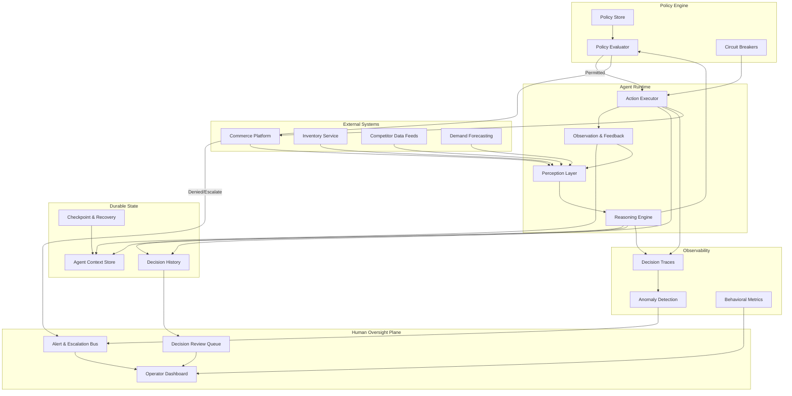
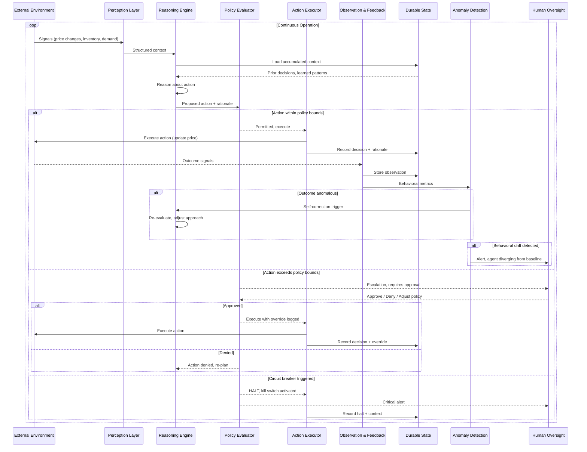

# Bucket 4: Autonomous, Policy-Guided Agents
*Persistence changes everything. When an agent does not stop, your architecture and governance cannot either.*

**By the [Enterprise Agent Architecture Working Group](https://github.com/machalliance/wg-enterprise-agent-architecture) of the [Agent Ecosystem](https://agentecosystem.org)**

---

## What changes here

A goal-directed agent (bucket 3) receives a task, works out how to accomplish it, and finishes. Clear start, clear end. An autonomous, policy-guided agent does not wait for assignments. It persists. It monitors a domain, detects conditions that warrant action, decides what to do, acts, observes the result, and self-corrects. Continuously. Without a human in the loop for each decision.

This is not a difference in degree. It is a difference in kind. The moment an agent operates independently over extended durations, you inherit a new class of problems:

- **Identity becomes infrastructure.** The agent needs a durable machine identity with its own lifecycle, provisioned, rotated, scoped, and revocable independently of any human session.
- **State becomes critical path.** The agent accumulates context over hours, days, or weeks. Losing that state mid-operation is not a minor inconvenience. It is a correctness failure.
- **Accountability becomes continuous.** You cannot review decisions in a post-mortem if you cannot reconstruct why the agent took action X at time T. Decision trails must be first-class infrastructure, not afterthought logging.
- **Policy becomes the operating system.** Without task-by-task human approval, the policies you define *are* the supervision. They must be precise, enforceable, and auditable.

## Running example: Revenue optimization agent

Throughout this document we use a **revenue optimization agent** operating in a retail/e-commerce context. This agent:

- **Monitors** pricing signals, inventory levels, competitor pricing, demand forecasts, and margin targets. Continuously.
- **Decides** when to adjust pricing, trigger promotions, or flag conditions that require human review.
- **Acts** by pushing price changes to commerce platforms, updating promotion engines, or escalating to merchandising teams.
- **Self-corrects** when it observes that an action produced unexpected results (a price change that tanked conversion instead of improving margin, for example).

This agent runs 24/7. It does not wait for an "optimize pricing" task. It watches, reasons, and acts within the boundaries its operators define.

---

## Architecture

This section covers the system from two angles. First, the component architecture: what pieces exist and how they connect. Second, the operational loop: how control flows between those pieces during continuous operation.

### Component architecture

The diagram below shows six subsystems and their relationships. The agent runtime sits at the center. Policy evaluation gates every action. Durable state preserves context across cycles. Observability detects drift. Human oversight retains final authority.

### Operational loop

The component diagram shows structure. The sequence diagram below shows *behavior*: what happens during a single cycle of the agent's continuous operation, and the three possible outcomes when an action is proposed.

The key thing to notice: every proposed action passes through policy evaluation before execution. There is no path from reasoning to action that skips this gate. The three branches (permitted, escalated, halted) represent the full decision space the policy engine can produce.

---

## Architecture deep dive

### Persistent machine identity and lifecycle

The revenue optimization agent is not a function that runs when called. It is a persistent entity that authenticates to commerce platforms, pricing engines, and data feeds. Continuously. That requires:

- **Dedicated machine identity.** Not a shared service account. Not a human user's credentials delegated. The agent has its own identity with its own credential lifecycle.
- **Scoped permissions.** The agent can read pricing data from all channels but can only *write* price changes to specific SKU categories. Permissions are granular and auditable.
- **Credential rotation.** Automated, on schedule, without disrupting the agent's operation. The agent handles credential refresh as part of its normal runtime, not as an exceptional case.
- **Revocation.** If the agent is compromised or behaving anomalously, its identity can be revoked immediately, severing access to all downstream systems in one operation.

In bucket 3, an agent typically inherits the invoking user's session credentials for the duration of a task. Persistence demands standalone identity.

### Long-running durable state

The agent builds context over time: what pricing strategies have worked, how competitors have responded, which SKUs are sensitive to changes, what time-of-day patterns matter. Losing this context means the agent starts from scratch, making decisions without the benefit of what it has already learned.

Durable state requirements:

- **Checkpointing.** The agent's full context (reasoning state, accumulated observations, active hypotheses) is periodically persisted. If the process crashes, it resumes from the last checkpoint, not from zero.
- **State versioning.** As the agent's context evolves, prior versions are retained. This enables rollback (if the agent goes off track) and forensic reconstruction (understanding what the agent "knew" at a given point).
- **Separation of concerns.** Short-term working memory (current reasoning cycle) is distinct from long-term learned context (patterns accumulated over weeks). Different retention and recovery guarantees apply to each.

Implementation patterns: durable execution frameworks (Temporal, AWS Step Functions, Restate), event-sourced state stores, or custom checkpoint/restore against object storage.

### Behavioral anomaly detection

An agent that runs continuously can drift, slowly or suddenly. The model's reasoning may shift after a context window fills up. External data may change in a way the agent handles incorrectly. You need to detect this without waiting for a human to notice.

- **Baseline behavioral profiles.** Establish what "normal" looks like for this agent: frequency of actions, magnitude of changes, distribution of decision types, reasoning patterns.
- **Real-time comparison.** Every action is compared against the baseline. A pricing agent that normally makes 5-15 adjustments per hour suddenly making 200 is anomalous regardless of whether each individual action passes policy checks.
- **Graduated response.** Minor deviations trigger logging and increased monitoring. Significant deviations trigger alerts to human operators. Extreme deviations trigger circuit breakers.
- **Semantic drift detection.** Beyond quantitative metrics, monitor whether the agent's *reasoning* is drifting. Are the rationales in its decision traces becoming repetitive, circular, or disconnected from the observations that triggered them?

### Auditable decision trails

Every decision the agent makes must be reconstructable after the fact. Not just *what* it did, but *why*: what context it had, what alternatives it considered, what policy checks it passed, and what outcome it expected.

- **Structured decision records.** Each action produces a record containing: triggering observation, agent's reasoning, proposed action, policy evaluation result, execution outcome, and post-action observation.
- **Causal chains.** Decisions often build on prior decisions. The trail must preserve these links. "I raised the price on SKU-4521 because my previous reduction on SKU-4519 shifted demand, and the margin target requires rebalancing."
- **Tamper-evident storage.** Decision trails are append-only and integrity-protected. The agent cannot retroactively alter its own history.
- **Queryable.** Operators must be able to ask: "Show me every pricing decision this agent made for category X in the last 48 hours where the margin impact exceeded 2%." Unstructured logs do not cut it.

---

## Policy deep dive

### Identity governance

Machine identity for a long-running agent is not "create a service account and forget it." It requires full lifecycle management:

| Lifecycle Stage | What Happens | Who Is Responsible |
|---|---|---|
| Provisioning | Agent identity created with scoped permissions | Platform team + agent owner |
| Authentication | Agent authenticates to downstream systems using its own credentials | Agent runtime |
| Rotation | Credentials rotated on schedule without service interruption | Automated by platform |
| Monitoring | Authentication patterns monitored for anomalies | Security / observability |
| Revocation | Identity revoked, all sessions terminated | Security team (emergency) or automated |
| Decommissioning | Identity retired, audit trail preserved | Platform team |

### Permission boundaries and escalation policies

The agent operates within a defined action space. Anything outside that space requires escalation:

- **Tier 1, Autonomous:** Adjust prices within ±5% of current price for non-flagged SKUs. No approval needed.
- **Tier 2, Notify:** Adjust prices between ±5-15%. Execute immediately but notify merchandising team.
- **Tier 3, Approve:** Adjust prices beyond ±15%, or touch flagged/regulated SKUs. Queue for human approval before execution.
- **Tier 4, Prohibited:** Actions that cross compliance boundaries (pricing below cost in jurisdictions where that is illegal, for example). Hard block, no override without legal review.

These tiers are defined in a policy store, not hardcoded. They can be adjusted as trust in the agent grows or as business conditions change, without redeploying the agent.

### Kill switches and circuit breakers

When things go wrong at machine speed, you need machine-speed safeguards:

- **Rate limiters.** Maximum actions per time window. Prevents runaway loops even if reasoning is correct per-action.
- **Magnitude limiters.** Maximum cumulative impact within a window. "This agent has moved total revenue exposure by $X in the last hour" triggers a pause regardless of individual action validity.
- **Dead man's switch.** If the agent has not checked in with the oversight system within a defined interval, it is automatically paused. Covers the case where the agent is running but observability is broken.
- **Manual kill switch.** Immediate, unconditional halt accessible to authorized operators. The agent stops, preserves state, and waits for human review before resuming.

### Drift detection and compliance

Policy is not static. The agent's operating environment changes, regulations evolve, business strategy shifts. Drift detection covers both sides:

- **Agent drift.** Is the agent still operating within its defined boundaries, or has it found edge cases that technically pass policy checks but violate intent?
- **Policy drift.** Are the policies still appropriate for the current business context? An agent faithfully following outdated policies is a different failure mode.
- **Compliance attestation.** Periodic automated verification that the agent's actual behavior matches its declared policy boundaries. Gaps trigger review.

---

## Bridging to bucket 5

Everything above assumes a single agent operating within a single organization's boundary. The architecture and policy patterns hold until the agent needs to interact with agents it does not control.

When that happens, new questions emerge:

- **Trust.** How does your revenue optimization agent verify that the supplier's inventory agent is reporting accurate data? How does the supplier's agent verify your agent's pricing requests are legitimate?
- **Protocol.** What communication standards let agents from different organizations, built on different stacks, interact reliably?
- **Intent alignment.** Your agent optimizes for margin. A partner's agent optimizes for volume. They need to negotiate. Who arbitrates?
- **Accountability.** When two agents from different organizations produce an outcome neither operator intended, whose decision trail matters?

These questions define bucket 5. The infrastructure you build here (durable identity, decision trails, policy enforcement) becomes the *foundation* for operating across trust boundaries. You do not throw it away. You extend it with protocols for discovery, negotiation, and cross-organizational accountability.

---

**Authors**

This document was developed by the Enterprise Agent Architecture Working Group of the Agent Ecosystem. The working group's charter, members, and ongoing work are public at [github.com/machalliance/wg-enterprise-agent-architecture](https://github.com/machalliance/wg-enterprise-agent-architecture). Learn more about the broader agent ecosystem vision at [agentecosystem.org](https://agentecosystem.org).
