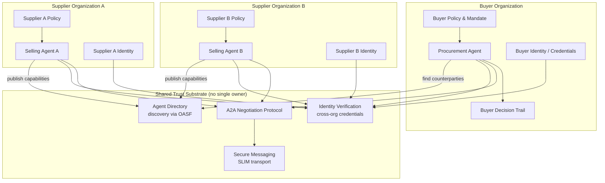
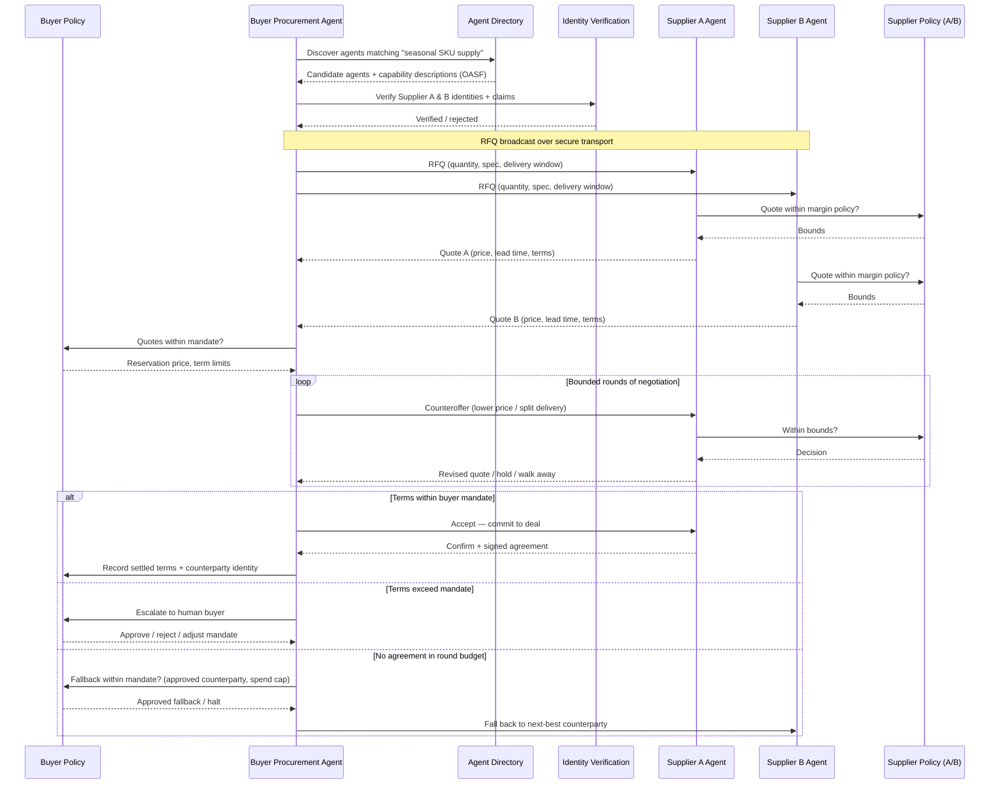

# Bucket 5: Collaborating, Self-Directed Agents

*The orchestrator is gone. When no single party controls the system, trust has to be built into the architecture itself.*

**By the [Enterprise Agent Architecture Working Group](https://github.com/machalliance/wg-enterprise-agent-architecture) of the [Agent Ecosystem](https://agentecosystem.org)**

---

## What changes here

Every bucket before this one assumes a boundary. An LLM-assisted workflow runs inside your pipeline. A goal-directed agent (bucket 3) works on your task with your tools. An autonomous, policy-guided agent (bucket 4) persists and self-corrects, but it does so inside *your* trust domain, under *your* policies, authenticating with *your* machine identity. There is always a single operator who can answer "who is in charge here?"

Bucket 5 removes that assumption. Agents now collaborate across teams, vendors, and organizational lines — and at the far end, they do so on behalf of parties with opposing interests. A buyer's agent optimizing for landed cost talks directly to a seller's agent optimizing for margin. There is no shared orchestrator. No single party controls the system. No one can see the whole decision trail.

This bucket deliberately collapses two ideas that are separable in theory:

- **Coordinated multi-agent systems** — independently built agents working toward a *shared* objective. Different teams or vendors, aligned intent.
- **Discoverable, self-interested agents** — independent agents with their *own* goals, interacting across organizational lines. Different parties, opposed intent.

They sit on a continuum of trust and intent, and the infrastructure needs run in the same direction. As you move from "agents we both built to cooperate" toward "agents representing rival interests," every assumption you could leave implicit inside one organization has to become an explicit, verifiable protocol.

The moment an agent must interact with an agent it does not control, four questions you never had to ask before become unavoidable:

- **Discovery.** How does your agent even find a counterparty agent, learn what it can do, and decide whether to engage — without a human wiring them together first?
- **Identity and trust.** How does your agent prove it is who it claims to be, and verify the same of a counterparty issued by a different organization, on a different stack?
- **Protocol.** What shared message contract lets agents built independently negotiate, counteroffer, and settle reliably across a network neither side owns?
- **Accountability.** When two agents from two organizations produce an outcome neither operator intended, whose decision trail is authoritative, and how is the dispute resolved?

Bucket 4 told you to build durable identity, auditable decision trails, and enforceable policy. You do not throw any of that away. Bucket 5 extends it outward — across trust boundaries you do not own.

## One scenario, all the way up

Bucket 5 is easiest to see as the top of a ladder you already climb in a single domain. Take B2B procurement and replenishment. Here is how the same domain plays out at each bucket, with bucket 5 on the last line:

1. *(LLM-assisted)* An LLM extracts purchase-order data from incoming supplier emails.
2. *(LLM-directed)* An LLM classifies and routes requisitions by category and spend threshold.
3. *(Goal-directed)* An agent takes "restock store 142 for the weekend promo" and drafts the purchase orders.
4. *(Autonomous, policy-guided)* An agent watches inventory and demand signals and reorders continuously within policy. This is bucket 4's revenue optimization agent, working inside one organization.
5. **(Collaborating, self-directed)** A buyer's procurement agent runs an RFQ against several suppliers' agents, trading counteroffers and settling the deal.

The shift happens on that last line. Through bucket 4, the work is something one organization's agent does to its own systems. At bucket 5 it becomes something multiple organizations' agents do with each other.

## Running example: Cross-organization procurement negotiation

We carry forward the retail/e-commerce setting from bucket 4, but cross the boundary. Bucket 4's **revenue optimization agent** lived entirely inside one retailer. Here, that retailer's **procurement agent** must source a seasonal product and negotiate terms with **several independent suppliers' selling agents**, none of which it controls.

The procurement agent:

- **Discovers** candidate supplier agents through a directory, rather than relying on a hardcoded list of integration endpoints.
- **Verifies** each counterparty's identity and the claims it makes about itself before exchanging anything of value.
- **Negotiates** with agents that are optimizing for the other side: issues an RFQ, receives quotes, and trades counteroffers on price, quantity, lead time, and delivery terms.
- **Settles** on terms within its mandate, escalates anything outside it, and records a decision trail it can defend even though it can only see its own half of the exchange.

This is exactly the shape of the **AGNTCY [CoffeeAGNTCY](https://github.com/agntcy/coffeeAgntcy) reference application**, which models a fictitious coffee company as a multi-agent system: buyer-side agents, an exchange, and supplier "farm" agents that fetch live conditions, coordinated over open protocols rather than a single orchestrator. We use its building blocks throughout to keep the architecture concrete.

---

## Architecture

Two angles, as in bucket 4. First the component architecture: what exists on each side of the boundary and what the shared substrate provides. Then the negotiation loop: how a deal actually flows between two agents that trust nothing implicitly.

No box in this diagram is owned by both organizations. The trust substrate in the middle is shared infrastructure — open protocols and a directory — not a controlling party. Each organization runs its own agent, its own policy engine, and its own decision store, and they meet only through verified, mediated exchange.

### Component architecture

The buyer's internal stack (policy, identity, decision trail) is the bucket-4 architecture, intact. What is new is the substrate: a **directory** for discovery, **identity verification** that works across organizations, a **secure transport** for messages that traverse a network neither side owns, and a shared **negotiation protocol** that gives both agents the same vocabulary for offers and counteroffers.

### Negotiation loop

The component diagram shows structure. The sequence below shows behavior: how a single RFQ flows between a buyer's agent and two competing supplier agents, with verification and local policy gating every step. Note that **each agent consults its own policy engine privately** — neither can see the other's mandate, reservation price, or escalation rules.

The three terminal branches — settle within mandate, escalate beyond it, walk away — are the full decision space, and **every one of them passes through the buyer's policy engine.** That is the point: policy governs the agent regardless of how much agency it has been given. Settling consults the mandate, escalating hands control back to a human, and even walking away is policy-bounded — which counterparties are approved fallbacks, and whether the cumulative spend cap across concurrent negotiations still allows another attempt. "Walk away" matters here in a way it never did inside a single organization: a counterparty agent can refuse, stall, or behave adversarially, and your agent has to disengage cleanly rather than concede — but the disengage-and-retry decision is itself a governed action, not a free one.

---

## Architecture deep dive

### Discovery: finding agents you did not pre-integrate

Inside one organization you wire agents together by hand. Across organizations that does not scale — you cannot pre-integrate every supplier on earth. Agents need to *find* each other dynamically and learn what a counterparty can do before engaging.

This is what an **agent directory** provides. In the AGNTCY model, agents and multi-agent applications describe themselves using the **[Open Agentic Schema Framework (OASF)](https://docs.agntcy.org/)** — an extensible data model that gives every agent a consistent, machine-readable description of its capabilities and a unique identity, regardless of the framework or vendor it was built on. The **Agent Directory** lets organizations announce and discover those descriptions. Directories can be operated independently and synchronized, forming a distributed inventory rather than a single registry any one party controls.

Practical consequences:

- **Capability descriptions are contracts, not docs.** Your agent decides whether to engage based on a structured, verifiable description — what the counterparty offers, what it requires, what protocols it speaks — not a PDF integration guide.
- **Discovery must be filtered by policy.** Finding an agent is not the same as being allowed to transact with it. Discovery feeds a trust decision; it does not replace one.

### Identity and trust across boundaries

Inside bucket 4, machine identity was about giving *your* agent a durable, scoped, revocable credential. Bucket 5 adds the harder half: verifying the identity of an agent that *someone else* issued.

The **[AGNTCY Identity](https://github.com/agntcy/identity)** model uses decentralized techniques to issue and verify identities for agents, MCP servers, and multi-agent systems across organizations, so claims can be cryptographically checked rather than taken on faith. Your procurement agent must answer, before it exchanges anything of value:

- **Is this agent who it says it is?** Cryptographic verification of the counterparty's identity, issued and attestable by its own organization.
- **Are its claims trustworthy?** The capability description from the directory must be verifiable, not self-asserted marketing.
- **What is it authorized to do?** A verified identity that is not actually empowered to commit its organization to a deal is a liability — you need assurance the counterparty agent speaks for its principal.

Trust is graduated. Coordinated agents built by aligned teams may need only lightweight verification. Self-interested agents representing rival commercial parties need the full apparatus — verified identity, signed messages, and non-repudiable records — because the incentive to misrepresent is real.

### Protocol: a shared language for negotiation

Two agents built independently, on different stacks, cannot negotiate unless they share a message contract. Two open standards do the work here:

- **[A2A (Agent-to-Agent)](https://a2a-protocol.org)** defines how agents exchange structured messages — requests, responses, and the turn-taking of an interaction — independent of how either agent is implemented internally.
- **SLIM (Secure Low-Latency Interactive Messaging)** defines the secure, network-level transport beneath it: encrypted, low-latency communication supporting request-reply, fire-and-forget (unicast), and group communication patterns — more than the simple request/response exchange a single-org RPC assumes.

In the CoffeeAGNTCY reference app, an A2A client embedded in a LangGraph workflow talks to A2A server agents, with SLIM as the default transport and NATS pub/sub as an alternative — demonstrating that the *negotiation contract* and the *transport* are separable concerns. Your agent's reasoning does not change when the wire protocol does.

The protocol layer must encode, at minimum: the structure of an offer, how counteroffers reference prior turns, how a deal is committed and confirmed, and how either party signals walk-away. Ambiguity here does not produce a confusing interaction; it produces a disputed contract.

### Accountability when no one sees the whole picture

In bucket 4, one operator could reconstruct the agent's full decision trail. Across organizations, **each party sees only its own half.** Your procurement agent's trail records what it offered, what it received, what it accepted, and from whom. The supplier's trail records the mirror image. Neither is complete.

This forces new requirements:

- **Non-repudiable exchange.** Both sides need records that the *other* cannot later deny — signed offers and acceptances tied to verified identities, so a settled deal is provable by either party independently.
- **Correlatable trails.** When a dispute arises, the two half-trails must be reconcilable — shared correlation identifiers on every message so a customer's, retailer's, and carrier's records of the same remedy can be lined up.
- **Cross-organization observability.** The AGNTCY **Observe SDK** in CoffeeAGNTCY provides telemetry across the multi-agent application. Across a true trust boundary, you instrument *your* side fully and rely on protocol-level evidence (signed messages) for the counterparty's.

---

## Policy deep dive

### Mandates: policy that travels to the negotiating table

Bucket 4's policy tiers governed what an agent could do to your own systems. Bucket 5 policy must govern what an agent may *commit you to* in a deal with an outside party. This is a **mandate**: the negotiating authority you delegate to your agent.

- **Tier 1, Autonomous settle:** Accept terms within a defined envelope — price ≤ reservation, standard delivery, approved counterparties. Commit without approval.
- **Tier 2, Notify on settle:** Accept within a wider band but record and notify the buying team immediately.
- **Tier 3, Approve before commit:** Terms beyond the envelope, novel counterparties, or non-standard contract clauses queue for human approval before the agent commits.
- **Tier 4, Prohibited:** Commitments that cross legal or compliance lines — counterparties failing identity verification, terms violating procurement regulation. Hard block, no override without legal review.

The reservation price, term limits, and approved-counterparty list live in a policy store the agent consults privately. **The counterparty must never be able to infer your mandate** — leaking your reservation price to a self-interested seller's agent is a direct financial loss, the negotiation equivalent of showing your hand.

### Negotiating with an agent that does not share your interests

Self-interested counterparties change the safety model. An adversarial or merely buggy counterparty agent may stall, flood, misrepresent, or try to extract your bounds. Defenses:

- **Round and time budgets.** Negotiations are bounded. An agent that will not converge within N rounds triggers fallback to the next counterparty, not an indefinite loop.
- **Information minimization.** The agent reveals only what each turn requires. Internal targets, fallback suppliers, and urgency are never exposed.
- **Counterparty rate limits and reputation.** Track behavior across interactions — agents that repeatedly stall, renege, or probe get down-weighted or blocked, independent of any single deal.
- **Walk-away as a safeguard, not a failure.** The ability to disengage cleanly, with state preserved, is what prevents a hostile counterparty from holding your agent (and your budget) hostage.

### Inherited safeguards, extended outward

The bucket-4 machinery does not disappear — it now guards a more dangerous surface:

- **Kill switches and circuit breakers.** A manual halt must sever active negotiations and revoke in-flight commitments, not just stop internal actions. Magnitude limiters cap total committed spend across *all* concurrent negotiations, not per-deal.
- **Dead man's switch.** If oversight connectivity drops, the agent suspends new commitments — it does not keep deal-making blind.
- **Drift detection across the boundary.** Beyond your own agent's drift, watch the *relationship*: are settled terms with a given counterparty trending against you over time in a way that passes per-deal policy but signals systematic disadvantage?

### Dispute and arbitration

When two organizations' agents produce an outcome neither operator intended, "whose policy wins?" has no local answer. This bucket needs mechanisms a single organization never required:

- **Pre-agreed dispute terms.** The protocol exchange should reference the contractual basis for resolving a contested settlement before either agent commits.
- **Authoritative reconciliation.** Correlated, non-repudiable trails from both sides feed a defined arbitration path — human, contractual, or a trusted third party — rather than a stalemate of two partial logs.
- **Liability mapping.** Clarity, in advance, on which party owns the consequences of an agent's commitment. An unverified or out-of-mandate commitment should be void by protocol, not litigated after the fact.

---

## Where this leaves us

The five buckets were never a ladder to climb. Each is the right tool for a given problem, and most production systems run several at once. But bucket 5 is where the foundations you built earlier earn their keep. Durable identity, auditable decision trails, and enforceable policy were good engineering inside one organization. Across organizations, with no orchestrator to fall back on, they are what makes collaboration safe instead of reckless.

The far end of this bucket is already being built. [MIT Sloan's Sinan Aral](https://mitsloan.mit.edu/faculty/directory/sinan-aral) describes it as a marketplace of agents representing both sides of every transaction, and it is the long-term vision behind the AGNTCY [Internet of Agents](https://agntcy.org). The protocols exist today: open discovery via OASF and the Agent Directory, verified cross-organization identity, secure messaging over SLIM, and a shared negotiation contract in A2A. The CoffeeAGNTCY reference application runs a working version of it for a coffee supply chain.

What remains unsolved is the part this document keeps returning to: trust between parties who do not share interests, accountability when no one sees the whole picture, and arbitration when two faithful agents reach an outcome both operators regret. The organizations that get there will be the ones that did buckets 3 and 4 well, because in bucket 5 your internal rigor is the credential the rest of the ecosystem checks you against.

---

**Authors**

This document was developed by the Enterprise Agent Architecture Working Group of the Agent Ecosystem. The working group's charter, members, and ongoing work are public at [github.com/machalliance/wg-enterprise-agent-architecture](https://github.com/machalliance/wg-enterprise-agent-architecture). Learn more about the broader agent ecosystem vision at [agentecosystem.org](https://agentecosystem.org).
